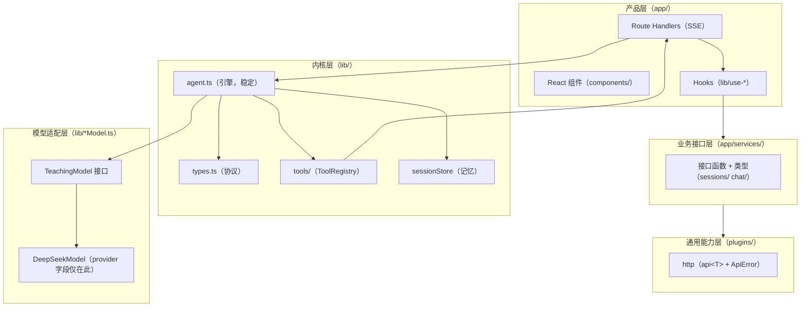

# ARCHITECTURE.md —— 项目架构设计

> **定位**：地基文档，与 `PLAN.md`（路线图）、`AGENTS.md`（规则）并列。核心回答一个问题：**加新东西时，长在哪、怎么长、动哪些文件——且不破坏现有代码。**
> **参考系**：5 个成熟开源项目（pi / DSH / smolagents / CodeWhale / Reasonix）+ 理论框架（《Agent Harness Engineering: A Survey》的 ETCLOVG 七层，本地中文版在 `E:\agents-read\Agent-Harness-Survey-ZH-main\`）。
> **一句话架构**：**内核稳定、能力外挂**——引擎只做循环，一切能力从接缝长出去。

---

## 0. 参考坐标系（我们站在谁的肩上）

| 参考 | 架构一句话 | 我们学什么 |
|---|---|---|
| **pi** | monorepo 分包：`agent`（内核）/ `coding-agent`（产品）/ `ai`（模型适配）/ `protocol`/`telemetry`；功能长在 core/ 具体文件里；`.pi/` 用户配置目录 | 内核与产品严格分离；配置即文件 |
| **DSH** | 50+ 包，**一能力一包**：`core/agent-loop`、`hooks`、`skill`、`subagent`、`todo`、`schedule`、`sandbox`、`settings`、`llm`、`mcp`…；web 前端 + 自研 `ui-primitives` 原语库 | 能力独立成模块的粒度；UI 原语与业务组件分层 |
| **smolagents** | 一文件一能力：`agents.py`（循环）/ `tools.py`（工具）/ `mcp_client` / `local_python_executor` / `memory` / `monitoring` | 轻量到极致的模块切分 |
| **CodeWhale** | Rust crates：`agent`/`core`/`tools`/`execpolicy`（审批）/`hooks`/`mcp`/`state`/`tui` | 审批（execpolicy）和 hooks 独立成模块 |
| **Reasonix** | Go `internal/` 90+ 包：`agent`/`permission`/`sandbox`/`memory`/`skill`/`hook`/`shellrun`/`trajectory`/`task`… | 概念的模块化粒度（命令静态分析审批） |
| **综述 ETCLOVG** | 七层：E 执行环境 / T 工具接口 / C 上下文记忆 / L 生命周期编排 / O 可观测性 / V 验证评估 / G 治理安全 | 架构设计的学术坐标；O 和 G 是开源最稀疏区（我们的主战场） |

**五个项目 + 理论的共识**：不是巧合——所有成熟 harness 都在用同一套分层思想，只是切分粒度不同。

---

## 1. 架构共性（从五个项目提炼的六条模式）

| # | 模式 | pi | DSH | smolagents | CodeWhale | Reasonix | 我们现状 |
|---|---|---|---|---|---|---|---|
| 1 | **内核与产品分离** | agent vs coding-agent | core vs client | agents.py | agent vs tui | agent vs desktop | ✅ lib/ vs app/ |
| 2 | **能力独立成模块** | core/ 文件 | 一能力一包 | 一文件一能力 | 一 crate 一能力 | 一概念一包 | ⚠️ lib/tools/ 已做到，其他待长 |
| 3 | **统一扩展点**（工具/模型/hooks） | tools + pi-ai | tools + llm + hooks | tools | tools + execpolicy + hooks | tool + permission + hook | ⚠️ 工具/模型有，hooks 是雏形 |
| 4 | **配置即文件** | `.pi/` | settings 包 | 环境变量 | config crate | config 包 | ❌ 散在 .env.local |
| 5 | **可观测性独立成层** | telemetry 包 | telemetry | monitoring | telemetry | trajectory | ⚠️ trace L2 有，无遥测层 |
| 6 | **UI 原语与业务组件分层** | tui | ui-primitives | gradio_ui | tui + web | desktop frontend | ✅ components/ui（刚建）+ 业务组件 |

**结论**：六条模式里我们已符合 2 条、接近 3 条、缺 1 条（配置）——**方向对，差的只是把"隐式的接缝"写出来、把"缺的层"补上。**

---

## 2. 我们的架构（三层 + 两个扩展层，单向依赖）



**依赖规则（可拓展的第一条纪律）**：
1. **单向**：`app → services → plugins`；`app → lib`；`lib/` 内核不依赖任何上层
2. **provider 字段只在适配层**（AGENTS.md 规则 6）
3. **引擎只透传**：新能力（signal、onChunk、onToolOutput…）以参数/回调进引擎，引擎不理解、只搬运

---

## 3. 可拓展性的七个接缝（核心章节）

> 接缝 = 设计好的"生长点"。**接缝由需求逼出来，不预挖空壳**——但一旦出现，就要写清楚"怎么长"，让它变成规范。

### 接缝 ① 模型接缝（换大脑）
- **是什么**：`lib/model.ts` 的 `TeachingModel` 接口（8 行）
- **怎么加**：新写一个实现类（如 `openaiModel.ts`），在 `app/api/chat/route.ts` 的 `selectModel()` 注册；引擎无感
- **实例**：DeepSeek（已有）→ 未来多 provider 注册表（抄 pi-ai / DSH extensions）
- **不变量**：`runAgentLoop` 永远只看到 `AssistantMessage`

### 接缝 ② 工具接缝（加手脚）
- **是什么**：`lib/tools/` 一工具一文件 + `ToolRegistry`
- **怎么加**：新文件 `lib/tools/xxx.ts` 导出 `createXxxTool(workspaceRoot)`，在 `lib/tools/index.ts` 组装注册；`resolveInsideWorkspace` 自动圈住
- **实例**：9 个工具（已有）→ 仓库地图 / 代码执行器 / **MCP 外部工具源**（MCP 就是"把外部工具注册进 ToolRegistry"）

### 接缝 ③ 执行接缝（跑动作）
- **是什么**：`lib/tools/bash-runner.ts` 的 BashRunner（进程管理）
- **怎么加**：新 Runner 与 BashRunner 平级（共享超时/终止/流式约定）
- **实例**：bash（已有）→ Python 代码执行器（抄 smolagents）→ 沙箱容器（抄 OpenHands/DSH sandbox）

### 接缝 ④ 记忆接缝（记与忘）
- **是什么**：`lib/session/store.ts` 的 JsonlSessionStore + `compactIfNeeded`
- **怎么加**：升级压缩策略（现在拼贴 → 调模型生成结构化摘要，复用 `TeachingModel.complete`）；加记忆层（短期/摘要/长期，抄 Reasonix memory 的 recall/forget/freshness 设计）
- **不变量**：`buildContext()` 永远从会话文件重建上下文——"内存 = 磁盘"

### 接缝 ⑤ 观测接缝（看得见）
- **是什么**：`lib/types.ts` 的 AgentEvent + `lib/trace.ts` 落盘（L2）
- **怎么加**：加事件类型（协议先改 types.ts 再全量 typecheck）；加视图（L3 Trace Viewer）；加遥测层（成本/用量，抄 pi telemetry / Reasonix trajectory）
- **不变量**：事件 = 引擎产出，展示/落盘 = 外部消费者（引擎不关心）

### 接缝 ⑥ 审批接缝（人把关）
- **是什么**：`beforeToolCall` 钩子（async，可放行/拦截）+ `lib/toolApproval.ts` 挂起表
- **怎么加**：泛化成 hooks 注册表（`onBeforeTool`/`onAfterTool`，抄 CodeWhale hooks / DSH hooks）；审批策略升级（只读放行 → 分级模式 → 审批日志，抄 Reasonix/CodeWhale）
- **不变量**：副作用必须过审批钩子；secret/秘密 文件名硬拦不弹框

### 接缝 ⑦ UI 接缝（长得像）
- **是什么**：`app/components/ui/`（原语）+ 业务组件（components/<业务>/）
- **怎么加**：交互原语（dialog/collapse/select/stepper）进 `ui/`，与业务无关；业务组件（task-panel/choice-panel）长在 `ui/` 之上，样式 CSS Modules
- **实例**：审批弹框（已有）→ 任务面板 / 选择向导 / 思考折叠（规划中）

---

## 4. 目录地图（现在 + 未来会长出什么）

```
lib/                      ← 内核（稳定，几乎不改）
  agent.ts types.ts model.ts deepseekModel.ts sessionStore.ts sessionManager.ts
  toolApproval.ts runControl.ts trace.ts hooks.ts（未来）
  tools/                  ← 工具接缝：bash/read/write/edit/delete/grep/find/list/write-note + repo_map/python（未来）+ MCP（未来）
app/
  api/                    ← Next.js 约定（服务端路由）
  services/               ← 业务接口层（sessions/ chat/ + task/ 未来）
  components/
    ui/                   ← 原语层（dialog/collapse/select/stepper…未来）
    nameplate/ …          ← 业务组件（+ task-panel/ trace-viewer/ choice-panel/ 未来）
  lib/                    ← 前端 hooks（use-sessions/use-agent-run + use-tasks 未来）
plugins/                  ← 通用能力（http + 未来：terminal? workspace?）
settings/（未来）          ← 配置即文件（模型/权限/工作区，抄 DSH settings / pi .pi/）
```

---

## 5. 架构不变量（五条，写死不许违反）

1. **内核稳定、能力外挂**：加功能永远在外层/接缝，`agent.ts` 的循环逻辑不动
2. **单向依赖**：`app → services → plugins`，`lib/` 不依赖上层；违反 = 架构债
3. **接缝由需求逼出来**：不预挖空壳目录/空接口；需求来了在接缝长，并把接缝写进本文档
4. **配置即文件**：设置的本质是读写配置文件（抄 pi `.pi/`、DSH settings）
5. **可观测性是一等公民**：事件/轨迹不是调试工具，是架构的一部分（ETCLOVG 的 O 层）

---

## 6. 与 ETCLOVG 七层的映射

| 综述层 | 我们的对应 | 状态 |
|---|---|---|
| E 执行环境 | 接缝③ + 路径沙箱 | 有雏形（C 期补容器） |
| T 工具接口 | 接缝② ToolRegistry | ✅ 已有 |
| C 上下文记忆 | 接缝④ SessionStore | 有雏形（B 期补真摘要） |
| L 生命周期编排 | `runAgentLoop` | ✅ 单 agent（A 期 task 面板，C 期子智能体） |
| O 可观测性 | 接缝⑤ AgentEvent + trace | 有雏形（A 期 L3） |
| V 验证评估 | 测试（A 期 vitest） | ❌ 空白 |
| G 治理安全 | 接缝⑥ 审批 | 有雏形（B 期审批三步） |

**注**：O（可观测）和 G（治理）是综述单独拎出来、开源最稀疏的两层——恰是我们的主战场（轨迹 + 审批），也是分享 PPT 的亮点论据。

---

## 7. 演进路线（mini-harness → 工程化 → 平台）

```
现在（mini-harness）      Phase 0-4 + 工程化三连（fetch/CSS/可读性）
  ↓ 阶段 A（主线收尾）     task 面板、vitest、L3 Trace Viewer
  ↓ 阶段 B（工程化补齐）   审批三步、真摘要、原语库、diff、hooks、记忆分层、终端加固
  ↓ 阶段 C（功能丰富）     MCP、沙箱、子智能体、定时任务、遥测、工作区、设置页、Skills
未来（agent 平台）         多工作区 + 多 agent + 对外接口（抄 DSH 的"平台"形态）
```

**判断架构要不要变的信号**（记在 `PLAN.md` 排期表的**「条件触发」**里）：需要常驻后台的 agent 服务独立于 web、要发 CLI、要跨进程复用内核——到那时把 `lib/` 抽成共享包（monorepo），这是"换架构"的正确时机，不是现在。

---

## 8. 新增/扩展功能的操作流程（落地）

1. 在 PLAN.md 对应位置补"实现前补记"（说明：长哪个接缝、参考谁）
2. 展示规划 → 用户确认
3. 实现（遵守依赖规则 + 不变量）
4. `tsc --noEmit` 全量校验
5. 展示改动清单 → 用户确认 → 提交（AGENTS.md 第 9 条）
6. 涉及新接缝时，回填本文档第 3 节

---

## 9. 明天分享可用的一句话

> "我们不是从零发明架构——**五个成熟开源项目 + 一篇学术综述告诉我们：agent 的架构是共识，不是设计**。我们做的是把这个共识装进一个看得懂的小项目里：内核稳定、能力外挂，七个接缝等着功能长出来。"

---

## 10. 落地路线（设计 → 代码）

> 第 1-9 节是"设计"，本节是"怎么让代码符合设计"。分两类任务：**合规任务**（补文档里缺的层——结构债）+ **功能任务**（在接缝上长功能，施工单在 `doc/plan/*.md` 详案里）。
> 顺序逻辑：**先审计知道差什么 → 补层让架构合规 → 长功能让架构有产出**。每个任务一个 commit。

### 第 0 步：架构审计（L0，先知道差什么）

核查现状 vs 本文档：
- 依赖方向是否真的单向（`app → services → plugins`；`lib/` 是否被反依赖）
- provider 字段有没有泄漏出适配层（AGENTS.md 规则 6）
- 引擎 `agent.ts` 是否被改过（不变量 1：内核稳定）
- 配置散落点清单（route.ts 顶部系统提示词 / `selectModel()` / `TOOLS_NEEDING_CONFIRM` / bash 超时）
- **产出**：审计清单（零违规 or 列出待修项）

### 第 1 步：补缺失的层（合规任务，可并行）

| # | 任务 | 对应不变量/接缝 | 验收标准 | 参考 |
|---|---|---|---|---|
| L1 | **`lib/settings.ts`** 配置集中化（模型/审批清单/bash 超时/工作区根） | 不变量 4（配置即文件） | 配置只在一处读 | DSH settings / pi `.pi/` |
| L2 | **建 `app/components/ui/`** + 第一批原语（dialog） | 接缝⑦ UI | ui/dialog 存在且被审批弹框使用 | DSH ui-primitives |
| L3 | **`lib/hooks.ts`**：beforeToolCall 泛化成注册表 | 接缝⑥ G 层 | onBeforeTool/onAfterTool 可注册 | CodeWhale hooks |

### 第 2 步：接缝上长第一批功能（复用第十三节）

| # | 功能 | 长在哪个接缝 | 对应第十三节 |
|---|---|---|---|
| L4 | 审批三步（只读放行 → 分级模式 → 审批日志） | 接缝⑥ G 层 | B1 |
| L5 | 真摘要压缩（compactIfNeeded 升级） | 接缝④ C 层 | B2 |
| L6 | L3 Trace Viewer（轨迹回放） | 接缝⑤ O 层 | A3 |

### 第 3 步：持续机制

- 新功能 = 长在接缝 + **回填本文档第 3 节**（接缝文档随生长更新，文档不变成僵尸）
- 每完成一个接缝的新增功能，在对应小节补一行实例
- 出现"接缝不够用"的信号（要改引擎才能加功能）→ 先停下来讨论架构，而不是硬塞

### 落地顺序图

```
L0 审计 ──→ L1/L2/L3 补层（合规，可并行）──→ L4/L5/L6 长功能（接缝就位后）──→ 持续回填
```

