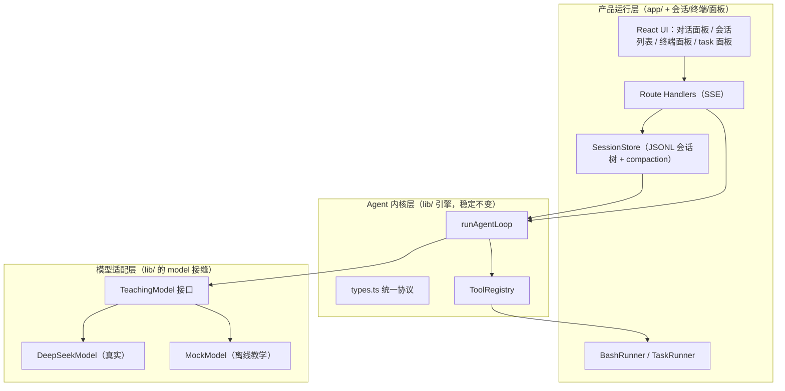

# Agent 学习项目：整体评估与长期方案

> 本文件是"做中学"的长期路线图。它基于两个参照系：
> 1. `E:\agents-read\how-pi-agent-works` —— 一套把 Pi 核心思想拆小再拼回去的教学路线（本仓库就是它的 Next.js 重写版）
> 2. `E:\agents-read\pi` —— 真实开源 coding agent（monorepo），三层架构的范本
>
> 目标不是复制 Pi，而是用 **Next.js + TypeScript** 写出一个保留 Pi 核心思想、可一步步长成的 Agent。

---

## 一、当前状态评估（结论先行）

**结论：单轮对话逻辑已经是一个"能跑通、分层干净"的初步框架，而且质量不错。** 你现在不是"从零开始"，而是"骨架已经立好，缺记忆和真实大脑"。

对照教学路线（`how-pi-agent-works/docs/project/build-00-roadmap.md`）的 7 步 + 可选第 8 步：

| 步骤 | 内容 | 当前状态 |
| --- | --- | --- |
| 1 | 共享协议 `types.ts` | ✅ 完成（3 消息类型 + 12 事件类型） |
| 2 | Loop + MockModel | ✅ 完成（`agent.ts` 完整 ReAct + 审批 + guardrail） |
| 3 | 工具系统 | ✅ 完成（`tools.ts` list/read/write_note + 路径越界防护） |
| 4 | **JSONL 会话存储 / 记忆** | ❌ **缺失**（这是最大缺口） |
| 5 | API（SSE 流式） | ✅ 完成（`app/api/chat/route.ts`） |
| 6 | React 前端 | ✅ 完成（`app/page.tsx` 聊天 + 事件时间线） |
| 7 | 调试与验收 | ⚠️ 部分（有 `.env.local` 开关，但无测试） |
| 8 | **接入真实模型** | ❌ **缺失**（只有 MockModel） |

### 已经做对的地方（值得保留）

1. **抽象接缝留对了**：`TeachingModel` 接口（`lib/model.ts`）就是"换大脑"的正确位置；`ToolRegistry`（`lib/tools/`）就是"加手脚"的正确位置。接真实模型、加终端、加文件工具，都不需要重写引擎。
2. **引擎不依赖消费者**：`runAgentLoop` 同时产出 `events`（拉取）和 `onEvent`（推送），事件协议已经按"真实流式模型"的形状设计好了。
3. **副作用边界清晰**：模型只能提 tool call，真正的文件读写发生在工具里，且有路径沙箱 + 审批钩子。

### 当前缺口（按重要度排序）

1. **无会话记忆** —— `route.ts` 每次 POST 都是 `messages: [userMessage]`，上一轮结果不进入下一轮上下文。多轮对话现在其实是"每次都重新开始"。
2. **无真实模型** —— MockModel 靠关键词匹配，无法真正推理和自由组合工具。
3. **无多会话** —— sessionId 硬编码，没有会话列表/切换/删除。
4. **文件操作不完整** —— 只有 list/read/写笔记，缺 write 任意文件 / edit / delete / grep / find。
5. **无终端** —— 没有执行命令的能力。
6. **无 task 面板** —— 没有任务/计划/子任务跟踪。
7. **`lib/agentDemo.ts` 是 `agent.ts` 的陈旧副本** —— 建议删除或改名归档，避免两处代码漂移。

---

## 二、四个直接问题的回答

### Q1：单轮对话逻辑是否已经算"初步框架"？
**是。** 而且不止"初步"——协议、引擎、工具、SSE、前端五层都已打通，是一个可以真实运行的闭环。你现在的起点已经高于很多初学者。

### Q2：需要下载 sse.js 或 openai SDK 吗？
**都不需要。**

- **sse.js**：不需要。你的项目已经手写了 SSE——服务端 `ReadableStream` + `text/event-stream`，客户端 `fetch` + `res.body.getReader()`。浏览器原生 `EventSource` 不支持 POST body，而你现在用的 `fetch` 方式已经绕开了这个限制。sse.js 反而多一层封装。
- **openai SDK**：不必须。DeepSeek 提供的是 **OpenAI 兼容** 接口，直接用 `fetch` 调 `https://api.deepseek.com/chat/completions` 即可。用 `fetch` 手写 adapter 反而更符合"做中学"——你能看清"provider 字段 → 统一协议"这一层转换，这正是 pi 的 `pi-ai` 层在做的事。等以后要接多家供应商、要 OAuth/缓存等高级能力时，再引入 SDK 或自己抽 `pi-ai` 那样的适配层。

### Q3：Next.js 能支撑这些功能吗？
**能，全部能。** 而且本地跑（localhost）几乎没有限制：

| 功能 | Next.js 方案 | 备注 |
| --- | --- | --- |
| 单/多会话、记忆 | Route Handler + 磁盘 JSONL / SQLite | 与 pi 的 JSONL 会话树一致 |
| 文件增删改查 | Node runtime 下 `node:fs` | 需 `export const runtime = "nodejs"` |
| 终端运行 | Node runtime 下 `node:child_process` + SSE 推流 | 需进程管理 + 安全白名单 |
| task 面板 | 前端组件 + 会话内持久化 | 与消息一起存进 session |
| 对话面板 | React + SSE（已通） | 继续加会话列表/分支树 |

**唯一的边界提醒**：交互式 TTY（如 `vim`、需要回显的 REPL）比"执行命令并流式返回输出"难得多。前期只做"跑一条命令 → 流式吐 stdout/stderr → 支持 Ctrl-C 终止"就够用了，不要一开始做完整 pty。

### Q4：现在就该换架构吗？
**不换。** 换架构（比如迁到 pi 的 Bun monorepo、或换成 Python + FastAPI）是"过早优化"：

- 你现在的抽象（`TeachingModel` / `ToolRegistry` / `runAgentLoop` / `types.ts`）**已经是 pi 三层思想的雏形**，换架构不会让你更接近目标，只会丢掉能跑的代码。
- Next.js 能一路支撑到你要的全部功能。真正需要"换/拆架构"的信号是：需要常驻后台的 agent 服务独立于 web 服务、要发 CLI 工具、要跨进程复用内核。到那时，把 `lib/` 抽成共享包（monorepo）即可——这也是 pi 的分层给出的答案，而不是推翻重来。

---

## 三、目标架构（高维度）

对齐 pi 的三层（`how-pi-agent-works/docs/concepts/pi-architecture.md`）：



- **模型适配层**：provider 差异关在这里。DeepSeek 的 OpenAI 兼容字段只在 `deepseekModel.ts` 里出现，`runAgentLoop` 永远只看 `AssistantMessage`。
- **Agent 内核层**：越稳定越小越好，现在已经是。以后几乎不改。
- **产品运行层**：会话、终端、task、面板这些"麻烦但关键"的事都长在这里，是可替换、可迭代的部分。

抓住这些边界（pi 的核心教训）：
1. **LLM 边界**：进模型前把 `AgentMessage` 转成 provider 格式，出模型后把 provider 事件转回 `AssistantMessage`。
2. **副作用边界**：模型不能直接读写文件/执行命令，只能提 tool call；副作用发生在工具里，可被审批和权限拦截。
3. **可观测性边界**：引擎只负责产出事件，不负责展示和存储；展示（Event Timeline）和落盘（轨迹 Trace）由外部消费者完成。详见下一节。

---

## 四、可观测性与轨迹（Trace）—— 调试与可视化的地基

### 4.1 为什么把"轨迹"当作一等公民

这个项目的核心会越来越依赖 AI 生成，失控是迟早的。失控时的第一反应不应该是"猜"，而是"读轨迹"。所以可观测性不是某个阶段的功能，而是贯穿全程的横切地基——**Event Timeline 是实时仪表盘，轨迹（Trace）是黑匣子**。

能不能"追责"到具体一步，取决于三件事：

1. 每个事件有**稳定序号 `seq`** 和**归属 `runId`**，顺序和归属不会被多会话、并发、重试搞乱。
2. 每个关键步骤有**快照 snapshot**（上下文 token、leafId、模型名、工具 I/O、错误堆栈）。
3. 轨迹**持久化且可回放**——离线也能重绘出同样的时间线，把"哪一步开始错"钉死。

### 4.2 三层视图（对应三个成熟度）

| 层 | 名字 | 时机 | 内容 | 现状 |
| --- | --- | --- | --- | --- |
| L1 | 实时事件流（Event Timeline） | run 进行中 | 边跑边推的 `AgentEvent` | ✅ 已有，**保留** |
| L2 | 持久轨迹（Trace / 黑匣子） | 每次 run 落盘 | `事件 + 快照`，JSONL 追加 | ❌ 新增 |
| L3 | 可视化回放（Trace Viewer） | 事后调试/展示 | 按 turn 分泳道、工具调用↔结果配对、token 用量、step 前进 | ❌ 新增 |

关键设计：**不动 `types.ts` 里现有的 `AgentEvent`**。轨迹是"事件 + 快照"的一层包装，引擎和前端不用大改，轨迹作为横切层叠加在现有五层之上。这符合"内核稳定、能力外挂"。

### 4.3 TraceEntry 数据模型（示意）

```ts
// 轨迹条目：包装 AgentEvent，额外带定位和快照信息
type TraceEntry = {
  seq: number;         // 全局递增，决定顺序
  runId: string;       // 本次 run 唯一 id（多会话/并发/重试不串）
  ts: number;          // 墙钟时间
  turn?: number;       // 属于第几轮
  event?: AgentEvent;  // 原有事件（复用 types.ts，不改）
  snapshot?: {         // 每步快照，用于回放/诊断
    contextTokens?: number;
    leafId?: string;
    model?: string;
    toolInput?: unknown;   // 工具入参快照
    toolOutput?: unknown;  // 工具输出快照
    errorStack?: string;
  };
};
```

### 4.4 轨迹要回答的调试问题

| 调试问题 | 轨迹里的答案 |
| --- | --- |
| 模型为什么调了这个工具？ | 该 turn 的 assistant 消息 + 工具入参快照 |
| 工具结果为什么是错的？ | 工具 I/O 快照 + 错误堆栈 |
| 上下文为什么爆了？ | 每步 `contextTokens` 快照 + 压缩事件 |
| 哪一步开始偏离预期？ | `seq` 定位 + 回放到该步 |
| 这次和上次有什么不同？ | 两个 `runId` 的轨迹 diff |

### 4.5 轨迹落在路线图的哪里

- **Phase 0**：给事件流补 `seq`/`runId`/`ts`，先落盘成最简 JSONL 轨迹（L2 打地基）。
- **Phase 1**：session store 本身就是轨迹的一部分（`id`/`parentId`/`leafId`），此时把"消息轨迹"和"事件轨迹"统一，实现回放。
- **Phase 6**：做 L3 Trace Viewer（参考 pi 的 `export-html`），把轨迹渲染成可读的调试视图。

参考源码：

- pi 事件/遥测：`pi/packages/agent/src/harness/events.ts`、`telemetry.ts`
- pi 会话 JSONL：`pi/packages/agent/src/harness/session/jsonl/{codec,storage,repo}.ts`
- pi 可视化导出：`pi/packages/coding-agent/src/core/export-html/{index,ansi-to-html,tool-renderer}.ts`

### 4.6 "失控防线"（针对 AI 开发核心会漂移）

| 防线 | 做法 |
| --- | --- |
| 协议即真相 | `types.ts` 是唯一事实源；改协议先改这里并全量 typecheck |
| 轨迹即黑匣子 | 出问题先读轨迹，不靠猜；能回放到"哪一步开始错" |
| 阶段提交 + 测试 | 每个 phase 一次 `git commit`；loop/sessionStore/tools 补单测 |
| 小内核 + 清晰边界 | 内核尽量不改，新能力加在适配层/产品层 |
| 每次 run 独立 runId | 多会话、并发、重试都不串轨迹 |

---

## 五、功能 → 模块 → 阶段 映射

| 你想做的功能 | 落在哪一层 | 对应阶段 |
| --- | --- | --- |
| 对接真实大模型 | 模型适配层 | **Phase 0（现在做）** |
| 单个会话（多轮记忆） | 产品层 SessionStore | Phase 1 |
| 会话记忆 / 压缩 | 产品层 compaction | Phase 1 |
| 多个会话 | 产品层 SessionManager + UI | Phase 2 |
| 文件增删改查 | 内核层 ToolRegistry 扩展 | Phase 3 |
| 终端运行 | 产品层 BashRunner | Phase 4 |
| 执行 task 面板 | 产品层 TaskRunner + UI | Phase 5 |
| 对话面板（完整） | 产品层 UI | Phase 6 |
| 选择 / 切换多个工作区 | 产品层 SessionManager/API/UI + 内核层沙箱参数化 | 暂缓（见第十一节） |

---

## 六、分阶段路线图

> 每完成一个阶段就 `git commit`。Agent 项目的 bug 常跨协议/loop/工具/存储，阶段提交能帮你回到最近的可用点。

### Phase 0：接入 DeepSeek（真实大脑）—— 立即做
- 新建 `lib/deepseekModel.ts`，实现 `TeachingModel`。
- 用 `fetch` 调 OpenAI 兼容接口，先做**非流式**跑通，再做**流式**。
- 保留 MockModel：`.env.local` 里 `MOCK_MODE` 开关切换（你的 `.env.local.example` 已经预留了 `MOCK_MODE` / `DEEPSEEK_API_KEY`）。
- **轨迹打地基**：给事件流补 `seq`/`runId`/`ts`，落盘最简 JSONL 轨迹（L2，见第四节）。
- 具体实现要点见下一节。

### Phase 1：单个会话 + 记忆（把多轮变成真的）
- 移植教学版的 `JsonlSessionStore`（`how-pi-agent-works/examples/teaching-agent/src/server/agent/sessionStore.ts`）。
- 核心：JSONL 追加写 + `id`/`parentId`/`leafId` 会话树 + `buildContext()`（从 leaf 回溯）+ `compactIfNeeded()`（超窗口时用摘要替代旧消息）。
- 改 `route.ts`：不再每次新建 `[userMessage]`，而是 `appendMessage(user) → buildContext() → runAgentLoop → appendMessage(assistant/toolResult)`。
- 把"事件轨迹"与"会话消息轨迹"统一，实现离线回放（L2 完整）。

**实现前补记（AGENTS.md：先想清楚再动手）**

- 会话文件：`.sessions/<sessionId>.jsonl`，与 `.traces/` 平级、进 gitignore。为什么放 `.sessions/` 而不是 workspace/sessions：workspace 是 agent 的工作区（工具可读写），会话数据是运行时状态，不该被 agent 工具碰到。
- sessionId：Phase 1 固定 `"default"`；POST body 预留可选 `sessionId` 字段（不传则用 default）——为 Phase 2 多会话留接口，前端零改动。
- store 生命周期：每次 POST 新建 store 实例（loadOrCreate 从磁盘读全量）。多进程安全、内存态与磁盘一致；会话文件小，读全量可接受。
- 引用安全：`buildContext()` 返回新数组 + `runAgentLoop` 内部再复制，不污染 store 内存态；run 结束把 `result.newMessages`（assistant + toolResults）逐条 `appendMessage` 落盘。
- `compactIfNeeded` 触发：每次 run 结束后调用；初值 `maxApproxTokens=4000`、`keepRecentMessages=8`（教学版测试里的 20/2 是逻辑验证值，不是生产值）。
- 历史展示（经用户授权，本会话接管 UI 线这部分）：done frame 改为带**全量会话历史**（`store.buildContext()`）；新增 `GET /api/chat?sessionId=` 返回历史（前端挂载时恢复、刷新不丢）、`DELETE /api/chat?sessionId=` 清空会话（配合前端「清空记录」）；前端发送时不再清空消息。
- 测试：本阶段不引入测试框架（原计划 Phase 6 再补），教学版 `sessionStore.test.ts` 留作参考。

**Phase 1 后续优化（暂缓，等主线跑稳再回来）——「真摘要」压缩**

当前 `compactIfNeeded` 的摘要只是原文拼贴（`role: 文本` 连起来），token 几乎不省，是教学简化。真实产品（pi）会**调用 LLM 生成结构化摘要**（`pi/packages/agent/src/harness/compaction/compaction.ts` 的 `generateSummary`）：专用系统提示词 + 一次性 complete 请求，产出 `## Goal / ## Progress / ## Key Decisions / ## Next Steps / ## Critical Context` 结构，把几千 token 压成几百。升级方案：复用 `TeachingModel` 接口（摘要 = 调模型 complete 一次），照抄 pi 的结构化提示词；注意 `MOCK_MODE` 下无 key 的降级策略（可回退到现在的拼贴式）。对照细节见 `workspace/实现走读-pi对照.md`。

### Phase 2：多个会话
- 一个 session = 一个 JSONL 文件。`SessionManager` 负责 list/create/rename/delete（switch 只是换前端用的 sessionId）。
- 前端加左侧会话列表；切换会话 = 前端换 `sessionId`，所有 API 调用随之切换。
- 这一步之后，"对话面板"就有了会话维度。

**实现前补记（AGENTS.md：先想清楚再动手）**

- 会话身份：id = 文件名（稳定身份，如 `s_<时间戳+随机>`）；显示名 = `title ?? id`。`SessionEntry` 的 session 头加可选 `title` 字段（向后兼容：旧文件没有就回退显示 id）；**重命名只改头里的 title，不改文件名**——id 是身份，title 是给人看的名字。
- 接口分工：`/api/sessions` 管「会话本身」（GET 列表 / POST 新建 / PATCH 重命名 / DELETE 删除）；`/api/chat` 管「会话里的对话」（POST 发消息 / GET 历史 / DELETE 清空当前会话消息）。**清空 ≠ 删除**，两个都保留。
- `SessionManager` 只管目录级操作（list/create/rename/delete/sessionPath）；对话读写仍用 `JsonlSessionStore`（每请求新建，保持「内存 = 磁盘」）。`list()` 轻量扫目录：解析头 + 数消息 + 首条用户消息预览 + 文件 mtime 当更新时间。
- **安全（必须）**：sessionId 必须匹配 `^[a-zA-Z0-9_-]+$` 否则 400——否则 `join(sessionDir, "../../x.jsonl")` 路径越界。这是 tools.ts 路径沙箱（resolveInsideWorkspace）的精神在会话层的补课。
- 前端：新 `useSessions` hook 管列表 + currentId；`useAgentRun({sessionId})` 所有 fetch 带 sessionId，sessionId 变化时清空本地状态并拉新会话历史。删除当前会话后自动切到列表第一个。
- 布局：`.deck` 两列变三列 `240px minmax(0,1fr) 348px`（侧栏 + 对话面 + 轨迹）；侧栏视觉沿用走纸记录仪语言（明度分层 + 等宽字体）。
- 暂缓：会话树分支切换（`switchLeaf`，那是会话内的岔路）、标题自动生成（从首条消息摘）、归档/排序、并发写锁。

### Phase 3：文件增删改查
- 扩展 `ToolRegistry`：`read_file`（已有）、`write_file`（任意路径）、`edit_file`（旧串→新串替换）、`delete_file`、`grep`、`find`、`list_files`（已有）。
- 保留并强化路径沙箱（`resolveInsideWorkspace`）。
- 对应 pi：`packages/agent/src/harness/tools/{read,write,edit,edit-diff,path-utils}.ts` + `packages/coding-agent/src/core/tools/{find,grep,ls}.ts`。

**实现前补记（AGENTS.md：先想清楚再动手）**

- 新工具清单（参数见 `lib/tools/` 各工具文件）：`write_file`（任意路径 + 自动建父目录）、`edit_file`（唯一 oldText→newText 替换：找不到/多处都报错回给模型）、`delete_file`、`grep`（正则搜内容，无效正则转 isError）、`find`（文件名 `*` 通配）。全部复用 `resolveInsideWorkspace`。
- **write_note 保留并存**（已确认）：它是「只写 notes/」的低危特例，`write_file` 是通用入口——同一种能力两种危险等级，审批策略不同（教学点）。
- **edit_file 形态**（已确认）：形态 A 最简版「唯一 oldText→newText 替换」。模糊匹配（智能引号/破折号归一化，pi 的做法）和 diff 式编辑都留作扩展。
- **审批策略**（已确认）：读类（list/read/find/grep）默认放行；写类（write_note/write_file）放行但拦截「secret/秘密」文件名；**delete_file 默认 block**（演示审批机制），`ALLOW_FILE_DELETE=true` 环境变量可放行——「策略配置」的教学样例。
- **grep 细节**（已确认）：JS 正则；默认最多 50 条匹配，超出提示「共 N 条，显示前 M」；每行截断 200 字符；读文件失败（二进制等）跳过不崩。
- 暂缓：edit 模糊匹配、diff 式编辑、符号链接逃逸防护、二进制识别、并发写锁、前端删除确认弹窗（等 Phase 5/6 的交互通道）。
- **人工确认（已确认：全部写操作弹框 + 60s 超时自动拒绝）**：`write_note`/`write_file`/`edit_file`/`delete_file` 每次调用都弹框让用户当场允许/拒绝，不再依赖硬编码策略。实现：`beforeToolCall` 是 async 钩子——识别写/改/删 → SSE 推新帧 `tool_permission_request`（toolCallId/工具名/参数）→ await 挂起的 Promise（`lib/toolApproval.ts` 的 pending 注册表，globalThis 挂载防 dev 多 worker 不共享）→ 前端弹框 → `POST /api/chat/approve` 回传决定 → resolve 放行/拦截。60 秒不点自动拒绝（block 结果回给模型解释）。硬性安全策略（secret/秘密 文件名）仍不弹框直接拦。**`ALLOW_FILE_DELETE` 开关被弹框机制取代，移除**。会话/全局「记住选择」留待以后。
- 测试：Phase 6 补框架；`tools.ts` 是全项目最适合先补单测的模块（纯函数 + node:fs），届时从这里开始。

### Phase 4：终端运行
- 新增 `bash` 工具 + `BashRunner`（`node:child_process`）。
- 能力：执行命令 → 流式吐 stdout/stderr → 超时/终止（Ctrl-C）→ 退出码。
- 安全：命令白名单或确认机制、限制工作目录、禁止交互式 TTY（前期）。
- 对应 pi：`packages/coding-agent/src/core/bash-executor.ts` 和 `exec.ts`。
- 注意：`route.ts` 需 `export const runtime = "nodejs"`（已有）。

**实现前补记（AGENTS.md：先想清楚再动手）**

- **BashRunner**（`lib/tools/bash-runner.ts`）：`spawn(command, { cwd, shell: true, stdio: ["ignore","pipe","pipe"] })`。stdout/stderr 的 `data` 事件逐块清理（去 ANSI 色码/`\r`/二进制垃圾）→ `onChunk` 流式回调 + 滚动缓冲（超 64KB 丢最旧）；`close` 事件拿退出码。**两级终止**：超时（已确认默认 30 秒）或 AbortSignal → `SIGTERM` → 5 秒后 `SIGKILL`。
- **工具签名扩展**：`ToolExecutor` 加可选 `options?: { signal?, onChunk? }`（`lib/tools/types.ts`）——其他 8 个工具零改动。
- **引擎只透传**：`RunAgentLoopOptions` 加 `onToolOutput?`，`executeToolCall` 原样递 signal + onChunk。引擎不理解 onChunk，只搬运。
- **`tool_output` 是旁路帧，不是 AgentEvent**：工具 → route.ts → SSE → 前端实时显示；不进引擎事件流、不进 trace（避免一条 `npm install` 几千块把黑匣子淹掉）。最终输出仍在 `tool_execution_end` 的 result 里带一份（截断后）。
- **run 级取消**：`lib/runControl.ts`（挂 globalThis 的 `Map<runId, AbortController>`，同 `toolApprovals` 模式）；POST /api/chat 创建 controller 注册（同时传给 `complete` 和工具 execute），finally 清理；新接口 `POST /api/chat/stop { runId }` → `abort()`。
- **审批**（已确认）：bash 加入 `TOOLS_NEEDING_CONFIRM` 全量弹框；`cwd` 锁 workspace；`stdin: "ignore"` 天然禁交互式 TTY。
- **诚实边界**：bash 执行任意字符串，`cd ..` 一行就出围栏——**bash 的安全不靠沙箱靠确认**，与文件工具本质不同（规划时已向用户说明）。
- **Windows**：`shell: true` 走 cmd.exe；提示词引导用 Windows 兼容命令，避免 `ls` 等 Unix 专属命令。
- 暂缓：交互式 TTY/pty、命令白名单免确认、Windows 进程树击杀（`taskkill /T`，先单层）、远程执行（SSH/容器）、输出写临时文件全量保留（pi 的 fullOutputPath）。

### Phase 5：task 面板
- 引入"任务/计划"概念：模型产出 todo list，前端渲染成可勾选面板；或你手动拆任务，agent 逐条执行。
- 后期可加 subagent 委派（把子任务交给子 agent 跑，汇总结果）。DSH 和 pi 的扩展系统都是这个方向。
- 先做最简单版：session 内持久化一个 todo 数组 + 面板展示，跑通再谈多 agent。

**实现前补记（2026-08-22，来源：走读 07 DSH todo + 走读 18 Reasonix TodoPanel）**

**核心思想：todo 是会话事件，不是独立存储**（DSH 走读 07）——`SessionEntry` 加 `type: "todo"` 条目，与对话同生命周期、可回放、可审计。前端形态抄 Reasonix TodoPanel（走读 18）：进度徽章 + 当前任务 + 折叠。

- **数据模型**（`lib/types.ts`）：`TodoItem = { content: string; status: "pending" | "in_progress" | "completed" }`；`SessionEntry` 加 `{ type: "todo", id, parentId, timestamp, todos: TodoItem[] }`。
- **工具**（`lib/tools/todo.ts` 新文件）：`todo_write`，**整表替换语义**（工具描述写明"Send the ENTIRE list every call, it REPLACES the previous list"——幂等，模型不会漂移）；校验 content trim 非空 + 去重 + 最多一个 in_progress（教学版固定单 active，allowParallel 留扩展）；返回 `counts { pending, inProgress, completed }` + 完整 todos（给模型的即时反馈）；**不进 `TOOLS_NEEDING_CONFIRM`**（低危：只改会话内 todo 列表，不碰文件）。
- **写会话机制**（仿 onToolOutput 旁路模式，引擎只透传）：`ToolExecutorOptions` 加 `onTodoWrite?: (todos) => void`；todo 工具 execute 调它；route.ts 注入 `(todos) => store.appendTodo(todos)`；`lib/agent.ts` executeToolCall 原样透传（与 onChunk 同模式，其他工具零改动）。
- **Store**（`lib/session/store.ts`）：`appendTodo(todos)`（复用 appendEntry）+ `getLatestTodos()`（叶子回溯找最新 todo 条目）。
- **API**（`app/api/chat/route.ts`）：POST 新增 SSE 帧 `{ type: "tool_todo", todos }`（run 中实时更新面板），done 帧带 `todos`（权威值）；GET 返回 `todos`（挂载/刷新恢复）。
- **前端**（`app/components/task-panel/` 新组件）：进度徽章 `done/total` + 当前任务（in_progress）+ 状态标签 + 折叠（默认折叠）；数据源 = GET todos（初始）+ tool_todo 帧（run 中）+ done 帧（最终）；**只读展示**（todo 唯一写者是模型，与 DSH/Reasonix 一致——"可勾选"改为"可查看进度"，勾选交互暂缓）。
- **系统提示词**：加 todo_write 工具说明（复杂任务先列任务清单，任务完成/进度更新时调用）。
- **验收标准**（改自第十三节 A1）：模型在复杂任务时产出 todo_write 调用 → 会话落盘 → 前端面板显示进度 → 刷新/切换会话不丢。

**Phase 5 增补（2026-08-24）：TodoPanel 关闭交互（抄 Reasonix todoVisibility）**

> 背景：调研 7 项目（DSH/tether/Reasonix/CodeWhale/codex/pi/我们）发现"关闭"分三派——不提供（DSH/我们）、随时可关（tether 抽屉级/CodeWhale /rail off）、**未完成强制可见 + 全完成才可关**（Reasonix）。选 Reasonix 式，因为它最符合 todo 面板的存在意义：任务没做完不该被藏起来，关闭是"清理已看完的清单"的单向动作。

- **判定是派生状态，不是事件点**：`show = todos.length > 0 && (有未完成 || !dismissed)`——每次渲染根据当前 todos + dismissed 重算（GET 恢复 / tool_todo 帧 / done 帧三条数据路径自然触发），幂等纯函数，不需要"记住上次判定"。只有两个事件：初始读 localStorage、点 X 写 localStorage。
- **dismissed 只对"全完成"生效**：只要有未完成任务，强制显示（忽略 dismissed）→ 新任务到来面板自动复活，无需额外逻辑。
- **存储**：`localStorage`，key 按 sessionId 隔离（`todoPanel:dismissed:<sessionId>`）——纯前端状态，后端零改动（todo 数据仍在会话里，面板可见性是前端视图状态）。
- **改动范围**：`app/components/task-panel/index.tsx`（加 `useState(dismissed)` + 全完成时头部显示 X 按钮 + `show` 判定）+ `task-panel.module.css`（X 按钮样式，沿用走纸记录仪笔色 `--pen-signal` 或 `--ink-faint`）。
- **验收**：任务全完成 → 面板出现 X → 点击后面板消失 → 刷新仍消失（localStorage）→ 模型写新任务（未完成）→ 面板自动复活 → 切换会话互不影响（按 sessionId 隔离）。

### Phase 6：对话面板打磨 + 架构加固
- UI 打磨（消息渲染、工具调用卡片、事件时间线、终端面板、task 面板整合成统一布局）。
- 补测试（`loop`、`sessionStore`、`tools` 的单元测试，教学版已有 `*.test.ts` 可参考）。
- 实现 L3 Trace Viewer：轨迹回放 / step 前进 / 工具调用↔结果配对（参考 pi 的 `export-html`）。
- 若出现"内核要被多个入口复用"的需求，把 `lib/` 抽成共享包（monorepo），这是"换架构"的正确时机。

---

## 七、Phase 0 实现要点（DeepSeek 适配器）

### 6.1 接口约定
- Base URL：`https://api.deepseek.com`（OpenAI 兼容；也接受 `/v1` 前缀）。
- 鉴权：`Authorization: Bearer <DEEPSEEK_API_KEY>`。
- 模型：`deepseek-chat`（支持工具调用）；`deepseek-reasoner` 是思考模式，历史上**不支持** function calling（以官方文档为准），所以做 agent 工具循环先用 `deepseek-chat`。

### 6.2 消息转换（进模型前）
把 `AgentMessage[]` 转成 OpenAI messages：
- `user` → `{ role: "user", content: text }`
- `assistant` → `{ role: "assistant", content, tool_calls: [...] }`（tool call 的 `arguments` 转成 JSON 字符串）
- `toolResult` → `{ role: "tool", tool_call_id, content }`（**`tool_call_id` 必须与上面的 tool call id 对齐**，丢了模型就不知道结果对应哪次调用）

### 6.3 响应转换（出模型后）
写 `toTeachingAssistantMessage()`（对应 `build-08-real-model.md`）：
- `content` → `{ type: "text", text }`（`null` 时不生成空文本块）
- `tool_calls[].function.arguments` → **先 `JSON.parse`**，失败时包装成 `isError` 的 tool result，别让进程崩
- `finish_reason === "tool_calls"` 或 `toolCalls.length > 0` → `stopReason: "toolUse"`

### 6.4 流式（关键坑）
- 请求带 `stream: true`，逐行读 SSE，`data: [DONE]` 结束。
- `delta.content` 逐段累积成文本；`delta.tool_calls[i].function.arguments` 也是分片 JSON 字符串，**必须按 index 累积，finish 后再 parse**，不能每段都 parse。
- 文本累积过程发 `message_update` 事件（前端 `applyFrame` 里现在的注释已经预留了这个位置）。

### 6.5 错误收尾
- HTTP 401/429/500 → `AssistantMessage.stopReason = "error"` + `errorMessage`。
- 网络断流 → 已累积文本作为 partial 发出，仍发 `message_end` 或错误事件。

> 完整对照参考：`E:\agents-read\how-pi-agent-works\docs\project\build-08-real-model.md`，以及可运行示例 `how-pi-agent-works/examples/demos/05-openai-compatible.ts`。

---

## 八、pi 源码阅读地图（做中学的下一步）

按"想理解什么"去读，不要通读整个 monorepo：

| 想理解的问题 | 读这些文件 |
| --- | --- |
| Agent Loop 怎么停 / 怎么循环 | `pi/packages/agent/src/agent-loop.ts`、`agent.ts` |
| 模型适配为什么单独一层 | `pi/packages/ai`（pi-ai 包） |
| JSONL 会话树 / 恢复上下文 | `pi/packages/agent/src/harness/session/*.ts`（`jsonl.ts`、`codec.ts`、`storage.ts`、`memory.ts`、`session.ts`、`context.ts`） |
| 上下文压缩 | `pi/packages/agent/src/harness/compaction/*.ts` |
| 内置工具（读/写/改/终端） | `pi/packages/agent/src/harness/tools/{bash,read,write,edit,edit-diff,path-utils}.ts`；`pi/packages/coding-agent/src/core/tools/{find,grep,ls}.ts` |
| 产品层会话管理 / 终端执行 | `pi/packages/coding-agent/src/core/{agent-session.ts,session-manager.ts,bash-executor.ts,exec.ts}` |
| 教学版对照（和本项目同源） | `how-pi-agent-works/examples/teaching-agent/` + `how-pi-agent-works/docs/` |

其他开源项目（`E:\agents-read` 下）：
- `how-pi-agent-works` —— 教学路线 + 每步文档，**当前阶段最该精读**。
- `pi` —— 真实产品，读上面列的文件，不要通读。
- `smolagents-main` —— HuggingFace 的 Python 轻量 agent 框架，可对照理解"工具/多步/代码执行"的另一种取舍。
- `deepseek-harness` —— 即 DSH 本身（我正在运行的 harness），是"会话/终端/task 面板/子 agent"完整落地的大型参考，等做 Phase 4/5 时再看它的相应模块。

---

## 九、原则与"不要做的事"

（摘自教学路线 `build-00-roadmap.md` 的"暂缓事项"，加上 pi 的教训）

| 现在不要做 | 原因 |
| --- | --- |
| 同时接多家模型 | 先跑通 DeepSeek，provider 差异留到需要时再抽适配层 |
| 完整权限审批系统 | 先用路径沙箱 + 工具白名单打底 |
| 漂亮动画 / 复杂 UI | 先让事件时间线和消息准确，视觉最后升级 |
| 交互式 TTY 终端 | 先做"执行命令 → 流式输出 → 终止" |
| 一步到位做多 agent | 先把单 agent + 会话 + 工具跑扎实 |

**核心心法**：模型会变、工具会变、UI 会变，但 Agent Loop 相对稳定。让"稳定的内核"和"不稳定的外部"分离，你后面每一步都是在往对的位置加东西，而不是推倒重来。

---

## 十、界面设计语言（Phase 6 视觉部分，提前落地）

### 10.1 方向：走纸记录仪，不是聊天软件

这一页的工作只有一件：**让一次 run 变得可读**。所以视觉语言不取自 IM，而取自本文件自己用的那些词 —— 黑匣子、仪表盘、泳道、回放、seq。对应到实验室的走纸记录仪：

| 现实中的物件 | 页面上的角色 |
| --- | --- |
| 走纸（点阵纸） | 底色与轨迹区的纸纹，`background-attachment: local` 让纸随内容滚动 |
| 多支笔（每通道一色） | 一种事件通道 = 一种墨色，颜色只表示语义，不做装饰 |
| 记录条 | 轨迹区的时间脊线：轮次开带、输出成笔、工具成段 |
| 面板刻字 | 等宽字体承担全部标签与读数（它同时是本页的标题字） |

明度分三层，信息层级靠明度而非边框：**铭牌 `--plate`（最亮）> 走纸 `--paper`（阅读面）> 记录仪 `--recorder`（最暗）**。

### 10.2 令牌（`app/globals.css` 顶部即真相）

- 纸墨：`--plate #fbfbf8`、`--paper #e9eae4`、`--recorder #e0e1d9`、`--ink #1d2127`
- 五支笔：`--pen-user #2f4b99`、`--pen-model #0b6857`、`--pen-tool #9c2b6e`、`--pen-signal #b0741b`、`--pen-error #a32d1f`
- 字体：`Azeret Mono`（标签/读数/标题）+ `Instrument Sans`（正文，中文交给系统 PingFang SC / 微软雅黑）
- 两条硬约束：① 承载信息的文字对比度 ≥ 4.5:1（所以 `--ink-faint` 只用于装饰，amber 另留一个 `--pen-signal-ink` 文字版）；② 含中文的等宽标签不小于 11px、字距不超过 0.1em —— 汉字在同样字号下比拉丁字母更需要空间。

### 10.3 轨迹区做了三次聚合（`foldEvents`）

实测一次"列出工作区文件"的真实 run：**105 条 `message_update` + 12 条其它事件**。一行一条事件的画法会被 delta 淹没，所以前端按语义聚合，105 条塌成 2 行：

| 原始事件 | 记录行 | 为什么 |
| --- | --- | --- |
| `turn_start` | ◆ 轮次带 `T1` / `T2` | 轮次是真实序列，序号在这里是信息不是装饰 |
| 连续 `message_update` | ● 一笔墨迹，长度随字数 | 流式输出在物理上就是一支笔连续画一条线 |
| `tool_execution_start` + `end` | ■ 一段跨度，条长 = 真实耗时 | 工具执行有时长；配对靠 `toolCallId` |
| `tool_permission`（非 allow） | 信号行 | 放行是默认路径，只记真正的干预 |

配套的两个小决定：
- **前端自己给事件盖时间戳**（`ObservedEvent = { seq, at, event }`）。协议里 `AgentEvent` 没有 ts（4.3 节说 Phase 0 才补），前端作为"观测者"盖到达时间，不改 `types.ts` 就能画出耗时与用时。等 Phase 0 的 `TraceEntry` 落地，这一层可以直接换成服务端的 `seq`/`ts`。
- **工具结果默认折叠**（超过 12 行），长文件不该淹掉对话。

### 10.4 仍然遵守"暂缓事项"

第九节写着"漂亮动画 / 复杂 UI"暂缓。这次只做了排版与信息结构，动效只保留三处、且都表示状态而非装饰：状态灯脉冲、流式笔尖、工具运行中的条。`prefers-reduced-motion` 下全部关闭。

---

## 十一、未来规划（暂缓，等主线跑稳再回来）

- **思考过程渲染**：模型处于"思考模式"时会在 `reasoning_content` 字段返回推理链（V4 系列支持）。届时四步落地：① `types.ts` 加 `reasoning` 内容块；② 适配器捕获 `reasoning_content`（流式 `delta.reasoning_content` + 非流式 `message.reasoning_content`）；③ 回传 assistant 消息时把 `reasoning_content` 原样带回去，否则工具调用会报错；④ UI 渲染成默认折叠的「思考过程」块。
- **模型版本**：model id 会持续演进（当前 V4 flash / pro）。`DEFAULT_MODEL` 只是兜底，正式使用一律在 `.env.local` 用 `DEEPSEEK_MODEL` 显式指定。
- **工作区选择（完整版，多工作区）**：让 agent 能在多个工作区之间选择，而不是硬编码 `workspace/`。暂缓原因：它是跨切面功能（数据模型 + API + 前端 + 安全），且会动摇「单一 workspace 围栏」这个安全教学基础，等 Phase 4（终端）跑稳后再评估。设计要点（想清楚再动手）：
  - **核心原则：工作区选择器是「换围栏」，不是「拆围栏」**——每个工作区仍然是路径沙箱（`resolveInsideWorkspace` 的参数从固定 workspaceRoot 变成当前工作区路径），白名单外的路径一律拒绝，否则"选择任意路径"等于绕过沙箱。
  - **工作区定义走白名单**：如 `.env.local` 的 `WORKSPACES=path1;path2`（和 `ALLOW_FILE_DELETE` 同一种「策略配置」思路）；备选：扫描 `./workspaces/*` 子目录。推荐白名单——最安全、最教学。
  - **会话 ↔ 工作区绑定**：现状会话头 `cwd` 只存字符串，切换工作区后旧会话失真。推荐 `.sessions/<workspaceId>/<sessionId>.jsonl` 按工作区分目录——切换工作区 = 会话列表跟着换，互不污染。
  - **基础设施变化**：`workspaceRoot` 从模块级常量变成每个请求解析当前工作区；`toolRegistry` 现在是模块级单例（绑定 workspaceRoot），需要按工作区建 registry 或改成接收 root 参数；系统提示词里"你运行在安全工作区（workspace/）"要改成当前工作区名。
  - **前端**：工作区切换器（侧栏上方），切换 = 会话列表刷新 + 转录稿清空（复用 `useSessions` 的"换 id 即换数据"模式）。
  - **轻量版备选**：只想换一个目录时，只做 `WORKSPACE_ROOT` 环境变量（一处改动，沙箱跟随），不用等完整版。
- **UI 视觉打磨（暂缓）**：核心功能跑稳后再回头调视觉。已记录的问题：Phase 3 人工确认弹框的样式（用户反馈不喜欢当前形态）、会话侧栏等。原则不变：交互正确优先于美观，视觉升级参考第十节的走纸记录仪语言。
- **fetch 调用封装（暂缓）**：前端 8 处手写 fetch（`use-sessions.ts` 4 处 + `use-agent-run.ts` 4 处），存在链式 `.then`、重复 headers/错误处理、`.catch(() => {})` 静默吞错等痛点。封装方向：`app/lib/http.ts` 提供 `api<T>(url, { method, body, signal })`——自动 `Content-Type: application/json`、`!ok` 时抛带服务端 error 消息的 `ApiError`、调用方用 async/await。覆盖 7 处普通 JSON 请求（会话列表/历史/新建/重命名/删除/清空/approve）；**SSE 流式 `POST /api/chat` 除外**（它要 `res.body` 交给 `readStream`，保持原样）。顺带可消除 `cancelled` 手写竞态标志（换 AbortController）。
  - **实现前补记（已确认，2026-08-20，两轮调整后定案）**：**两个正交的抽象，两层目录**（用户第二轮意见：plugins 只放通用能力，接口定义进专门的 api 文件夹）：
    - `plugins/` = **通用能力插件**（与业务无关、可复用）：`plugins/http/` 放 `api<T>()` + `ApiError`（全项目唯一 fetch 样板；方法类型限定实际用到的 GET/POST/PATCH/DELETE，**不做 PUT**；`body` 有值才加 Content-Type + stringify；`signal` 透传 AbortController）。以后其他插件（终端、工作区…）并列放在 `plugins/` 下。
    - `api/` = **业务接口清单**（本项目专属，与服务端 route 一一对应）：按 REST 资源分模块 `sessions/`、`chat/`，每个模块 `index.ts` 定义语义化接口函数（method 在此消化，调用方见不到）、`types.ts` 放参数/返回类型。`api/` 依赖 `plugins/http`，hooks 只依赖 `api/`——依赖单向。**命名沿革（2026-08-20 定案）**：最初放根目录 `api/`，会与 Next.js 强约定的 `app/api/`（服务端路由位置，route.ts 只能放那里）撞名混淆；用户定案改名 **`app/services/`**（与 `app/lib/`、`app/components/` 平级）。`app/` 下只有 page.tsx/route.ts 等特定文件名参与路由，普通 .ts 文件不产生路由，放 `app/` 下安全。
    - **`sendMessage`（SSE）不收进 `api<T>`**（它要原始 `res.body` 交 `readStream`），但定义仍收口在 `app/services/chat/index.ts`，注释写明原因。
    - 类型搬家：`SessionSummary` 从 `use-sessions.ts` re-export（`session-list.tsx` 的 import 不变）；**`ToolApprovalRequest` 不搬家**——它是弹框 UI 状态类型（含 toolName/args 用于展示），不是接口参数类型（接口只要 `{toolCallId, allow}`），借此区分「接口类型 vs UI 状态类型」。
    - 顺手修两处：① `approve` 的 fetch 移出 setState updater（React 反模式，updater 理论上可能被调用两次）；② 两处手写 `cancelled` 竞态标志换 AbortController（挂载/切会话 effect 里 `controller.abort()` 即取消请求，catch 里按 `AbortError` 名显式忽略）。

---

## 十二、远期功能地图（开源 Agent 盘点提炼）

> 来源：`workspace/开源Agent功能盘点.md`（市面五类 agent 全景 + pi / DSH / smolagents 一手探索）。
> 定位：**很后期**——主线（Phase 5/6）走稳后再回头。每一项都已确认"长在哪个接缝"，**不需要为此改架构**——这是"接缝由需求逼出来"的运用：先登记在路线图（文档级预留），需求真来了再实现。
> 完整施工单（含三阶段排期与验收标准）见**第十三节**。

### Top 5（按"学到的东西 ÷ 改动量"排序）

| # | 功能 | 参考 | 长在哪 | 前置 |
|---|---|---|---|---|
| 1 | **仓库地图（repo map）** | [Aider](https://aider.chat/docs/repomap.html) | `lib/tools/` 新工具 `repo_map`：解析 import 引用边 + 按任务关键词 BFS 选相关文件压进上下文 | 无 |
| 2 | **Skills（.md 即技能）** | Claude Code / pi `.pi/skills/` / DSH `packages/skill` | `app/api/chat/route.ts` 的 systemPrompt 组装处 + 根目录 `skills/` 目录（加载函数按描述注入） | 无 |
| 3 | **分级权限（auto/plan/ask）** | Cline / Roo Code / Codex | `app/api/chat/route.ts` 的 `TOOLS_NEEDING_CONFIRM` 判定处：弹框加"本次会话记住"→ 会话级偏好 → 命中即放行；plan 档 = 模型只出计划 | 无 |
| 4 | **hooks 化**（`beforeToolCall` → 钩子注册表） | Claude Code / DSH `packages/hooks` | `lib/agent.ts`（引擎只触发、不实现，同 `onToolOutput` 透传模式）；`lib/hooks.ts` 注册表 `onBeforeTool`/`onAfterTool` | 无 |
| 5 | **代码执行器（Python 沙箱）** | smolagents `local_python_executor` | `lib/tools/` 新工具 `python`：复用 BashRunner 的进程管理 + stdout 捕获，"代码即动作" | 无 |

### 远期其他项

| 功能 | 参考 | 长在哪 | 前置 |
|---|---|---|---|
| MCP 生态 | Cline / smolagents `mcp_client.py` | ToolRegistry 注册外部工具源 | 工具系统稳定后 |
| 沙箱容器 | OpenHands / DSH `packages/sandbox` | BashRunner 同级的新 Runner（真隔离） | 安全课题单独立项 |
| 多智能体（handoffs 交接） | OpenAI Agents SDK | `runAgentLoop` 嵌套调用（子智能体=再跑一个 loop） | Phase 5 子智能体委派 |
| 定时任务 | DSH `packages/schedule` | 产品层新 Runner | 无 |
| 分析面板 | OpenHands / DSH `packages/feedback` | trace L3 Viewer（Phase 6）的延伸 | Phase 6 |
| 个人行为偏好 | 各家配置体系 | 设置页 + 系统提示词注入 | 设置页之后 |

### 五个共同规律（判断"要不要学"的尺子）

1. **配置即文件**：`.pi/skills/*.md`、"设置页"的本质是读写配置文件，不是独立系统。
2. **hooks 是标准扩展点**：Claude Code、DSH 都有 hooks 包；我们的 `beforeToolCall` 已是雏形。
3. **记忆分层是标配**：上下文（短期）→ 摘要（长期）→ 外部记忆；我们只有第一层 + 拼贴式摘要。
4. **权限分级是共识**：auto / plan / ask 三档；我们已在"ask 全量"这一档。
5. **成熟产品必有沙箱**：OpenHands 容器、Codex 双层、DSH sandbox；我们是"路径沙箱 + 人工确认"的轻量版。

---

## 十三、综合长远规划（综述分类法 × 6 个项目）

> 来源：《Agent Harness Engineering: A Survey》（110+ 论文 / 23 系统的 harness 分类法，本地中文版 `E:\agents-read\Agent-Harness-Survey-ZH-main\`）+ 本地 6 个参考项目（pi / DSH / smolagents / CodeWhale / Reasonix / how-pi-agent-works）。详细版见 `workspace/综合长远规划.md`。
> 原则：**架构好的学架构，功能丰富的学功能**。每项标注"参考谁、长在哪、怎么验收"——落地意义 = 每步都知道做什么、为什么、跟谁学。
> 定位：我们的项目 = mini-harness（综述分类法的实践投影）。三阶段：**主线收尾 → 工程化补齐 → 功能丰富**。
> 学术背书（binding-constraint thesis，综述第 1 章）：实证显示——只改进 harness（不碰模型）就能让基准提升 **10 倍**（改编辑工具格式）、+13.7 个百分点（Terminal-Bench 2.0 纯 harness 优化）。结论：**执行环境（harness）比模型本身更能决定现实世界的可靠性**（OpenAI 2026-02 已把 harness engineering 确立为独立学科）。我们做的正是 harness——方向有学术背书。

### 13.1 综述对照表（官方 ETCLOVG 七层 ↔ 我们 ↔ 差距）

> 分类法出处：综述第 2.3 节。**E/T/C/L 是结构性骨架，O/V/G 是控制平面**——综述把可观测性（O）和治理（G）提为独立层，因为它们"藏在工业系统商业平台里、开源生态最稀疏"，而这恰是我们的主战场（轨迹 + 审批）。

| 层 | 全称（回答的问题） | 我们现状 | 差距 | 参考 | 规划期 |
|---|---|---|---|---|---|
| **E** | Execution Environment & Sandbox（代码在哪运行、什么沙箱约束） | 路径沙箱 + 人工确认 | bash 一行 `cd ..` 出围栏；无容器隔离 | OpenHands / DSH sandbox | C |
| **T** | Tool Interface & Protocol（工具如何描述/发现/调用） | 9 工具 + ToolRegistry | 无 MCP 外部工具源；edit 无 diff/模糊匹配 | Cline / smolagents mcp_client | B、C |
| **C** | Context & Memory Management（模型能看到什么） | JSONL 会话树 + 拼贴式压缩 | 压缩不省 token；无记忆分层（回忆/遗忘/新鲜度） | pi compaction / Reasonix memory | B、C |
| **L** | Lifecycle & Orchestration（步骤如何组织、简单循环→复杂编排） | 单 agent ReAct 循环 | 无 task 面板、子智能体、handoffs、issue-to-PR 流程 | DSH todo/subagent / CodeWhale todo_snapshot | A、C |
| **O** | Observability & Operations（如何测量追踪/成本/可靠性） | 事件流 + L2 轨迹落盘 | L3 回放没有；无成本跟踪 | pi export-html / OpenHands 泳道 | A、B |
| **V** | Verification & Evaluation（轨迹→反馈/护栏/回归） | 无测试框架 | 无单测、无 benchmark | smolagents / DSH test-support | A |
| **G** | Governance & Security（权限/身份/策略/审计） | 全量弹框 + 60s 超时 | 无分级、无记忆、无审批日志；bash 不做危险分析 | CodeWhale 四档 / Reasonix 静态分析 | **B（最快见效）** |

注：模型适配（TeachingModel 接口）与配置集中化不在七层内——综述把"模型本身"排除在研究范围外、配置属横切关注点（第 10 章），归入阶段 B/C 单独处理。

### 13.2 六项目各取所长

| 项目 | 最值得学 | 我们拿走什么 |
|---|---|---|
| **pi** | 架构纪律：monorepo 分层、core 文件、`.pi/` 用户配置目录 | 真摘要压缩（generateSummary）、配置即文件思想 |
| **DSH** | 功能全景：50+ 包 = 完整功能目录；ui-primitives 自研原语库 | 功能清单（todo/hooks/skill/schedule/sandbox…）、原语库模式 |
| **smolagents** | 轻量、代码执行器、一文件一能力 | 代码执行器思路、工具模块组织 |
| **CodeWhale** | 审批四档 + Shift+Tab 切换 + approval_log；todo_snapshot；session_resume | 审批分级与日志、任务面板参考 |
| **Reasonix** | 命令静态分析审批（只读放行）；memory 40 文件；shellrun/parse/safe 三层 | 审批智能化、记忆分层设计、终端安全分析 |
| **how-pi-agent-works** | 教学路线（我们的根） | 每阶段的"为什么" |

> **工具全景参考源（2026-08-24）**：开工任何"工具"相关项（B1/B7/新工具），查 `workspace/工具全景对比-7项目.md`（7 项目工具全景 + 缺口三档）与 `workspace/三项目横向对照-施工决策表.md` 第五节（工具参考源 + 裁决增补）——那里已把 7 个项目的工具名实读核对完毕，含 ask_user_question / web_search / 后台任务三件套 / 只读放行等新缺口与抄谁。

### 13.3 三阶段规划（带验收标准）

**阶段 A：主线收尾（近期）**

| # | 做什么 | 参考 | 长在哪 | 验收标准 |
|---|---|---|---|---|
| A1 | **Phase 5 task 面板** | DSH todo / CodeWhale todo_snapshot | 协议（todo 数组存会话）+ `app/components/task-panel/` | 模型产出任务清单，前端可勾选，刷新不丢 |
| A2 | **测试框架 vitest** | smolagents / DSH test-support | `lib/tools/` 先补单测（纯函数+fs） | tools 全测过，`pnpm test` 绿 |
| A3 | **L3 Trace Viewer** | pi export-html / OpenHands 泳道 | 轨迹数据已有，加回放视图（`app/components/trace-viewer/`） | 能按 turn 前进/后退，工具调用↔结果配对 |
| A4 | **ask_user_question**（2026-08-24 增补，工具全景第一档） | DSH tool-ask-user / codex request_user_input | 新工具 + SSE 帧 + 前端弹层（复用 approval-dialog 模态形态） | 模型提问 → 弹层出现 → 用户回答 → 结果回模型继续；`lib/tools/` 补单测 |
| A5 | **web_search / web_fetch**（2026-08-24 增补，工具全景第一档） | DSH tool-web / CodeWhale Web 聚合 | 新工具（独立，不依赖现有模块） | 模型能搜索并抓取网页；搜不到时 isError 回模型；`lib/tools/` 补单测 |

**阶段 B：工程化补齐（中期，从"能跑"到"好用"）**

- **B1 审批升级三步（最快见效，先做）**：① **只读命令放行**（bash 只读白名单，命中不弹框——抄 Reasonix `bash_readonly.go`）② **分级模式**（Suggest/Auto/Bypass 三档 + 弹框加"本次会话记住"——抄 CodeWhale `approval_mode.rs`）③ **审批日志**（放行/拒绝记事件——抄 CodeWhale `approval_log.rs`）。长在哪：`app/api/chat/route.ts` 的 `TOOLS_NEEDING_CONFIRM` 判定处 + `lib/tools/bash.ts`
- **B2 真摘要压缩**：compactIfNeeded 从拼贴升级为调模型生成结构化摘要（`## Goal / ## Progress / ## Key Decisions / ## Next Steps / ## Critical Context`）——抄 pi `compaction/compaction.ts`，复用 TeachingModel.complete。长在哪：`lib/session/store.ts` + `lib/summarize.ts`
- **B3 UI 原语库**：建 `app/components/ui/`（dialog/collapse/select/stepper…），对标 DSH `dsh-client-ui-primitives`。长在哪：`app/components/ui/`
- **B4 文件 diff 预览**：edit/write 前生成 diff 给你看（红绿视图）——抄 Cline 交互 + DSH DiffBlock。长在哪：`lib/tools/edit.ts` + `app/components/ui/diff/`
- **B5 hooks 注册表**：beforeToolCall 泛化成 onBeforeTool/onAfterTool 注册表——抄 CodeWhale hooks / DSH hooks。长在哪：`lib/hooks.ts` + `lib/agent.ts` 透传
- **B6 记忆分层**：会话（短期）+ 摘要（长期）已有雏形，补"主动回忆/新鲜度"——抄 Reasonix memory 设计思路。长在哪：`lib/session/store.ts` + 未来记忆工具
- **B7 终端加固**：bash 输出全量落盘（界面显示尾部）+ shell 危险分析（重定向/嵌套检测，抄 Reasonix shellsafe）。长在哪：`lib/tools/bash-runner.ts`

**阶段 C：功能丰富（远期，按需）**

| # | 做什么 | 参考 | 长在哪 | 触发时机 |
|---|---|---|---|---|
| C1 | MCP 接入 | Cline / smolagents mcp_client | ToolRegistry 注册外部工具源 | 需要外部数据源时 |
| C2 | 沙箱容器 | OpenHands / DSH sandbox | 新 Runner（与 BashRunner 平级） | 安全需求出现时 |
| C3 | 子智能体 / handoffs | DSH subagent（8 种实现） | runAgentLoop 嵌套调用 | Phase 5 任务面板跑稳后 |
| C4 | 定时任务 | DSH schedule | 产品层新 Runner | 有无人值守需求时 |
| C5 | 遥测/分析面板 | pi usage-totals / DSH feedback | A3 Trace Viewer 的延伸 | 数据积累后 |
| C6 | 工作区选择 | 第十一节已有设计 | resolveInsideWorkspace 参数化 | 多工作区需求 |
| C7 | 设置页 | DSH settings / pi .pi/ | 配置集中化模块 | C6 前后 |
| C8 | Skills | DSH skill / pi .pi/skills | systemPrompt 注入处 | 提示词体系稳定后 |
| C9 | **代码执行器（python）**（2026-08-24 增补，第十二节已登记） | smolagents local_python_executor / CodeWhale js_execution | `lib/tools/` 新工具，复用 BashRunner 进程管理 | "代码即动作"需求出现时（第十二节远期地图第 5 项） |
| C10 | **goal 三件套**（2026-08-24 增补） | DSH get/create/update_goal / CodeWhale goal / Reasonix update_goal | 新工具（模型可调）+ 会话事件（仿 todo 模式） | 需要跨会话长期目标追踪时 |
| C11 | **complete_step 证据签收**（2026-08-24 增补） | Reasonix complete_step（证据 ≥1 条，verification 核对命令历史） | `lib/tools/` 新工具 + todo 配套 | todo 面板跑稳、要"步骤完成可验证"时 |
| C12 | **move_file / read_image**（2026-08-24 增补） | Reasonix move_file（双 subject 审批）/ DSH read_image | `lib/tools/` 两个小工具 | 随做：30 分钟一个 |
| C13 | **斜杠命令面板**（2026-08-25 增补） | pi `core/slash-commands.ts` / Reasonix `.reasonix/commands/*.md` | `lib/commands/` 注册表 + 前端斜杠输入 | 立即（一步到位，不做 API+按钮过渡） |

> **非核心/可选（暂不排期，条件触发）**：**LSP 代码智能**（重型依赖——要起语言服务器进程，教学项目收益低；真需要代码智能时再评估）和 **tool_search 工具发现**（工具超过 20 个才需要，现在 10 个；等工具膨胀时再评估）。这两项不是"不学"，是"条件触发"。

---

**C13 斜杠命令面板 · 立项补记（2026-08-25，用户拍板"一步到位"）**

> 触发：用户指出成熟 agent 都有自带斜杠命令（DeepSeek CLI 自带压缩/导出/模型选择/skill 列表；pi `BUILTIN_SLASH_COMMANDS` 22 个内置命令；Reasonix `.reasonix/commands/*.md` 命令即文件；codex `/compact /review`）。我们 PLAN 无此规划——缺口。**决定：直接做命令面板，不做"独立 API + 按钮"中间过渡**（有现成成熟参考项）。

**pi 机制精读结论**（`core/slash-commands.ts` + `interactive-mode.ts:675-773`）：
- **命令模型**：`SlashCommandInfo { name, description, source: "extension"|"prompt"|"skill", sourceInfo }`——命令有来源分类
- **内置命令表**：`BUILTIN_SLASH_COMMANDS`（settings/model/tree/thinking/export/import/compact/…22 个）
- **聚合**：内置 + 提示词模板 + 扩展命令 + 技能（`skill:xxx`）全部转成 SlashCommand 进**同一个自动补全**——命令 = 统一功能入口抽象
- **参数补全**：每个命令可挂 `getArgumentCompletions`（如 /model 补全 `provider/model`、/thinking 补全级别）
- **执行**：斜杠命令在输入时识别（不走模型），各走各的处理逻辑

**我们第一批命令**（对齐 DeepSeek 自带那几项）：
- `/compact`——手动压缩当前会话（**核心**：接 B2 ③ 的 prepare→generate→commit 三步，复用共享函数）
- `/model`——模型选择/展示（config 驱动；切换接口按 selectModel 扩展）
- `/skills`——技能列表（C8 未做，先占位展示"规划中"或列 PLAN）
- `/export`——导出当前会话（下载 JSONL，简单）

**设计**：
- **`lib/commands/` 注册表**：`SlashCommand { name, description, argumentHint?, run(args, ctx) }`——同 ToolRegistry 思路，一命令一文件
- **后端**：`app/api/chat/compact/route.ts`（手动压缩端点，返回 { ok, summary, tokensBefore }）；命令执行 = 调对应 API
- **前端**：输入框识别 `/` 开头 → 命令补全下拉（name + description）→ 选中执行（不走模型，直接调 API）；结果作为系统消息展示
- **验收**：输入 `/` 弹命令列表 → 选 /compact → 会话被压缩 → 前端出现压缩卡片（compactionSummary 渲染已有）；/export 下载会话文件；/model 展示当前模型

**关联**：`compactSession` 共享函数（从 route.ts 抽出的三步）同时服务自动路径（run 结束后）和 /compact 命令——对齐 DSH 的 compactIfNeeded / compactNow 共享底层。

**A2 实现前补记（2026-08-24，用户已确认规划）**

**目标**：搭 vitest 框架 + `lib/tools/` 单测全绿。边界：**只测 lib/ 纯 TS（零 Next.js 集成）**，不做 agent loop mock（留以后专门学 mock）。验收：`pnpm test` 全绿、每工具一个 `.test.ts`、关键边界用例覆盖、`lib/tools/` 覆盖率 ≥80%。

- **vitest 支持 Next.js 吗**：支持（官方有 App Router 指南），但 **lib/ 是纯 Node 模块不需要任何集成**——`environment: "node"` 零配置直测；将来测 `app/components/` 才需要 `@testing-library/react` + jsdom + mock `next/*` 导入。**A2 明确不做组件测试**。
- **第 1 层框架**：装 `vitest`（devDependency）；`vitest.config.ts`（`environment: "node"`，include `lib/**/*.test.ts`）；package.json 加 `"test": "vitest run"` + `"test:watch": "vitest"`。
- **第 2 层纯函数**（零 mock）：`path-utils.ts`（resolveInsideWorkspace：越界拒绝/相对解析/workspace 内放行）、`todo.ts` 的 `validateTodos`/`countTodos`（trim/去重/单 active 抛错）。
- **第 3 层 fs 工具**（临时目录 fixture）：`read`/`list`/`find`/`write`/`edit` 等——`beforeAll` 建 tmpdir 当 workspace、`afterAll` 清理；测写入 workspace 内成功、越界失败。**学 fixture 管理**。
- **第 4 层顺带（可选）**：`sessionStore`（临时 `.sessions` 目录：appendEntry/叶子回溯/appendTodo/getLatestTodos/compactIfNeeded）。agent loop mock 测试**明确不做**。
- **测试文件位置**：与源码同目录（`lib/tools/path-utils.test.ts`）——vitest 默认 include，就近可读，符合"一工具一文件"的组织。
- **学习点**（做中学）：断言 expect / 生命周期 beforeAll-afterAll / fixture 临时目录 / **测试倒逼可测试性**（测时发现耦合 I/O 的函数该拆——这回答"要不要先拆模块"：测了才知道，不是先拆再测）。
- **验收**：① `pnpm test` 全绿 ② 每工具 ≥1 `.test.ts` ③ 边界用例覆盖（越界/重复/双 in_progress）④ `pnpm vitest --coverage` 时 `lib/tools/` ≥80%。

### 13.4 落地原则

1. **每步标注"参考谁"**：学的是思路不是代码；实现时对照参考项目源码（本地都有）
2. **一个阶段一个 commit**：阶段内小步提交，每步展示清单等确认
3. **先 PLAN.md 补思路再动手**：每个规划项开工前，在 PLAN.md 对应位置补"实现前补记"
4. **验收标准先行**：每项有明确的"怎么算做完"（上表验收列）
5. **B1 优先**：审批升级改动小、收益大、教学点密（命令分析=新一课），建议阶段 B 先做它

**A4 实现前补记（2026-08-24，ask_user_question）**

**核心思想**：复用审批的"挂起等待 + 回传接口"模式（`toolApproval.ts` + approve 接口 + 前端弹框），但语义从「允许/拒绝（布尔）」换成「回答问题（字符串）」——ask_user_question 不是审批，是模型主动要信息。参考：DSH tool-ask-user（问题 + 结构化回答）。

- **工具**（`lib/tools/ask-user/index.ts` 新目录，一工具一目录）：`ask_user_question`，参数 `question: string`（必填）。execute 里 **`const answer = await options?.onAskUser?.(question)`**——旁路回调，工具不碰前端/route。返回 content 带用户回答 + details { question, answer }。**不进 `TOOLS_NEEDING_CONFIRM`**（本身就是交互，别再叠审批弹框）。
- **回调签名**（`lib/tools/types.ts`）：`ToolExecutorOptions` 加 `onAskUser?: (question: string) => Promise<string> | string`——和 onTodoWrite 同模式，但它是「请求-响应」（要等答案），onTodoWrite 是「单向通知」。
- **引擎只透传**（`lib/agent.ts`）：`RunAgentLoopOptions` 加 `onAskUser`，`executeToolCall` 原样递给工具（与 onTodoWrite 并列）。
- **挂起注册表**（`lib/userAnswers.ts` 新文件，仿 toolApproval.ts）：`globalThis.__userAnswers: Map<toolCallId, { resolve(answer), timer }>`——多 worker 场景同审批的解法。
- **route.ts 注入**：SSE 新帧 `{ type: "ask_user_request", toolCallId, question }`；`onAskUser` 实现 = 推帧 → 注册 pending → await（**60s 超时兜底**：resolve "（用户未在 60 秒内回答）"，run 不挂死）。新接口 `POST /api/chat/ask-user`（body `{ toolCallId, answer }`）回传答案。
- **前端**：`app/lib/sse.ts` 加帧类型；`use-agent-run.ts` 加 `pendingAsk` state + `answerAsk(answer)` + reset 清空；新组件 `app/components/ask-user-dialog/`（复用 approval-dialog 弹框形态 + 输入框 + 提交/取消）；page.tsx 挂载。
- **系统提示词**：加 ask_user_question 说明（需要用户提供信息/决策/澄清时才调用，问题要具体，别滥用）。
- **测试**（A2 框架）：`ask-user/index.test.ts`——mock onAskUser 返回答案 → 断言 content/details；question 空抛错；无 onAskUser 时返回"（未回答）"降级。
- **验收**：模型调 ask_user_question → 前端弹框 → 用户输入回答 → 答案回模型 → 模型基于答案继续；60s 不答返回超时文案；`pnpm test` 全绿。

---

**agent-loop 纯净性改造 · 实现前补记（2026-08-24，独立架构修正，不在 A/B/C 阶段内）**

> 触发：用户指出 `RunAgentLoopOptions` 里混入 `onTodoWrite`/`onAskUser` 两个业务名回调——引擎（agent-loop）被业务污染。判据（用户定）：**agent-loop 原则上不允许污染，除非 pi 也是这么做的。** 精读 pi 后确认：pi 的引擎不认识任何业务（context 闭包注入 + 事件外推），所以对齐 pi。完整改动点全览见 `doc/01-agent-loop-纯净性改造.md`（方案 B 定稿版）。

**核心思想（方案 B · 完全贴 pi）**：业务 hooks 从「引擎 options 透传」改为「工厂参数 + 闭包烙」——引擎只传运行时参数（signal/onChunk），连"递容器"都不做。pi 源码对应：

- 引擎调用工具：`execute(toolCallId, params, signal, onUpdate)` —— 4 个运行时参数，无 context（`pi-agent-core/src/agent-loop.ts:679`）
- 业务 context 注入：`execute: (id, params, signal, onUpdate) => tool.execute(id, params, signal, onUpdate, context)` —— 闭包烙（`pi-agent-core` 的 `create-harness.ts:35`）
- 组装：`createCodingAgentHarness` 每次会话组装，`toolContext = { env }`（create-harness.ts:99）

**改动（一句话版）**：

- **`lib/tools/types.ts`**：新增 `ToolHooks`（onTodoWrite/onAskUser）；`ToolExecutorOptions` 删掉这两个业务字段（只留 signal/onChunk 运行时参）
- **工具工厂**：`todo`/`ask-user` 改 `createXxxTool(hooks)`，`execute(args)` 用烙进来的 hooks；其余 7 个文件工具 + bash **零改动**（本就只收 args / 只用运行时参）
- **`lib/agent.ts`**（红线核心）：`RunAgentLoopOptions` 删 `onTodoWrite`/`onAskUser`；`executeToolCall` 只透传 signal/onChunk
- **`app/api/chat/route.ts`**（唯一接口层改动）：删模块级单例，POST 内每请求组装 `createToolRegistry(workspaceRoot, hooks)`，hooks 闭包捕获当次 store/send
- **测试**：todo/ask-user 测试改 `createXxxTool(hooks)` + `execute(args)`

**决策点（已定稿）**：① hooks 用工厂闭包（贴 pi `createCodingAgentHarnessTool`）② `onToolOutput` 留在引擎（= pi execute 第 4 参 onUpdate）③ `beforeToolCall` 审批钩子保留（pi 同款）。

**验收**：`RunAgentLoopOptions`/`ToolExecutorOptions` 无业务字段；todo/ask-user 通过闭包拿到 hooks（不经引擎）；`pnpm test`（84 用例）全绿 + `tsc --noEmit` 通过；行为与 A4 commit 前完全一致（无功能回归）。

---

**B2 真摘要压缩 · 实现前补记（2026-08-25 升级，触发：多轮对话后页面渲染异常 + 孤儿 tool 400）**

> 原 B2（PLAN:552）只写了"拼贴 → 调模型摘要"。本次升级补三点：**摘要消息类型（修渲染）**、**切点不落在 toolResult（修 400，已实现于 `sessionStore.ts`）**、**LLM 结构化摘要 + retainedTail（对齐 pi）**。三家对照精读完毕。

**症状与根因（本次触发）**：
1. **页面渲染奇怪**：`buildContext` 把 compaction 摘要合成一条 `role:"user"` 消息（`sessionStore.ts:231-241`），文本是 `"以下是旧上下文摘要...\n\nuser: ...\nassistant: ...\ntoolResult: ..."`（`summarizeEntries` 拼了 role 前缀）。前端 `message-row` 把它当**用户气泡**渲染 → 几轮后出现一大坨带 `user:/assistant:/toolResult:` 前缀的混乱文本。
2. **孤儿 tool 400**（已修）：切点落在 toolResult 上，它配对的 assistant toolCall 被压进摘要 → DeepSeek 400。已用 `while` 循环前移切点修复 + 单测（`lib/session/store.test.ts`）。

**三家对照（精读结论）**：

| | pi | DSH | codex |
|---|---|---|---|
| 摘要消息类型 | **独立 role**：`compactionSummary`（`messages.ts createCompactionSummaryMessage`），有 `summary`/`tokensBefore` 字段 | 不截断上下文（持久化层不管窗口），靠前端折叠 | 独立 summary 记录，不冒充 user |
| 切点规则 | **`findValidCutPoints`（compaction.ts:312-344）：toolResult 不是合法切点**，user/assistant/bashExecution/custom 才是；按 token 预算反向累计选点 | —（无窗口压缩） | — |
| 摘要生成 | **LLM 生成**：`SUMMARIZATION_PROMPT`（Goal/Constraints/Progress/Key Decisions/Next Steps/Critical Context，compaction.ts:424-459），`generateSummary` 调模型；前次摘要传 `<previous-summary>` 增量更新 | — | 调模型生成摘要 |
| 保留策略 | **`retainedTail` 存进 compaction entry**（不是重建时临时算），cut 时 split turn 单独摘要前缀 | — | 保留最近 N 条 |

**改造方案（三步，对应三个症状）**：

- **① 摘要消息类型（修渲染）**：`lib/types.ts` 新增 `role: "compactionSummary"` 消息类型（`{ summary, tokensBefore, timestamp }`）；`buildContext` 产出它而非 `role:"user"`；`deepseekModel.ts` `toOpenAiMessages` 把 compactionSummary 转成 user 消息（对模型仍是指令）；`message-row` 新增渲染分支（折叠卡片"旧上下文已压缩"，点开展示摘要）——**模型看到的是 user 指令，前端看到的是压缩卡片，互不干扰**。
- **② 切点不落 toolResult（已做）**：`compactIfNeeded` 切点前移 while 循环 + `lib/session/store.test.ts` 3 用例（已提交待归档）。
- **③ LLM 结构化摘要（对齐 pi）**：`compactIfNeeded` 从 `summarizeEntries`（拼贴）升级为调 `TeachingModel.complete` 生成 pi 同款结构化摘要；`retainedTail` 存进 compaction entry（可选，二期）。
- **④ 压缩阈值配置化（2026-08-25 增补）**：原 `compactIfNeeded(4000, 8)` 是教学随手值（4~5 轮就压，浪费 DeepSeek 1M 窗口）。已建 `lib/config.ts`（全项目配置唯一入口）：provider 结构可扩展（每厂商自带 contextWindow/reserveTokens/keepRecent），触发对齐 pi `shouldCompact`（`contextTokens > 窗口 - 预留`）。DeepSeek V4 默认 1M 窗口，几十上百轮才触发；换厂商 = `AI_PROVIDER` 换 key + config 加一项。**注意：阈值随 provider 走，不同家窗口不一样（如 Anthropic 200K / OpenAI 128K）**。

**涉及文件**：`lib/types.ts`（新消息类型）、`lib/session/store.ts`（buildContext 产出 compactionSummary + compactIfNeeded 摘要生成）、`lib/deepseekModel.ts`（转换）、`lib/message.ts`（构造函数）、`app/components/message-row/`（渲染分支）、`lib/session/store.test.ts`（补用例）。

**验收**：多轮对话（>8 条 + 超 4000 token）后触发压缩，页面不出现"user: 摘要"大块文本而是折叠卡片；`tsc --noEmit` 通过；`pnpm test` 全绿；MOCK_MODE 下 `TeachingModel.complete` 降级为拼贴（无 key 不崩）。

> 注：①②是必做（修当前 bug），③是 B2 正题（对齐 pi）。①完成即解"渲染奇怪"；③单独一批 commit。

**B2 ③ 实现定稿（2026-08-25，四家精读后拍板，方案全文见 `doc/02-B2-LLM结构化摘要-改造方案.md`）**

> 用户要求：核心功能改造必须多方案对照（pi/codex/Reasonix/DSH 四家源码精读）→ 讲透取舍 → 确认后才动手。已确认开工。

**四家结论（一句话）**：pi 独立请求+显式增量（最教科书）；codex 服务端压缩+保留 user 原文（最工程）；Reasonix 缓存对齐+经济性检查（最省钱）；DSH 缓存对齐+8 段检查点格式（最产品化）。共识：压缩=调模型重写交接单；摘要伪装 user 回上下文；toolResult 不能当切点。

**决策（用户已确认）**：
- D1 摘要调用**独立请求**（不学缓存对齐：复杂度换钱不划算，DeepSeek cache 不透明）
- D2 格式 = **pi EXACT 结构 + DSH 的 Files and Code / Errors and Fixes 两段**（coding agent 刚需）
- D3 增量更新**显式机制**（pi UPDATE prompt + previousSummary，四家最可靠）
- D4 **不引入 retainedTail**（我们 JSONL 只追加不删，firstKeptEntryId 定位即可）
- D6 经济性检查（Reasonix：待压 region < 400 token 不压）
- D7 工具参数防泄漏（Reasonix：arguments 摘要成 `{key} (N keys)`）
- D9 截断检测（DSH：摘要非空检查，fail-closed）
- 不做：codex 服务端压缩（DeepSeek 无端点）/ tokPerChar 校准（二期）/ source 标记（独立 role 更简单）/ hooks 遥测（B5/C5）

**改动**：新建 `lib/summarize.ts`（提示词×3 + serializeConversation + generateSummary 降级 null）；`sessionStore.ts` compactIfNeeded → `prepareCompaction`（含经济性检查）+ `commitCompaction`；`types.ts` 加 `CompactionPreparation`；`route.ts` 三步组合（MOCK 降级拼贴）；新增 summarize.test.ts + 适配 sessionStore.test.ts。

**验收**：tsc + pnpm test 全绿；压缩后摘要为结构化 Markdown（含 Files/Errors 段）；第二次压缩 previousSummary 携带（信息链不断）；MOCK 降级拼贴不崩；切点/孤儿 tool 防护不回归。

---

**C7 前置 · 配置整合（2026-08-25 立项，lib/config.ts 已建骨架）**

> 触发：用户要求"项目里零零散散的配置（写死在代码里）都要变成可配的"，且要为多 provider（不止 DeepSeek）留口子。这是 C7 设置页（PLAN:569）的前置——先有统一配置入口，设置页 UI 才能读写它。

**已完成（本次）**：`lib/config.ts` = 全项目配置唯一入口。结构：
- `config.provider`：当前厂商（默认 deepseek），每厂商自带 `contextWindow/reserveTokens/keepRecentTokens/keepRecentMessages`（压缩阈值随 provider 走）
- `config.modelSecrets`：apiKey / mockMode（适配层用）
- `config.paths`：workspace / traces / sessions（环境变量可覆盖）
- `config.approval` / `config.bash`：超时等行为参数
- `shouldCompact()`：对齐 pi 触发判断（`token > 窗口 - 预留`）

**已收编的硬编码**：route.ts 路径/压缩阈值/审批超时、sessions/route.ts 路径、deepseekModel 的 model/baseUrl/debug、bash-runner 超时/输出上限。全部经 `lib/config.ts`，环境变量可覆盖。

**将来（C7 设置页，未做）**：
- **UI 读写**：设置页把配置持久化（写 `config.json` 或类似），不再只靠 `.env.local`——对齐 pi `.pi/` 配置即文件思想（PLAN:493）
- **provider 注册**：加 Anthropic / OpenAI / ollama 时 = `lib/config.ts` 的 PROVIDERS 加一项 + 适配器 + route.ts 分支（骨架已留）
- **审批策略可配**（B1 关联）：`TOOLS_NEEDING_CONFIRM` 等从硬编码变配置

**原则**：配置是"横切关注点"（PLAN:522），不进引擎；`lib/config.ts` 是唯一入口，引擎/工具不直接读 `process.env`。
