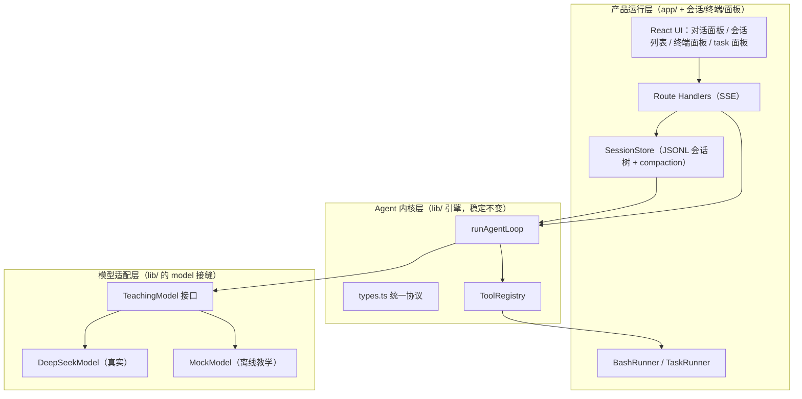

# Agent 学习项目：整体评估与长期方案（骨架版）

> 本文件是"做中学"的长期路线图**骨架**：只放核心规则与计划列表，
> 各阶段/功能的详细施工方案在 `doc/plan/*.md`（开工对应项时才读）。
> 渐进式加载分层：
> | 层 | 文件 | 什么时候读 |
> |---|---|---|
> | 入口索引 | `会话检查点.md` | 新会话/恢复上下文时（最快接上现状） |
> | **骨架（本文件）** | `PLAN.md` | 看全局规则 / 路线图 / 排期 |
> | 详案 | `doc/plan/*.md` | **开工某个阶段/功能时**才读对应文件 |
> | 归档 | `doc/plan-archive/*.md` | 考古：查已完成阶段的历史决策 |
>
> 项目定位：**做中学的 Agent Harness 学习项目**，站在多个成熟开源项目肩上——参考系是 **pi / DSH / codex / smolagents / CodeWhale / Reasonix** 等 + 理论框架（《Agent Harness Engineering: A Survey》的 ETCLOVG 七层）。完整参考坐标系见 `ARCHITECTURE.md` 第 0 节；"每个阶段抄谁"见 7.2 六项目各取所长表。
>
> 目标不是复制某一个项目，而是用 **Next.js + TypeScript** 写出一个保留各家核心思想、可一步步长成的 Agent。

---

## 〇、历史归档（已完成阶段的评估 / 答疑 / 施工单）

Phase 0-5 + B2 ③ 已全部完成并提交。当时的评估、架构答疑、Phase 0 施工单已归档（不再占主文件）：

- `doc/plan-archive/01-当前状态评估.md`（起步时"骨架已立好，缺记忆和真实大脑"的评估）
- `doc/plan-archive/02-四个直接问题回答.md`（sse.js / openai SDK / Next.js 能力 / 换架构——结论全部兑现：不换架构、不用 SDK、手写 SSE）
- `doc/plan-archive/07-phase0-实现要点.md`（DeepSeek 适配器施工单：消息转换/流式分片累积/错误收尾）

---

## 一、目标架构（高维度）——核心规则

对齐 pi 的三层架构（源头，`how-pi-agent-works/docs/concepts/pi-architecture.md`；DSH/smolagents/CodeWhale/Reasonix 同构，只是切分粒度不同，见 `ARCHITECTURE.md` 第 0 节）：

- **模型适配层**：provider 差异关在这里。DeepSeek 的 OpenAI 兼容字段只在 `deepseekModel.ts` 里出现，`runAgentLoop` 永远只看 `AssistantMessage`。
- **Agent 内核层**：越稳定越小越好。**agent-loop 是红线**：改引擎必须先精读 pi → 对比 → 展示 → 用户判断（AGENTS.md）。
- **产品运行层**：会话、终端、task、面板这些"麻烦但关键"的事都长在这里，是可替换、可迭代的部分。

抓住这些边界（pi 的核心教训）：
1. **LLM 边界**：进模型前把 `AgentMessage` 转成 provider 格式，出模型后把 provider 事件转回 `AssistantMessage`。
2. **副作用边界**：模型不能直接读写文件/执行命令，只能提 tool call；副作用发生在工具里，可被审批和权限拦截。
3. **可观测性边界**：引擎只负责产出事件，不负责展示和存储；展示（Event Timeline）和落盘（轨迹 Trace）由外部消费者完成。详案见 `doc/plan/observability.md`。

---

## 二、功能 → 模块 → 阶段 映射（计划列表）

| 你想做的功能 | 落在哪一层 | 对应阶段 |
| --- | --- | --- |
| 对接真实大模型 | 模型适配层 | **Phase 0** ✅ |
| 单个会话（多轮记忆） | 产品层 SessionStore | Phase 1 ✅ |
| 会话记忆 / 压缩 | 产品层 compaction | Phase 1 ✅ → **B2 真摘要** ✅ |
| 多个会话 | 产品层 SessionManager + UI | Phase 2 ✅ |
| 文件增删改查 | 内核层 ToolRegistry 扩展 | Phase 3 ✅ |
| 终端运行 | 产品层 BashRunner | Phase 4 ✅ |
| 执行 task 面板 | 产品层 TaskRunner + UI | Phase 5 ✅ |
| 对话面板（完整） | 产品层 UI | Phase 6 ⏳ |
| 选择 / 切换多个工作区 | 产品层 SessionManager/API/UI + 内核层沙箱参数化 | 暂缓（详案 `doc/plan/future-plans.md`） |

---

## 三、分阶段路线图（骨架；施工详案在 `doc/plan/`，开工时读）

> 每完成一个阶段就 `git commit`。Agent 项目的 bug 常跨协议/loop/工具/存储，阶段提交能帮你回到最近的可用点。

### Phase 0：接入 DeepSeek（真实大脑）—— ✅ 完成
`lib/deepseekModel.ts`（流式 + 真实 token）+ MockModel 开关（`.env.local` `MOCK_MODE`）+ 轨迹打地基（L2）。施工单已归档：`doc/plan-archive/07-phase0-实现要点.md`。

### Phase 1：单个会话 + 记忆 —— ✅ 完成
JSONL 会话树 + `buildContext()` 回溯 + `compactIfNeeded`。详案：`doc/plan/phase-1-session.md`（含"真摘要"优化前史 → B2 落地）。

### Phase 2：多个会话 —— ✅ 完成
SessionManager + 前端会话列表；sessionId 校验防路径越界；清空 ≠ 删除。详案：`doc/plan/phase-2-sessions.md`。

### Phase 3：文件增删改查 —— ✅ 完成
read/write/edit/delete/grep/find + 路径沙箱 + 写操作全量弹框审批（60s 超时自动拒绝）。详案：`doc/plan/phase-3-tools.md`。

### Phase 4：终端运行 —— ✅ 完成
BashRunner（spawn 流式 + 两级终止 + run 级取消）+ bash 全量弹框。**2026-08-26 乱码根治**：受限语言模式下 cmd+chcp+EncodedCommand。详案：`doc/plan/phase-4-bash.md`。

### Phase 5：task 面板 —— ✅ 完成
todo 是会话事件（非独立存储）；`todo_write` 整表替换幂等；面板只读展示；Reasonix 式关闭交互（未完成强制可见）。详案：`doc/plan/phase-5-todo.md`。

### Phase 6：对话面板打磨 + 架构加固 —— ⏳ 排队
- UI 打磨（消息渲染、工具调用卡片、事件时间线、终端面板、task 面板整合成统一布局）
- 补测试（已完成大半：23 文件 188 用例）
- 实现 L3 Trace Viewer（轨迹回放，参考 pi `export-html`）→ **A3**
- 若出现"内核要被多个入口复用"的需求，把 `lib/` 抽成共享包（monorepo），这是"换架构"的正确时机

---

## 四、参考项目源码阅读地图（做中学的下一步）

按"想理解什么"去读，不要通读整个 monorepo。**pi 是主参考**（本项目 = pi 思想的 Next.js 重写），其余项目按需对照：

> **★ 2026-08-31 新增：`doc/开源项目导航手册/index.md`** —— 渐进式导航卡（一个项目一个文件：结构 + 功能→位置映射 + 搜索配方 + 已读标记；新增项目流程见 `sop-新增参考项目.md`）。**新会话先读它定位"去哪找"，再按下表深读**。走读笔记（`workspace/精读走读-*.md`）标 ✅ 的模块直接引用结论，不重读。

| 想理解的问题 | 读这些文件 |
| --- | --- |
| Agent Loop 怎么停 / 怎么循环 | `pi/packages/agent/src/agent-loop.ts`、`agent.ts` |
| 模型适配为什么单独一层 | `pi/packages/ai`（pi-ai 包） |
| JSONL 会话树 / 恢复上下文 | `pi/packages/agent/src/harness/session/*.ts`（`jsonl.ts`、`codec.ts`、`storage.ts`、`memory.ts`、`session.ts`、`context.ts`） |
| 上下文压缩 | `pi/packages/agent/src/harness/compaction/*.ts` |
| 内置工具（读/写/改/终端） | `pi/packages/agent/src/harness/tools/{bash,read,write,edit,edit-diff,path-utils}.ts`；`pi/packages/coding-agent/src/core/tools/{find,grep,ls}.ts` |
| 产品层会话管理 / 终端执行 | `pi/packages/coding-agent/src/core/{agent-session.ts,session-manager.ts,bash-executor.ts,exec.ts}` |

**参考项目清单**（`E:\agents-read` 下）：**唯一列表在 `doc/开源项目导航手册/index.md`**（每个项目一个文件：架构/功能→位置/搜索配方，按需打开）——新增/删除项目只改那里，PLAN 不各自维护，避免两套列表不同步。

---

## 五、原则与"不要做的事"（核心规则）

（摘自教学路线 `build-00-roadmap.md` 的"暂缓事项"，加上 pi 的教训）

| 现在不要做 | 原因 |
| --- | --- |
| 同时接多家模型 | 先跑通 DeepSeek，provider 差异留到需要时再抽适配层 |
| 完整权限审批系统 | 先用路径沙箱 + 工具白名单打底 |
| 漂亮动画 / 复杂 UI | 先让事件时间线和消息准确，视觉最后升级（视觉语言见 `doc/plan/ui-design.md`） |
| 交互式 TTY 终端 | 先做"执行命令 → 流式输出 → 终止" |
| 一步到位做多 agent | 先把单 agent + 会话 + 工具跑扎实 |

**核心心法**：模型会变、工具会变、UI 会变，但 Agent Loop 相对稳定。让"稳定的内核"和"不稳定的外部"分离，你后面每一步都是在往对的位置加东西，而不是推倒重来。

---

## 六、设计 / 规划详案索引（渐进式加载，开工时读对应文件）

| 主题 | 文件 | 状态 |
|---|---|---|
| 界面设计语言（走纸记录仪） | `doc/plan/ui-design.md` | ✅ 已实现 |
| 可观测性与轨迹（L1/L2/L3） | `doc/plan/observability.md` | L2 ✅，L3 ⏳ A3 |
| 远期功能地图（Top5 + 五规律） | `doc/plan/far-map.md` | 很后期 |
| 未来规划（暂缓项设计） | `doc/plan/future-plans.md` | ⏳ 暂缓 |
| agent-loop 纯净性改造 | `doc/plan/agent-loop-purity.md` + `doc/01-*.md` | ✅ 已实现 |
| A2 vitest 测试框架 | `doc/plan/a2-vitest.md` | ✅ 已实现 |
| A4 ask_user_question | `doc/plan/a4-ask-user.md` | ✅ 已实现 |
| B2 真摘要压缩（三步） | `doc/plan/b2-compaction.md` + `doc/02-*.md`（四家对照） | ✅ 已实现 |
| C7 配置整合 | `doc/plan/c7-config.md` | 骨架 ✅，设置页 UI ⏳ |
| C13 斜杠命令面板 | `doc/plan/c13-slash-commands.md` | ✅ 已实现（2026-09-01，首批 /compact 全链路；/model /skills /export 排队） |
| **开源项目导航手册**（参考系速查 + 新增项目机制） | `doc/开源项目导航手册/index.md` | ✅ 2026-08-31 |
| C15 仓库更新面板（手动更新 + LLM 变更总结） | `doc/plan/c15-repo-updater.md` | ⏳ 进行中（代码完成，待测） |

---

## 七、综合长远规划（综述分类法 × 6 个项目）

> 来源：《Agent Harness Engineering: A Survey》（110+ 论文 / 23 系统的 harness 分类法，本地中文版 `E:\agents-read\Agent-Harness-Survey-ZH-main\`）+ 本地 6 个参考项目（pi / DSH / smolagents / CodeWhale / Reasonix / how-pi-agent-works）。详细版见 `workspace/综合长远规划.md`。
> 原则：**架构好的学架构，功能丰富的学功能**。每项标注"参考谁、长在哪、怎么验收"——落地意义 = 每步都知道做什么、为什么、跟谁学。
> 定位：我们的项目 = mini-harness（综述分类法的实践投影）。三阶段：**主线收尾 → 工程化补齐 → 功能丰富**。
> 学术背书（binding-constraint thesis，综述第 1 章）：实证显示——只改进 harness（不碰模型）就能让基准提升 **10 倍**（改编辑工具格式）、+13.7 个百分点（Terminal-Bench 2.0 纯 harness 优化）。结论：**执行环境（harness）比模型本身更能决定现实世界的可靠性**（OpenAI 2026-02 已把 harness engineering 确立为独立学科）。我们做的正是 harness——方向有学术背书。

### 7.1 综述对照表（官方 ETCLOVG 七层 ↔ 我们 ↔ 差距）

> 分类法出处：综述第 2.3 节。**E/T/C/L 是结构性骨架，O/V/G 是控制平面**——综述把可观测性（O）和治理（G）提为独立层，因为它们"藏在工业系统商业平台里、开源生态最稀疏"，而这恰是我们的主战场（轨迹 + 审批）。

| 层 | 全称（回答的问题） | 我们现状 | 差距 | 参考 | 规划期 |
|---|---|---|---|---|---|
| **E** | Execution Environment & Sandbox（代码在哪运行、什么沙箱约束） | 路径沙箱 + 人工确认 | bash 一行 `cd ..` 出围栏；无容器隔离 | OpenHands / DSH sandbox | C |
| **T** | Tool Interface & Protocol（工具如何描述/发现/调用） | 12 工具 + ToolRegistry | 无 MCP 外部工具源；edit 无 diff/模糊匹配 | Cline / smolagents mcp_client | B、C |
| **C** | Context & Memory Management（模型能看到什么） | JSONL 会话树 + **B2 ③ 真摘要压缩** ✅ | 无记忆分层（回忆/遗忘/新鲜度） | pi compaction / Reasonix memory | B、C |
| **L** | Lifecycle & Orchestration（步骤如何组织、简单循环→复杂编排） | 单 agent ReAct 循环 + task 面板 | 无子智能体、handoffs、issue-to-PR 流程 | DSH todo/subagent / CodeWhale todo_snapshot | A、C |
| **O** | Observability & Operations（如何测量追踪/成本/可靠性） | 事件流 + L2 轨迹落盘 | L3 回放没有；无成本跟踪 | pi export-html / OpenHands 泳道 | A、B |
| **V** | Verification & Evaluation（轨迹→反馈/护栏/回归） | vitest 23 文件 188 用例 | 无 benchmark | smolagents / DSH test-support | A |
| **G** | Governance & Security（权限/身份/策略/审计） | 全量弹框 + 5h 超时 | 无分级、无记忆、无审批日志；bash 不做危险分析 | CodeWhale 四档 / Reasonix 静态分析 | **B（最快见效）** |

注：模型适配（TeachingModel 接口）与配置集中化不在七层内——综述把"模型本身"排除在研究范围外、配置属横切关注点（第 10 章），归入阶段 B/C 单独处理。

### 7.2 六项目各取所长

| 项目 | 最值得学 | 我们拿走什么 |
|---|---|---|
| **pi** | 架构纪律：monorepo 分层、core 文件、`.pi/` 用户配置目录 | 真摘要压缩（generateSummary）✅、配置即文件思想 |
| **DSH** | 功能全景：50+ 包 = 完整功能目录；ui-primitives 自研原语库 | 功能清单（todo/hooks/skill/schedule/sandbox…）、原语库模式 |
| **smolagents** | 轻量、代码执行器、一文件一能力 | 代码执行器思路、工具模块组织 |
| **CodeWhale** | 审批四档 + Shift+Tab 切换 + approval_log；todo_snapshot；session_resume | 审批分级与日志、任务面板参考 |
| **Reasonix** | 命令静态分析审批（只读放行）；memory 40 文件；shellrun/parse/safe 三层 | 审批智能化、记忆分层设计、终端安全分析 |
| **how-pi-agent-works** | 教学路线（我们的根） | 每阶段的"为什么" |

> **工具全景参考源（2026-08-24）**：开工任何"工具"相关项（B1/B7/新工具），查 `workspace/工具全景对比-7项目.md`（7 项目工具全景 + 缺口三档）与 `workspace/三项目横向对照-施工决策表.md` 第五节（工具参考源 + 裁决增补）——那里已把 7 个项目的工具名实读核对完毕，含 ask_user_question / web_search / 后台任务三件套 / 只读放行等新缺口与抄谁。

### 7.3 三阶段规划（带验收标准；施工详案在 `doc/plan/`）

**阶段 A：主线收尾（近期）**

| # | 做什么 | 参考 | 长在哪 | 验收标准 | 状态 |
|---|---|---|---|---|---|
| A1 | **Phase 5 task 面板** | DSH todo / CodeWhale todo_snapshot | 协议（todo 数组存会话）+ `app/components/task-panel/` | 模型产出任务清单，前端显示进度，刷新不丢 | ✅ |
| A2 | **测试框架 vitest** | smolagents / DSH test-support | `lib/tools/` 先补单测（纯函数+fs） | tools 全测过，`pnpm test` 绿 | ✅（23 文件 188 用例） |
| A3 | **L3 Trace Viewer** | pi export-html / OpenHands 泳道 | 轨迹数据已有，加回放视图（`app/components/trace-viewer/`） | 能按 turn 前进/后退，工具调用↔结果配对 | ⏳ 排队 |
| A4 | **ask_user_question** | DSH tool-ask-user / codex request_user_input | 新工具 + SSE 帧 + 前端弹层 | 模型提问 → 弹层 → 回答 → 继续 | ✅ |
| A5 | **web_search / web_fetch** | DSH tool-web / CodeWhale Web 聚合 | 新工具（独立） | 模型能搜索并抓取网页；搜不到时 isError | ⏳ 排队 |

**阶段 B：工程化补齐（中期，从"能跑"到"好用"）**

| # | 做什么 | 参考 | 长在哪 | 状态 |
|---|---|---|---|---|
| B1 | **审批升级四步**：① 只读命令放行（Reasonix `bash_readonly.go` + `shellsafe/*.go`）② 分级模式（CodeWhale `approval_mode.rs`，suggest/bypass/never + 运行时切换）③ 审批日志（CodeWhale `approval_log.rs`，JSONL 成对校验）④ 前端面板 + 记忆（Reasonix 内嵌卡片布局 + 本会话/一直允许） | Reasonix / CodeWhale / pi | `lib/permission/`（readonly / approval-log / approval-memory）+ `lib/approvalMode.ts` + `app/api/chat/route.ts` + approve/approval-mode 接口 + `app/components/approval-dialog` + `approval-mode-switch` | ✅（详案 `doc/plan/b1-approval.md`） |
| B2 | **真摘要压缩**：拼贴 → 调模型生成结构化摘要（pi 六段 + DSH Files/Errors 两段；增量 previousSummary；经济性检查；MOCK 降级拼贴） | pi compaction + DSH + Reasonix | `lib/session/store.ts` + `lib/summarize.ts` | ✅（详案 `doc/plan/b2-compaction.md`） |
| B2.1 | **压缩打磨三件套**（DSH 走读 24 触发）：① compaction entry 补审计字段（被压消息 id 列表 + 摘要模型名）② "摘要必须更小" fail-closed 检查（摘要 ≥ 被压区域不落盘）③ tool-pairing balance 升级（替代"第一条不是 toolResult"单点修正）；B 类不抄（锁/KV cache/影子价格/错误分类/接口抽象——场景不需要） | DSH compaction（走读 24 施工单） | `lib/session/store.ts` + `app/api/chat/_pipeline/compact.ts` | 💡 讨论中（条件触发：① 长期会话复盘时 ② 下次动 compact.ts 时 ③ 遇孤儿工具坑时） |
| B3 | **UI V2：尺度升级 + 原语库**（2026-08-26 用户 UI 反馈触发：按钮太小、小家子气、溢出操作进 dropdown）：① 全面板尺度升级（按钮 ≥34px 命中区、字号上提、留白加大）② 第一个原语 = **下拉菜单 Menu**（溢出操作归集：顶栏「⋯」、会话行「⋯」、面板头部）③ 面板 chrome 统一（头部 = 标题 + 读数 + 操作区）④ dialog/collapse/select/stepper… 后续按需 ⑤ **精读 DSH `packages/client/AGENTS.md`**（约束 AI 写前端的教材；约束纪律见 `doc/plan/ui-design.md` §10.6） | DSH `dsh-client-ui-primitives` + Reasonix 面板族（走读 18） | `app/components/ui/`（新）+ 全部组件样式升级 | ⏳ 进行中（①②落地；08-27：原语评估全出局 + 删除确认行内化 + keys.ts + 等宽 12px 收口 + SessionRow 抽取 + **⑤精读完成**（对照表 `doc/知识点-04` + 新组件 checklist §10.9）） |
| B4 | **文件 diff 预览**：edit/write 前生成 diff（红绿视图） | Cline / DSH DiffBlock | `lib/tools/edit.ts` + `app/components/ui/diff/` | ⏳ 排队 |
| B5 | **hooks 注册表**：beforeToolCall 泛化成 onBeforeTool/onAfterTool | CodeWhale / DSH hooks | `lib/hooks.ts` + `lib/agent.ts` 透传 | ⏳ 排队 |
| B6 | **记忆分层**：会话 + 摘要已有，补"主动回忆/新鲜度" | Reasonix memory | `lib/session/store.ts` + 未来记忆工具 | ⏳ 排队 |
| B7 | **终端加固**：bash 输出全量落盘 + shell 危险分析（重定向/嵌套检测） | Reasonix shellsafe | `lib/tools/bash-runner.ts` | ⏳ 排队 |
| B8 | **前端单元测试**（**非核心**，2026-08-26 用户标注"这个倒不是核心"）：① 纯函数层先行（`app/lib/`：trace-fold/messages/format——不随 UI 变，随时可做）② 组件/hooks 层（RTL：Menu/MessageRow/use-sessions）等"冻结信号"：全局令牌与骨架连续 2 轮迭代不改、组件 API 冻结 | vitest + Testing Library（参考 DSH test-support） | `app/lib/*.test.ts` + `app/components/**/*.test.tsx` | ⏳ 排队 |
| B9 | **模型请求重试与退避**（外部评估 S1）：瞬时错误（429/5xx/超时）指数退避重试 2~3 次（`Retry-After` 头优先）、永久错误（401/400）fail-fast、请求加空闲超时兜底；重试过程发轨迹事件 | Claude Code / pi / DSH | `lib/deepseekModel.ts`（适配层内部，引擎无感） | ⏳ 排队（验收：stub fetch 前两次 429 第三次成功 → complete 正常返回 + 轨迹 2 条 retry；401 不重试） |
| B10 | **工作区记忆文件注入**（外部评估 S2）：`systemPrompt` 常量 → `createSystemPrompt(workspaceRoot)` 工厂，尾部拼接 `workspace/AGENTS.md`（存在才注入 + 缓存；`@文件` 引用行一期可不做）；配套写种子文件 | Claude Code CLAUDE.md / pi AGENTS.md / Codex | `_pipeline/prompt.ts`（E2 预埋的扩展位，C8 Skills 同落点） | ⏳ 排队（验收：记忆文件写一条规矩 → 新会话模型遵守；文件不存在行为不变） |
| B11 | **会话级运行锁**（外部评估 S3）：route.ts POST 入口 per-session 占用表（`Map<sessionId, runId>`），占用中返回 409 + 明确文案，finally 释放 | 所有成熟 harness 隐含前提 | `lib/runControl.ts`（run 级取消 → 加会话级互斥，概念同族） | ⏳ 排队（验收：并发两请求同 session → 第二个 409；不同 session 不受影响） |
| B12 | **中断/崩溃会话自愈**（外部评估 S4）：`buildContext`（或 loadOrCreate 后）扫描尾部未配对 toolCall → **不改文件**，重建上下文时补合成 toolResult（"上次运行被中断，工具未执行"，isError=true）——pi 同款：存储是事实，修复在重建视图时 | Claude Code / pi resume | `lib/session/store.ts`（buildContext 或私有辅助，纯逻辑可单测） | ⏳ 排队（验收：手工构造孤儿 toolCall 会话文件 → 正常发消息不 400；合成结果进上下文且前端可见） |
| B14 | **上下文余量指示**（外部评估 B 级顺手件）：数据已齐（done 帧 stats.tokens + 压缩阈值在 config），只差读数盘加一格"上下文 X%" | Claude Code /context | UI 读数盘一个格子 | ⏳ 排队（顺手，半小时~一天） |
| B15 | **自动会话命名**（外部评估 B 级顺手件）：首轮 assistant 回复完成后用首条用户消息（或小模型一句话）生成 title 更新会话（title 字段 + 改名接口都有） | Claude Code / DSH | `app/api/sessions/route.ts` + UI | ⏳ 排队（顺手，半小时） |
| B16 | **引擎核心零测试补齐**（体检报告行动①③，最高优先级）：补 `lib/agent.ts`（runAgentLoop：block→isError 进 context / rewrite 换参 / 工具抛错不崩循环 / maxTurns guardrail / 事件序列）与 `lib/deepseekModel.ts`（tool_call_id 配对 / compactionSummary 伪装 / SSE 坏 JSON）单测——FakeModel 基建已现成（summarize.test.ts），复用成本低 | pi（引擎测试思想）/ DSH test-support | `lib/agent.test.ts`（新）+ `lib/deepseekModel.test.ts`（新） | ✅ 完成（2026-09-01：agent 11 用例 + deepseekModel 13 用例；FakeModel 提炼为共享 `lib/testing/fake-model.ts`；对照 pi agent-loop.test.ts 六个测试模式；**全套 31 文件 263 用例全绿** + tsc 绿；顺带修了 vitest.config 缺 `@/` alias 的隐性坑——repos 测试第一批用别名全挂） |
| B17 | **前端切会话竞态 + 渲染优化**（体检报告行动②⑥）：① `use-agent-run.ts` SSE abort + `applyFrame` 加 sessionId 校验（旧 run 帧不污染新会话，历史拉取已有 AbortController 照抄）② TaskPanel dismissed 加 `key={sessionId}` ③ Markdown/MessageRow memo + foldEvents useMemo（消每 delta 全树重渲染 + O(n²) 重折叠）；**④ 面板渲染模式**（2026-08-31 讨论）：底部决策区三选一（pendingApproval ? 审批 : pendingAsk ? 提问 : 输入框）改**输入框常驻 + 覆盖层**（`{pendingApproval && <审批卡/>}` + `{pendingAsk && <提问卡/>}` 独立条件，输入框永远在，面板 absolute 盖住；业务上两 panel 天然互斥——串行 run 同时只会等一个请求，无需优先级判断）；**⑤ 渲染平铺原则**：面板内状态用提前 return 不用嵌套三元（`renderDetailBody` 五层三元 → 平铺 if return 的示范已在 repos 讨论过）。**2026-09-01 联动（C13）**：命令面板逻辑已拆成 `app/lib/use-command-menu.ts`（page.tsx 550+→336 行）——B17 决策区覆盖层改动面变小，且 ④ 的"输入框常驻"正落在 hook 持有的 input/console 上 | 体检报告前端专项 + Claude Code/Cline 输入框常驻模式 | `app/lib/use-agent-run.ts` + `app/components/{task-panel,message-row,markdown}.tsx` + `app/page.tsx`（决策区覆盖层）+ `app/repos/page.tsx` | ⏳ 排队（验收：run 中切会话无旧帧混入；流式时不再全树重渲染；审批/提问时输入框被面板盖住且行为与现在等价） |
| B18 | **测试质量细节**（体检报告行动④⑤⑦）：① 消灭弱断言（grep truncated 未断言 / store.test 条件断言 / config.test 恒真）② 补 store 树语义测试（switchLeaf/appendTodo/getLatestTodos/stats）③ `approval-memory` 显式 reset 接口 + `approval-log.test` 补真实清理 + `store.test` describe 改名 prepareCompaction | 体检报告 2.2 节 | `lib/**/*.test.ts` 各处 | ✅ 完成（2026-09-01，随 B16 一起做：grep 补 truncated 断言 + 去条件断言 / store 8 处早退改 fail-loud + describe 改名 + 新增树语义 6 用例 / config 删恒真 it / approval-memory 加 `resetSessionApprovals()` / approval-log 补 afterAll 真实清理；全套 31 文件 263 用例全绿） |
| B19 | **bash 工具定义测试补齐**（2026-09-01 检查 tools 目录时发现）：`lib/tools/bash/index.ts`（createBashTool）零测试——其他 10 个工具都有 index.test.ts 测工具定义，唯独 bash 漏（当初只测了 bash-runner 的纯函数，工具定义因依赖执行器被跳过）。做法：vi.spyOn `BashRunner.prototype.run` 返回固定 BashResult → 纯逻辑测 5 个行为（空命令报错 / cancelled 提示 / exitCode≠0 提示 / 无输出占位 / ToolResult 形状），不真 spawn（沙箱受限模式可跑） | 对齐 lib/tools 其他工具 index.test.ts | `lib/tools/bash/index.test.ts`（新） | ⏳ 排队（顺手，半小时；与 B8 前端单测同为测试补齐，非核心） |

**阶段 C：功能丰富（远期，按需）**

| # | 做什么 | 参考 | 长在哪 | 触发时机 | 状态 |
|---|---|---|---|---|---|
| C1 | MCP 接入 | Cline / smolagents mcp_client | ToolRegistry 注册外部工具源 | 需要外部数据源时 | ⏳ |
| C2 | 沙箱容器 | OpenHands / DSH sandbox | 新 Runner（与 BashRunner 平级） | 安全需求出现时 | ⏳ |
| C3 | 子智能体 / handoffs | DSH subagent（8 种实现） | runAgentLoop 嵌套调用 | Phase 5 任务面板跑稳后 | ⏳ |
| C4 | 定时任务 | DSH schedule | 产品层新 Runner | 有无人值守需求时 | ⏳ |
| C5 | 遥测/分析面板 | pi usage-totals / DSH feedback | A3 Trace Viewer 的延伸 | 数据积累后 | ⏳ |
| C6 | 工作区选择 | future-plans 已有设计 | resolveInsideWorkspace 参数化 | 多工作区需求 | ⏳ |
| C7 | 设置页 | DSH settings / pi .pi/ | 配置集中化模块（`lib/config.ts` 骨架 ✅） | C6 前后 | ⏳ |
| C8 | Skills | DSH skill / pi .pi/skills | systemPrompt 注入处 | 提示词体系稳定后 | ⏳ |
| C9 | 代码执行器（python） | smolagents local_python_executor | `lib/tools/` 新工具 | "代码即动作"需求出现时 | ⏳ |
| C10 | goal 三件套 | DSH goal / CodeWhale goal / Reasonix update_goal | 新工具 + 会话事件（仿 todo 模式） | 跨会话长期目标追踪时 | ⏳ |
| C11 | complete_step 证据签收 | Reasonix complete_step | `lib/tools/` 新工具 + todo 配套 | todo 面板跑稳后 | ⏳ |
| C12 | move_file / read_image | Reasonix move_file / DSH read_image | `lib/tools/` 两个小工具 | 随做（30 分钟一个） | ⏳ |
| C13 | **斜杠命令面板** | pi `core/slash-commands.ts` / Reasonix `.reasonix/commands/*.md` | `lib/commands/` 注册表 + 前端斜杠输入 | **立即（一步到位）**；详案 `doc/plan/c13-slash-commands.md` | ✅ 已实现（2026-09-01：首批 /compact + ContextMeter 圆环 + 后续 /clear /export 全链路；目录化 + 后端优化 + useCommandMenu 前端重构；详案补记 1-8） |
| C14 | **@ 文件匹配**（file mention）：输入 `@` 触发文件模糊搜索（文件+文件夹）→ 选中注入模型上下文（代码编写时点名要读的代码/配置；用户 08-27 提，**排在 C13 之后做**） | Codex `mention_codec`/`fuzzy_file_search` + pi `file-processor`（已实读） | `app/lib/mentions.ts`（纯函数）+ `app/api/file-search/` + `ui/mention-picker/` + 发送注入 | ⏳ 排队（详案 `doc/plan/c14-file-mention.md`：**含 A/B/C 方案对比与选 A 理由 + 效率实测（379 文件 7ms / 17k 文件 81ms，按真实工作区场景，**排除依赖是必须项**）+ debounce + 文件夹支持**；符号 @ 可配置不写死） |
| C15 | **开源仓库更新面板**（用户 08-31 提）：`/repos` 页面（**左右布局**：左项目边栏 + 右详情）列出 `E:\agents-read` 7 个参考项目 → 手动点击更新 = git fetch + pull + LLM 总结新增 commit + ⭐重点标注（结合导航手册"我们拿走什么"）；基线 `.repo-updates/<项目>.json` 增量总结，落盘 `workspace/更新日志/<日期>-<项目>.md`。**分支是数据不是探测**（命令固定 fetch/log/pull，分支写进 registry：pi/codex=main，DSH=master）；**状态 = 进页面实时 `git ls-remote` 检查**（毫秒级，有更新才显示 tag，不误导） | git 标准 CLI + 复用本项目 B2 模型管道（`selectModel`+`complete`+fail-soft） | `lib/repos/`（registry/git/baseline/summarize）+ `app/api/repos/route.ts` + `app/services/repos/` + `app/repos/page.tsx`（首个独立路由页） | ✅ 完成（2026-09-01 单测落地：5 文件 36 用例全绿；修了 3 个根因——vitest.config 缺 `@/` alias / vi.mock TDZ / git 测试缺裸远端；summarize.ts 截断提示死代码被测试逮住已修） |

> **非核心/可选（暂不排期，条件触发）**：**LSP 代码智能**（重型依赖——要起语言服务器进程，教学项目收益低；真需要代码智能时再评估）和 **tool_search 工具发现**（工具超过 20 个才需要，现在 12 个；等工具膨胀时再评估）。这两项不是"不学"，是"条件触发"。

### 7.4 落地原则（核心规则）

1. **每步标注"参考谁"**：学的是思路不是代码；实现时对照参考项目源码（本地都有）
2. **一个阶段一个 commit**：阶段内小步提交，每步展示清单等确认
3. **先补思路再动手**：每个规划项开工前，先在对应 `doc/plan/*.md` 补"实现前补记"（骨架版 PLAN 只留链接）
4. **验收标准先行**：每项有明确的"怎么算做完"（上表验收列）
5. **B1 优先**：审批升级改动小、收益大、教学点密（命令分析=新一课），建议阶段 B 先做它

**计划增改与维护流程（2026-08-26 定，操作流程以 AGENTS.md 第 10 条为准）**：

- **新增计划项**：先在 7.3 排期表加一行（状态 `💡 讨论中` 或 `⏳ 排队`）→ 讨论定案后新建 `doc/plan/<名>.md` 详案（功能描述 + 实施方案 + 验收标准）；讨论结论（含"为什么不做"）一并记录。
- **已有计划升级（完全体）**：在原详案文件**追加补记**（原方案 → 触发原因 → 新方案 → 决策），不新建文件、不覆盖原文——同功能演进记在一个文件，回顾开一个文件全看到。
- **收尾必做**：① 更新详案（实现细节/坑）② 更新 7.3 状态列（✅）③ 更新 `会话检查点.md` ④ 展示清单等确认再提交。少一步都算没做完。
- **状态位**：`💡 讨论中`（刚提想法，方案未定）/ `⏳ 排队`（定案未做）/ `⏳ 进行中`（正在做）/ `✅ 完成`。
- **新想法判定（2026-08-27 定，聊的过程中当场判定，不阻塞主线）**：冒出新功能/想法 → 先判「**核心功能**（影响主线架构/主线体验，如会话记忆、工具、轨迹这类骨架件）or **功能完善**（打磨已有能力，如 UI 细节、快捷键、小修复）」→ 核心排 **A/B 阶段**（近期/中期，插到对应阶段表）；完善排 **C 阶段或当前阶段末尾**；判定不了标 `💡 讨论中` 下轮再定。→ 无论哪种，先在 7.3 排期表加一行 → 回到主线继续开发（捕获即走）。判定与排期流程以 AGENTS.md 第 11.5 条为准。

### 7.5 外部评估发现问题清单（2026-08-27，另一 agent 客观评估，源文档用完即删）

> 另一 agent 实读代码 + 实测生成的五维评估，发现问题转排期。评估文档本身是临时工作材料（不提交，提供思路后删除）。

| # | 问题 | 严重度 | 处理 | 状态 |
|---|---|---|---|---|
| E1 | ~~审批正则 bug~~ **误报（2026-08-27 核实）**：评估称 `/[secret|秘密]/i` 字符类导致写英文文件被拦；但 `git log -S` 证实字符类版**从未存在于历史**，`/secret|秘密/i` 正确版自 6d0efa3（08-19）引入、line 487 现码即正确版 | ~~🔴 高~~ → ✅ 已核实无需修 | 教训：外部评估也可能误报，修 bug 前必须先验证现场（不信评估文档直接动手） | ✅ 误报 |
| E2 | **route.ts 615 行"上帝组装器"不可测**：审批策略 + 模型选择 + 压缩 + SSE + 挂起提问挤一个文件；bug E1 正是"组装层不可测"的代价 | 🟠 中（架构） | **阶段管线重构**（详案 `doc/plan/e2-route-pipeline.md`）：route.ts 614→**287 行**，`_pipeline/` 10 文件，approval 纯决策 + 15 单测，runPipeline 编排，hooks 统一；双轴 review + 冒烟验证 | ✅ 完成（08-27，`7f8728a`） |
| E3 | **死代码残留**：`lib/deepseekModel.ts` 72-81 行被注释的旧三目分支没删；`lib/session/store.ts` 219/234、`app/api/chat/route.ts` 219 行空注释 | 🟡 低（整洁） | 顺手清理 | ✅ 完成（08-27） |
| E4 | **`messageText` 重复实现**：`lib/message.ts` 与 `lib/session/manager.ts` 各一份，行为不一致风险 | 🟡 低（重复） | 收敛到一处（DRY） | ✅ 完成（08-27：职责合并进 message.ts 版，manager 引用 + preview 压空格；教训：不是简单删一份，manager 版有独立职责——compactionSummary 处理） |
| E5 | **审批策略硬编码**（`TOOLS_NEEDING_CONFIRM` 数组 + 写死分支）→ per-tool 策略需重构 | 🟠 中（可拓展） | B5 hooks 注册表是正确方向（未做），评估确认方向对 | 📌 归入 B5 |
| E6 | **内存态 Map**（`toolApprovals`/`userAnswers`/`runControllers`）：单进程 OK，多进程失效 | 🟠 中（部署） | 与 C6 工作区/部署相关，触发时处理 | 📌 条件触发 |

**优先级建议**：E1（真实 bug，一行修复 + 抽函数补测，学习点密：正则字符类 vs 分组）→ E3/E4（顺手清理）→ E2（大拆解，与 B5 联动）→ E5/E6（归入已有项）。

