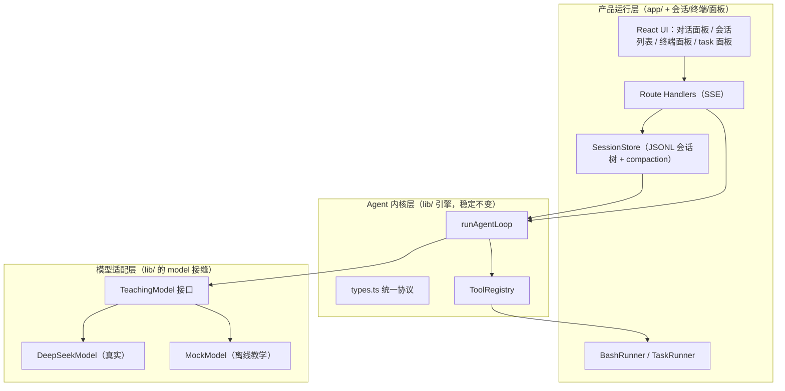

# Agent 学习项目：整体评估与长期方案

> 本文件是"做中学"的长期路线图。它基于两个参照系：
> 1. `E:\agents-read\how-pi-agent-works` —— 一套把 Pi 核心思想拆小再拼回去的教学路线（本仓库就是它的 Next.js 重写版）
> 2. `E:\agents-read\pi` —— 真实开源 coding agent（monorepo），三层架构的范本
>
> 目标不是复制 Pi，而是用 **Next.js + TypeScript** 写出一个保留 Pi 核心思想、可一步步长成的 Agent。

---

## 一、当前状态评估（结论先行）

**结论：单轮对话逻辑已经是一个"能跑通、分层干净"的初步框架，而且质量不错。** 你现在不是"从零开始"，而是"骨架已经立好，缺记忆和真实大脑"。

对照教学路线（`how-pi-agent-works/docs/project/build-00-roadmap.md`）的 7 步 + 可选第 8 步：

| 步骤 | 内容 | 当前状态 |
| --- | --- | --- |
| 1 | 共享协议 `types.ts` | ✅ 完成（3 消息类型 + 12 事件类型） |
| 2 | Loop + MockModel | ✅ 完成（`agent.ts` 完整 ReAct + 审批 + guardrail） |
| 3 | 工具系统 | ✅ 完成（`tools.ts` list/read/write_note + 路径越界防护） |
| 4 | **JSONL 会话存储 / 记忆** | ❌ **缺失**（这是最大缺口） |
| 5 | API（SSE 流式） | ✅ 完成（`app/api/chat/route.ts`） |
| 6 | React 前端 | ✅ 完成（`app/page.tsx` 聊天 + 事件时间线） |
| 7 | 调试与验收 | ⚠️ 部分（有 `.env.local` 开关，但无测试） |
| 8 | **接入真实模型** | ❌ **缺失**（只有 MockModel） |

### 已经做对的地方（值得保留）

1. **抽象接缝留对了**：`TeachingModel` 接口（`lib/model.ts`）就是"换大脑"的正确位置；`ToolRegistry`（`lib/tools.ts`）就是"加手脚"的正确位置。接真实模型、加终端、加文件工具，都不需要重写引擎。
2. **引擎不依赖消费者**：`runAgentLoop` 同时产出 `events`（拉取）和 `onEvent`（推送），事件协议已经按"真实流式模型"的形状设计好了。
3. **副作用边界清晰**：模型只能提 tool call，真正的文件读写发生在工具里，且有路径沙箱 + 审批钩子。

### 当前缺口（按重要度排序）

1. **无会话记忆** —— `route.ts` 每次 POST 都是 `messages: [userMessage]`，上一轮结果不进入下一轮上下文。多轮对话现在其实是"每次都重新开始"。
2. **无真实模型** —— MockModel 靠关键词匹配，无法真正推理和自由组合工具。
3. **无多会话** —— sessionId 硬编码，没有会话列表/切换/删除。
4. **文件操作不完整** —— 只有 list/read/写笔记，缺 write 任意文件 / edit / delete / grep / find。
5. **无终端** —— 没有执行命令的能力。
6. **无 task 面板** —— 没有任务/计划/子任务跟踪。
7. **`lib/agentDemo.ts` 是 `agent.ts` 的陈旧副本** —— 建议删除或改名归档，避免两处代码漂移。

---

## 二、四个直接问题的回答

### Q1：单轮对话逻辑是否已经算"初步框架"？
**是。** 而且不止"初步"——协议、引擎、工具、SSE、前端五层都已打通，是一个可以真实运行的闭环。你现在的起点已经高于很多初学者。

### Q2：需要下载 sse.js 或 openai SDK 吗？
**都不需要。**

- **sse.js**：不需要。你的项目已经手写了 SSE——服务端 `ReadableStream` + `text/event-stream`，客户端 `fetch` + `res.body.getReader()`。浏览器原生 `EventSource` 不支持 POST body，而你现在用的 `fetch` 方式已经绕开了这个限制。sse.js 反而多一层封装。
- **openai SDK**：不必须。DeepSeek 提供的是 **OpenAI 兼容** 接口，直接用 `fetch` 调 `https://api.deepseek.com/chat/completions` 即可。用 `fetch` 手写 adapter 反而更符合"做中学"——你能看清"provider 字段 → 统一协议"这一层转换，这正是 pi 的 `pi-ai` 层在做的事。等以后要接多家供应商、要 OAuth/缓存等高级能力时，再引入 SDK 或自己抽 `pi-ai` 那样的适配层。

### Q3：Next.js 能支撑这些功能吗？
**能，全部能。** 而且本地跑（localhost）几乎没有限制：

| 功能 | Next.js 方案 | 备注 |
| --- | --- | --- |
| 单/多会话、记忆 | Route Handler + 磁盘 JSONL / SQLite | 与 pi 的 JSONL 会话树一致 |
| 文件增删改查 | Node runtime 下 `node:fs` | 需 `export const runtime = "nodejs"` |
| 终端运行 | Node runtime 下 `node:child_process` + SSE 推流 | 需进程管理 + 安全白名单 |
| task 面板 | 前端组件 + 会话内持久化 | 与消息一起存进 session |
| 对话面板 | React + SSE（已通） | 继续加会话列表/分支树 |

**唯一的边界提醒**：交互式 TTY（如 `vim`、需要回显的 REPL）比"执行命令并流式返回输出"难得多。前期只做"跑一条命令 → 流式吐 stdout/stderr → 支持 Ctrl-C 终止"就够用了，不要一开始做完整 pty。

### Q4：现在就该换架构吗？
**不换。** 换架构（比如迁到 pi 的 Bun monorepo、或换成 Python + FastAPI）是"过早优化"：

- 你现在的抽象（`TeachingModel` / `ToolRegistry` / `runAgentLoop` / `types.ts`）**已经是 pi 三层思想的雏形**，换架构不会让你更接近目标，只会丢掉能跑的代码。
- Next.js 能一路支撑到你要的全部功能。真正需要"换/拆架构"的信号是：需要常驻后台的 agent 服务独立于 web 服务、要发 CLI 工具、要跨进程复用内核。到那时，把 `lib/` 抽成共享包（monorepo）即可——这也是 pi 的分层给出的答案，而不是推翻重来。

---

## 三、目标架构（高维度）

对齐 pi 的三层（`how-pi-agent-works/docs/concepts/pi-architecture.md`）：



- **模型适配层**：provider 差异关在这里。DeepSeek 的 OpenAI 兼容字段只在 `deepseekModel.ts` 里出现，`runAgentLoop` 永远只看 `AssistantMessage`。
- **Agent 内核层**：越稳定越小越好，现在已经是。以后几乎不改。
- **产品运行层**：会话、终端、task、面板这些"麻烦但关键"的事都长在这里，是可替换、可迭代的部分。

抓住这些边界（pi 的核心教训）：
1. **LLM 边界**：进模型前把 `AgentMessage` 转成 provider 格式，出模型后把 provider 事件转回 `AssistantMessage`。
2. **副作用边界**：模型不能直接读写文件/执行命令，只能提 tool call；副作用发生在工具里，可被审批和权限拦截。
3. **可观测性边界**：引擎只负责产出事件，不负责展示和存储；展示（Event Timeline）和落盘（轨迹 Trace）由外部消费者完成。详见下一节。

---

## 四、可观测性与轨迹（Trace）—— 调试与可视化的地基

### 4.1 为什么把"轨迹"当作一等公民

这个项目的核心会越来越依赖 AI 生成，失控是迟早的。失控时的第一反应不应该是"猜"，而是"读轨迹"。所以可观测性不是某个阶段的功能，而是贯穿全程的横切地基——**Event Timeline 是实时仪表盘，轨迹（Trace）是黑匣子**。

能不能"追责"到具体一步，取决于三件事：

1. 每个事件有**稳定序号 `seq`** 和**归属 `runId`**，顺序和归属不会被多会话、并发、重试搞乱。
2. 每个关键步骤有**快照 snapshot**（上下文 token、leafId、模型名、工具 I/O、错误堆栈）。
3. 轨迹**持久化且可回放**——离线也能重绘出同样的时间线，把"哪一步开始错"钉死。

### 4.2 三层视图（对应三个成熟度）

| 层 | 名字 | 时机 | 内容 | 现状 |
| --- | --- | --- | --- | --- |
| L1 | 实时事件流（Event Timeline） | run 进行中 | 边跑边推的 `AgentEvent` | ✅ 已有，**保留** |
| L2 | 持久轨迹（Trace / 黑匣子） | 每次 run 落盘 | `事件 + 快照`，JSONL 追加 | ❌ 新增 |
| L3 | 可视化回放（Trace Viewer） | 事后调试/展示 | 按 turn 分泳道、工具调用↔结果配对、token 用量、step 前进 | ❌ 新增 |

关键设计：**不动 `types.ts` 里现有的 `AgentEvent`**。轨迹是"事件 + 快照"的一层包装，引擎和前端不用大改，轨迹作为横切层叠加在现有五层之上。这符合"内核稳定、能力外挂"。

### 4.3 TraceEntry 数据模型（示意）

```ts
// 轨迹条目：包装 AgentEvent，额外带定位和快照信息
type TraceEntry = {
  seq: number;         // 全局递增，决定顺序
  runId: string;       // 本次 run 唯一 id（多会话/并发/重试不串）
  ts: number;          // 墙钟时间
  turn?: number;       // 属于第几轮
  event?: AgentEvent;  // 原有事件（复用 types.ts，不改）
  snapshot?: {         // 每步快照，用于回放/诊断
    contextTokens?: number;
    leafId?: string;
    model?: string;
    toolInput?: unknown;   // 工具入参快照
    toolOutput?: unknown;  // 工具输出快照
    errorStack?: string;
  };
};
```

### 4.4 轨迹要回答的调试问题

| 调试问题 | 轨迹里的答案 |
| --- | --- |
| 模型为什么调了这个工具？ | 该 turn 的 assistant 消息 + 工具入参快照 |
| 工具结果为什么是错的？ | 工具 I/O 快照 + 错误堆栈 |
| 上下文为什么爆了？ | 每步 `contextTokens` 快照 + 压缩事件 |
| 哪一步开始偏离预期？ | `seq` 定位 + 回放到该步 |
| 这次和上次有什么不同？ | 两个 `runId` 的轨迹 diff |

### 4.5 轨迹落在路线图的哪里

- **Phase 0**：给事件流补 `seq`/`runId`/`ts`，先落盘成最简 JSONL 轨迹（L2 打地基）。
- **Phase 1**：session store 本身就是轨迹的一部分（`id`/`parentId`/`leafId`），此时把"消息轨迹"和"事件轨迹"统一，实现回放。
- **Phase 6**：做 L3 Trace Viewer（参考 pi 的 `export-html`），把轨迹渲染成可读的调试视图。

参考源码：

- pi 事件/遥测：`pi/packages/agent/src/harness/events.ts`、`telemetry.ts`
- pi 会话 JSONL：`pi/packages/agent/src/harness/session/jsonl/{codec,storage,repo}.ts`
- pi 可视化导出：`pi/packages/coding-agent/src/core/export-html/{index,ansi-to-html,tool-renderer}.ts`

### 4.6 "失控防线"（针对 AI 开发核心会漂移）

| 防线 | 做法 |
| --- | --- |
| 协议即真相 | `types.ts` 是唯一事实源；改协议先改这里并全量 typecheck |
| 轨迹即黑匣子 | 出问题先读轨迹，不靠猜；能回放到"哪一步开始错" |
| 阶段提交 + 测试 | 每个 phase 一次 `git commit`；loop/sessionStore/tools 补单测 |
| 小内核 + 清晰边界 | 内核尽量不改，新能力加在适配层/产品层 |
| 每次 run 独立 runId | 多会话、并发、重试都不串轨迹 |

---

## 五、功能 → 模块 → 阶段 映射

| 你想做的功能 | 落在哪一层 | 对应阶段 |
| --- | --- | --- |
| 对接真实大模型 | 模型适配层 | **Phase 0（现在做）** |
| 单个会话（多轮记忆） | 产品层 SessionStore | Phase 1 |
| 会话记忆 / 压缩 | 产品层 compaction | Phase 1 |
| 多个会话 | 产品层 SessionManager + UI | Phase 2 |
| 文件增删改查 | 内核层 ToolRegistry 扩展 | Phase 3 |
| 终端运行 | 产品层 BashRunner | Phase 4 |
| 执行 task 面板 | 产品层 TaskRunner + UI | Phase 5 |
| 对话面板（完整） | 产品层 UI | Phase 6 |

---

## 六、分阶段路线图

> 每完成一个阶段就 `git commit`。Agent 项目的 bug 常跨协议/loop/工具/存储，阶段提交能帮你回到最近的可用点。

### Phase 0：接入 DeepSeek（真实大脑）—— 立即做
- 新建 `lib/deepseekModel.ts`，实现 `TeachingModel`。
- 用 `fetch` 调 OpenAI 兼容接口，先做**非流式**跑通，再做**流式**。
- 保留 MockModel：`.env.local` 里 `MOCK_MODE` 开关切换（你的 `.env.local.example` 已经预留了 `MOCK_MODE` / `DEEPSEEK_API_KEY`）。
- **轨迹打地基**：给事件流补 `seq`/`runId`/`ts`，落盘最简 JSONL 轨迹（L2，见第四节）。
- 具体实现要点见下一节。

### Phase 1：单个会话 + 记忆（把多轮变成真的）
- 移植教学版的 `JsonlSessionStore`（`how-pi-agent-works/examples/teaching-agent/src/server/agent/sessionStore.ts`）。
- 核心：JSONL 追加写 + `id`/`parentId`/`leafId` 会话树 + `buildContext()`（从 leaf 回溯）+ `compactIfNeeded()`（超窗口时用摘要替代旧消息）。
- 改 `route.ts`：不再每次新建 `[userMessage]`，而是 `appendMessage(user) → buildContext() → runAgentLoop → appendMessage(assistant/toolResult)`。
- 把"事件轨迹"与"会话消息轨迹"统一，实现离线回放（L2 完整）。

### Phase 2：多个会话
- 一个 session = 一个 JSONL 文件（或一张表）。`SessionManager` 负责 list/create/switch/rename/delete。
- 前端加左侧会话列表；切换会话 = 换 `leafId` 对应的文件。
- 这一步之后，"对话面板"就有了会话维度。

### Phase 3：文件增删改查
- 扩展 `ToolRegistry`：`read_file`（已有）、`write_file`（任意路径）、`edit_file`（旧串→新串替换，或 diff 式）、`delete_file`、`grep`、`find`、`list_files`（已有）。
- 保留并强化路径沙箱（`resolveInsideWorkspace`）。
- 对应 pi：`packages/agent/src/harness/tools/{read,write,edit,edit-diff,path-utils}.ts` + `packages/coding-agent/src/core/tools/{find,grep,ls}.ts`。

### Phase 4：终端运行
- 新增 `bash` 工具 + `BashRunner`（`node:child_process`）。
- 能力：执行命令 → 流式吐 stdout/stderr → 超时/终止（Ctrl-C）→ 退出码。
- 安全：命令白名单或确认机制、限制工作目录、禁止交互式 TTY（前期）。
- 对应 pi：`packages/coding-agent/src/core/bash-executor.ts` 和 `exec.ts`。
- 注意：`route.ts` 需 `export const runtime = "nodejs"`。

### Phase 5：task 面板
- 引入"任务/计划"概念：模型产出 todo list，前端渲染成可勾选面板；或你手动拆任务，agent 逐条执行。
- 后期可加 subagent 委派（把子任务交给子 agent 跑，汇总结果）。DSH 和 pi 的扩展系统都是这个方向。
- 先做最简单版：session 内持久化一个 todo 数组 + 面板展示，跑通再谈多 agent。

### Phase 6：对话面板打磨 + 架构加固
- UI 打磨（消息渲染、工具调用卡片、事件时间线、终端面板、task 面板整合成统一布局）。
- 补测试（`loop`、`sessionStore`、`tools` 的单元测试，教学版已有 `*.test.ts` 可参考）。
- 实现 L3 Trace Viewer：轨迹回放 / step 前进 / 工具调用↔结果配对（参考 pi 的 `export-html`）。
- 若出现"内核要被多个入口复用"的需求，把 `lib/` 抽成共享包（monorepo），这是"换架构"的正确时机。

---

## 七、Phase 0 实现要点（DeepSeek 适配器）

### 6.1 接口约定
- Base URL：`https://api.deepseek.com`（OpenAI 兼容；也接受 `/v1` 前缀）。
- 鉴权：`Authorization: Bearer <DEEPSEEK_API_KEY>`。
- 模型：`deepseek-chat`（支持工具调用）；`deepseek-reasoner` 是思考模式，历史上**不支持** function calling（以官方文档为准），所以做 agent 工具循环先用 `deepseek-chat`。

### 6.2 消息转换（进模型前）
把 `AgentMessage[]` 转成 OpenAI messages：
- `user` → `{ role: "user", content: text }`
- `assistant` → `{ role: "assistant", content, tool_calls: [...] }`（tool call 的 `arguments` 转成 JSON 字符串）
- `toolResult` → `{ role: "tool", tool_call_id, content }`（**`tool_call_id` 必须与上面的 tool call id 对齐**，丢了模型就不知道结果对应哪次调用）

### 6.3 响应转换（出模型后）
写 `toTeachingAssistantMessage()`（对应 `build-08-real-model.md`）：
- `content` → `{ type: "text", text }`（`null` 时不生成空文本块）
- `tool_calls[].function.arguments` → **先 `JSON.parse`**，失败时包装成 `isError` 的 tool result，别让进程崩
- `finish_reason === "tool_calls"` 或 `toolCalls.length > 0` → `stopReason: "toolUse"`

### 6.4 流式（关键坑）
- 请求带 `stream: true`，逐行读 SSE，`data: [DONE]` 结束。
- `delta.content` 逐段累积成文本；`delta.tool_calls[i].function.arguments` 也是分片 JSON 字符串，**必须按 index 累积，finish 后再 parse**，不能每段都 parse。
- 文本累积过程发 `message_update` 事件（前端 `applyFrame` 里现在的注释已经预留了这个位置）。

### 6.5 错误收尾
- HTTP 401/429/500 → `AssistantMessage.stopReason = "error"` + `errorMessage`。
- 网络断流 → 已累积文本作为 partial 发出，仍发 `message_end` 或错误事件。

> 完整对照参考：`E:\agents-read\how-pi-agent-works\docs\project\build-08-real-model.md`，以及可运行示例 `how-pi-agent-works/examples/demos/05-openai-compatible.ts`。

---

## 八、pi 源码阅读地图（做中学的下一步）

按"想理解什么"去读，不要通读整个 monorepo：

| 想理解的问题 | 读这些文件 |
| --- | --- |
| Agent Loop 怎么停 / 怎么循环 | `pi/packages/agent/src/agent-loop.ts`、`agent.ts` |
| 模型适配为什么单独一层 | `pi/packages/ai`（pi-ai 包） |
| JSONL 会话树 / 恢复上下文 | `pi/packages/agent/src/harness/session/*.ts`（`jsonl.ts`、`codec.ts`、`storage.ts`、`memory.ts`、`session.ts`、`context.ts`） |
| 上下文压缩 | `pi/packages/agent/src/harness/compaction/*.ts` |
| 内置工具（读/写/改/终端） | `pi/packages/agent/src/harness/tools/{bash,read,write,edit,edit-diff,path-utils}.ts`；`pi/packages/coding-agent/src/core/tools/{find,grep,ls}.ts` |
| 产品层会话管理 / 终端执行 | `pi/packages/coding-agent/src/core/{agent-session.ts,session-manager.ts,bash-executor.ts,exec.ts}` |
| 教学版对照（和本项目同源） | `how-pi-agent-works/examples/teaching-agent/` + `how-pi-agent-works/docs/` |

其他开源项目（`E:\agents-read` 下）：
- `how-pi-agent-works` —— 教学路线 + 每步文档，**当前阶段最该精读**。
- `pi` —— 真实产品，读上面列的文件，不要通读。
- `smolagents-main` —— HuggingFace 的 Python 轻量 agent 框架，可对照理解"工具/多步/代码执行"的另一种取舍。
- `deepseek-harness` —— 即 DSH 本身（我正在运行的 harness），是"会话/终端/task 面板/子 agent"完整落地的大型参考，等做 Phase 4/5 时再看它的相应模块。

---

## 九、原则与"不要做的事"

（摘自教学路线 `build-00-roadmap.md` 的"暂缓事项"，加上 pi 的教训）

| 现在不要做 | 原因 |
| --- | --- |
| 同时接多家模型 | 先跑通 DeepSeek，provider 差异留到需要时再抽适配层 |
| 完整权限审批系统 | 先用路径沙箱 + 工具白名单打底 |
| 漂亮动画 / 复杂 UI | 先让事件时间线和消息准确，视觉最后升级 |
| 交互式 TTY 终端 | 先做"执行命令 → 流式输出 → 终止" |
| 一步到位做多 agent | 先把单 agent + 会话 + 工具跑扎实 |

**核心心法**：模型会变、工具会变、UI 会变，但 Agent Loop 相对稳定。让"稳定的内核"和"不稳定的外部"分离，你后面每一步都是在往对的位置加东西，而不是推倒重来。

---

## 十、界面设计语言（Phase 6 视觉部分，提前落地）

### 10.1 方向：走纸记录仪，不是聊天软件

这一页的工作只有一件：**让一次 run 变得可读**。所以视觉语言不取自 IM，而取自本文件自己用的那些词 —— 黑匣子、仪表盘、泳道、回放、seq。对应到实验室的走纸记录仪：

| 现实中的物件 | 页面上的角色 |
| --- | --- |
| 走纸（点阵纸） | 底色与轨迹区的纸纹，`background-attachment: local` 让纸随内容滚动 |
| 多支笔（每通道一色） | 一种事件通道 = 一种墨色，颜色只表示语义，不做装饰 |
| 记录条 | 轨迹区的时间脊线：轮次开带、输出成笔、工具成段 |
| 面板刻字 | 等宽字体承担全部标签与读数（它同时是本页的标题字） |

明度分三层，信息层级靠明度而非边框：**铭牌 `--plate`（最亮）> 走纸 `--paper`（阅读面）> 记录仪 `--recorder`（最暗）**。

### 10.2 令牌（`app/globals.css` 顶部即真相）

- 纸墨：`--plate #fbfbf8`、`--paper #e9eae4`、`--recorder #e0e1d9`、`--ink #1d2127`
- 五支笔：`--pen-user #2f4b99`、`--pen-model #0b6857`、`--pen-tool #9c2b6e`、`--pen-signal #b0741b`、`--pen-error #a32d1f`
- 字体：`Azeret Mono`（标签/读数/标题）+ `Instrument Sans`（正文，中文交给系统 PingFang SC / 微软雅黑）
- 两条硬约束：① 承载信息的文字对比度 ≥ 4.5:1（所以 `--ink-faint` 只用于装饰，amber 另留一个 `--pen-signal-ink` 文字版）；② 含中文的等宽标签不小于 11px、字距不超过 0.1em —— 汉字在同样字号下比拉丁字母更需要空间。

### 10.3 轨迹区做了三次聚合（`foldEvents`）

实测一次"列出工作区文件"的真实 run：**105 条 `message_update` + 12 条其它事件**。一行一条事件的画法会被 delta 淹没，所以前端按语义聚合，105 条塌成 2 行：

| 原始事件 | 记录行 | 为什么 |
| --- | --- | --- |
| `turn_start` | ◆ 轮次带 `T1` / `T2` | 轮次是真实序列，序号在这里是信息不是装饰 |
| 连续 `message_update` | ● 一笔墨迹，长度随字数 | 流式输出在物理上就是一支笔连续画一条线 |
| `tool_execution_start` + `end` | ■ 一段跨度，条长 = 真实耗时 | 工具执行有时长；配对靠 `toolCallId` |
| `tool_permission`（非 allow） | 信号行 | 放行是默认路径，只记真正的干预 |

配套的两个小决定：
- **前端自己给事件盖时间戳**（`ObservedEvent = { seq, at, event }`）。协议里 `AgentEvent` 没有 ts（4.3 节说 Phase 0 才补），前端作为"观测者"盖到达时间，不改 `types.ts` 就能画出耗时与用时。等 Phase 0 的 `TraceEntry` 落地，这一层可以直接换成服务端的 `seq`/`ts`。
- **工具结果默认折叠**（超过 12 行），长文件不该淹掉对话。

### 10.4 仍然遵守"暂缓事项"

第九节写着"漂亮动画 / 复杂 UI"暂缓。这次只做了排版与信息结构，动效只保留三处、且都表示状态而非装饰：状态灯脉冲、流式笔尖、工具运行中的条。`prefers-reduced-motion` 下全部关闭。
