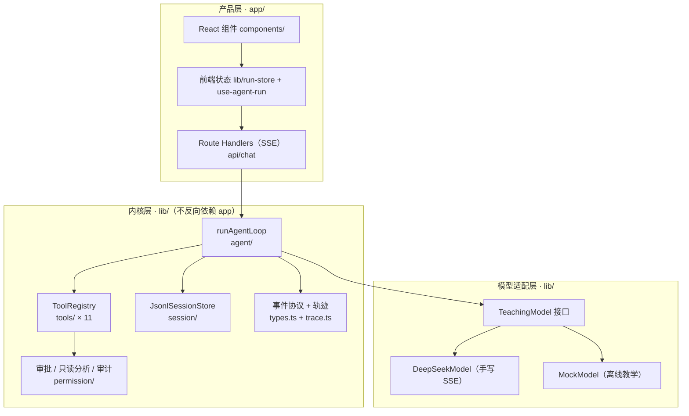

# agent-learn

> **一个从零手写的 Agent Harness。**
> 没有 LangChain，没有 agent 框架，没有 LLM SDK —— 唯一的"外来大脑"是一次手写的 `fetch`。

`agent-learn` 是一个用 **Next.js + TypeScript** 实现的 agent 运行环境（harness）：它能把一个大模型变成能读写文件、执行命令、管理任务、并在失控前被拦住的"干活的程序"。

项目起源于"**做中学**"：读透 9 个成熟开源 agent 项目（pi / DeepSeek Harness / codex / OpenCode / Reasonix …），把它们的架构共识装进一个**能完整读懂**的小项目里。所以它同时是两样东西——**一个能跑的产品**，和**一份可验证的学习记录**。

---

## 为什么值得一看

**① 依赖列表里没有 agent 框架**

```jsonc
"dependencies": {
  "next": "16.3.0", "react": "19.2.8", "react-dom": "19.2.8",
  "react-markdown": "^10.1.0", "remark-gfm": "^4.0.1",
  "rehype-highlight": "^7.0.2", "highlight.js": "^11.12.0",
  "zustand": "^5.0.15"          // 唯一的非 UI 依赖：前端状态
}
```

没有 `openai`、没有 `@langchain/*`、没有 `@ai-sdk/*`。
**流式调用、SSE 分片解析、tool_call 参数累积、重试与错误收尾——全部手写。** 模型适配层（`lib/deepseekModel/`）是唯一知道"DeepSeek 长什么样"的地方，引擎永远只看到统一的 `AssistantMessage`。

**② 引擎是纯净的（这条是硬约束）**

`lib/agent/` 里的循环**不认识任何业务**：它不知道什么是 todo、什么是提问、什么是审批。业务能力通过**工厂参数 + 闭包**在组装期"烙"进工具（`createTodoTool(hooks)`），引擎只传运行时参数（`signal` / `onChunk`）。
→ 结果：加功能永远在外层，内核几乎不动。这条纪律有专门的**红线流程**（改引擎必须先对照参考实现 → 展示差异 → 人工确认）。

**③ 上下文压缩是真的摘要，不是截断**

上下文超限时，不是简单丢弃旧消息，而是**调模型生成结构化摘要**（`## Goal / Progress / Key Decisions / Next Steps / Critical Context`），并走 pi 的三步流程：`prepare`（纯计算切点）→ `generateSummary`（调模型）→ `commit`（落盘）。含**增量摘要**（把上次摘要喂回去做 UPDATE 而非重写）、经济性检查（太小就不压）、失败降级。

**④ 治理与可观测是一等公民**

审批不是散落的 `if`：只读命令静态分析后**直接放行**，写操作走**分级模式**（suggest / bypass / never）+ 会话/持久记忆 + **JSONL 审计日志**（asked/decided 成对校验）。
引擎只负责**产出事件**，展示与落盘由外部消费者完成——所以轨迹能落盘成 `.traces/*.jsonl` 供事后复盘。

**⑤ 多会话并行 run**

会话级 run 所有权（`Map<sessionId, RunState>`）：切换会话**不会中断正在跑的 run**，A 在后台跑、UI 切到 B、回来还能接上实时流。前端用 zustand + selector 订阅，保证 A 的每帧更新不触发 B 重渲染。

**⑥ 全量单测覆盖内核与适配层**

覆盖引擎循环（含工具报错不崩循环、block → isError 进上下文、maxTurns 护栏）、模型适配（SSE 坏 JSON、tool_call_id 配对、流式参数分片累积）、会话日志语义（线性追加 + 压缩折叠）、审批决策、路径沙箱……**FakeModel 测试基建**支持断言"模型第 N 轮看到了什么"。

---

## 架构



**三层边界**（对齐 pi 的分层纪律）：

| 层 | 职责 | 不变量 |
|---|---|---|
| **内核层** `lib/` | 循环 / 协议 / 工具注册表 / 会话存储 | 不依赖任何上层；不认识业务 |
| **模型适配层** `lib/deepseekModel/` | provider 差异全部关在这里 | `runAgentLoop` 只看到 `AssistantMessage` |
| **产品层** `app/` | 路由 / 会话管理 / UI / 前端状态 | 可替换、可迭代 |

**七个接缝**（能力生长点，见 `ARCHITECTURE.md`）：模型 / 工具 / 执行 / 记忆 / 观测 / 审批 / UI。

---

## 快速开始

```bash
pnpm install

# 最小启动：Mock 模式，不需要 API Key，可离线跑通全链路
cp .env.local.example .env.local     # 默认 MOCK_MODE=true
pnpm dev                              # → http://localhost:3000
```

接真实模型：把 `.env.local` 改成 `MOCK_MODE=false` 并填 `DEEPSEEK_API_KEY`。

```bash
pnpm test        # vitest 全量单测
pnpm build       # 生产构建
```

**环境变量**（全部可选，见 `.env.local.example`）：

| 变量 | 作用 |
|---|---|
| `MOCK_MODE` | `true` = 用 MockModel 离线跑（教学 / 演示） |
| `DEEPSEEK_API_KEY` | 真实模型的 Key |
| `DEEPSEEK_BASE_URL` / `DEEPSEEK_MODEL` | 覆盖默认端点与模型 |
| `CONTEXT_WINDOW` / `RESERVE_TOKENS` / `MAX_TURNS` … | 覆盖内核参数（配置唯一入口是 `lib/config/`） |

---

## 功能一览

| 能力 | 位置 |
|---|---|
| **Agent 循环**（ReAct：思考 → 工具 → 观察） | `lib/agent/` |
| **11 个内置工具**：`list` `read` `write` `write-note` `edit` `delete` `grep` `find` `bash` `todo_write` `ask_user_question` | `lib/tools/`（一工具一目录） |
| **路径沙箱**：所有文件工具经 `resolveInsideWorkspace` 圈定工作区 | `lib/tools/path-utils.ts` |
| **终端执行**：流式输出 + 两级终止 + run 级取消（Windows 编码已根治） | `lib/tools/bash/bash-runner.ts` |
| **审批治理**：只读放行 / 分级模式 / 会话记忆 / JSONL 审计日志 | `lib/permission/` |
| **会话与记忆**：JSONL 线性日志 + `buildContext()` 顺序重建 + LLM 结构化摘要压缩 | `lib/session/` |
| **多会话并行 run**（切会话不中断） | `app/lib/run-store.ts` |
| **事件与轨迹**：引擎产事件 → SSE 推前端 → `.traces/*.jsonl` 落盘 | `lib/types.ts` · `lib/trace.ts` |
| **斜杠命令**：`/compact` `/clear` `/export` + 上下文占用圆环 | `lib/commands/` · `app/components/command-menu/` |
| **任务面板**：`todo_write` 整表替换（幂等），面板只读展示 | `app/components/task-panel/` |
| **仓库更新面板**：`/repos` 页面，git 检查 + LLM 增量总结 | `app/api/repos/` · `app/repos/` |

---

## 目录结构

```
lib/                        ← 内核（稳定，几乎不改）
  agent/                    ← 引擎循环（红线：改动需人工确认）
  tools/                    ← 一工具一目录：11 个工具 + 注册表
  session/                  ← JSONL 线性日志 + 压缩三步
  permission/               ← 只读分析 / 审批记忆 / 审计日志
  commands/                 ← 斜杠命令注册表（一命令一目录）
  summarize/  config/       ← 结构化摘要 / 唯一配置入口
  deepseekModel/  mockModel.ts  model.ts   ← 模型适配层
  types.ts  trace.ts  index.ts             ← 协议 / 轨迹 / 内核门面

app/                        ← 产品层
  api/chat/                 ← SSE 主路由 + _pipeline 编排（审批/压缩/命令/模型选择）
  api/sessions/  api/repos/
  components/               ← 12 个业务组件 + ui/ 原语
  lib/                      ← 前端状态（run-store / run-fold / use-agent-run）
  services/                 ← 接口函数层

doc/                        ← 设计文档
  plan/                     ← 每个功能的施工详案 + 决策记录
  开源项目导航手册/          ← 9 个参考项目的"想学什么 → 去哪找"
```

---

## 设计取舍

> 这部分是项目里**最有讨论价值**的地方——每个决策都有"不这么做会怎样"。

**为什么不用 LangChain？**
因为要学的是**机制**。框架会把循环、上下文管理、工具协议都藏起来，而这三样恰恰是 agent 的全部难点。手写一遍之后，再回头看任何框架都能定位到它在哪一层做了什么。

**为什么引擎必须"纯净"？**
最初业务回调（todo、提问）是作为引擎参数传进去的，导致引擎逐渐认识了一堆业务概念。改造后走"工厂参数 + 闭包烙"：业务在**组装期**注入工具，引擎只搬运运行时参数。收益是加功能不用碰内核——而内核是全项目最贵的代码。

**为什么会话存储用 JSONL 而不是数据库？**
"内存 = 磁盘"：上下文永远从会话文件重建（`buildContext()`），进程重启不丢状态。压缩只追加不删原文——被压的消息仍在文件里，随时可查。

> **一次被砍掉的"预挖"**：这里原本是一棵**会话树**（`id` / `parentId` + `switchLeaf` 支持分支）。审计发现它是**空壳**——`switchLeaf` 生产代码零调用、`leafId` 落盘从不记录、而加载逻辑又假设"最后一行就是叶子"，与树结构自相矛盾。实测 39/39 个会话文件都是干净的线性链 → **砍成线性日志**：少 37 行，而且读的结果**只取决于文件内容**（不再取决于一个永远等于"最后一条"的内存指针）。详见 [`doc/plan/session-compaction-refactor.md`](doc/plan/session-compaction-refactor.md) §7.5。

**审批为什么先做"只读放行"而不是"更漂亮的弹框"？**
弹框的体验问题是表象，真正的成本在**每次 `ls` 都要人点一下**。所以先做命令静态分析：只读命令直接放行，把人的注意力留给真正危险的操作。这也是"治理层收益最高、改动最小"的典型例子。

---

## 项目状态与路线

**已完成**：真实模型接入 · 单/多会话 · 11 个工具 + 路径沙箱 · 终端执行 · 任务面板 · 审批治理（只读放行 / 分级 / 审计） · LLM 结构化摘要压缩 · 引擎与适配层测试补齐 · 多会话并行 run · 斜杠命令 · 仓库更新面板。

**在做**：可观测性回放（Trace Viewer） · 可靠性三件套（重试退避 / 会话级运行锁 / 崩溃会话自愈） · MCP 外部工具接入 · 沙箱（含网络维度）。

完整路线图见 [`PLAN.md`](PLAN.md)，架构设计与接缝说明见 [`ARCHITECTURE.md`](ARCHITECTURE.md)。

---

## 参考

架构不是发明的，是**共识**。本项目对照了 9 个成熟开源项目与一篇学术综述：

| 参考 | 拿走了什么 |
|---|---|
| **pi** | 三层分层纪律、压缩三步（prepare → summarize → commit）、引擎纯净性 |
| **DeepSeek Harness** | 压缩的审计字段与上下文压力指标、一能力一模块的粒度 |
| **codex** | 审批引擎（execpolicy）、沙箱分层、轨迹记录 |
| **Reasonix / CodeWhale** | 命令静态分析审批、审批分级与日志、面板交互 |
| **smolagents / opencode / langchainjs** | 轻量模块切分、终端 agent 完整形态、模型适配对照 |
| **《Agent Harness Engineering: A Survey》** | ETCLOVG 七层分类法（执行 / 工具 / 上下文 / 生命周期 / 可观测 / 验证 / 治理） |

> 综述的一个实证结论是这个项目的方法论依据：**只改进 harness（不动模型），就能让基准成绩提升一个数量级**——执行环境比模型本身更能决定现实世界的可靠性。

## License

<!-- TODO(你)：确认开源许可证后再填。开放前需要先剥离 .env.local、确认无内部信息。 -->
