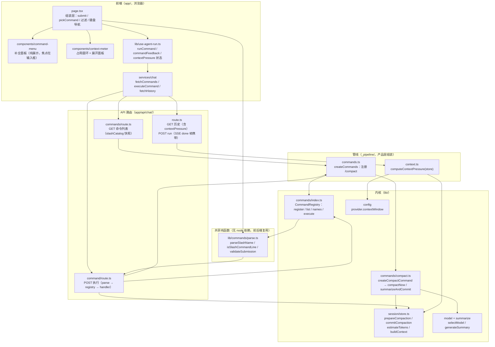
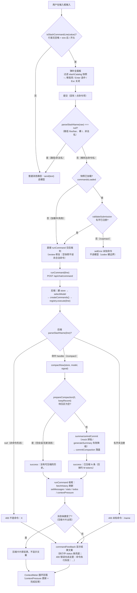

# doc/plan/c13-slash-commands —— C13 斜杠命令面板（立项补记）

> 来源：PLAN.md "C13 斜杠命令面板·立项补记"段（2026-08-26 PLAN 拆解时移入 doc/plan/）。**⏳ 排队（用户拍板"一步到位"，未开工）**——等 B2 ③ 收尾后做，/compact 手动压缩口子等它落地。

> 触发：用户指出成熟 agent 都有自带斜杠命令（DeepSeek CLI 自带压缩/导出/模型选择/skill 列表；pi `BUILTIN_SLASH_COMMANDS` 22 个内置命令；Reasonix `.reasonix/commands/*.md` 命令即文件；codex `/compact /review`）。我们 PLAN 无此规划——缺口。**决定：直接做命令面板，不做"独立 API + 按钮"中间过渡**（有现成成熟参考项）。

**pi 机制精读结论**（`core/slash-commands.ts` + `interactive-mode.ts:675-773`）：
- **命令模型**：`SlashCommandInfo { name, description, source: "extension"|"prompt"|"skill", sourceInfo }`——命令有来源分类
- **内置命令表**：`BUILTIN_SLASH_COMMANDS`（settings/model/tree/thinking/export/import/compact/…22 个）
- **聚合**：内置 + 提示词模板 + 扩展命令 + 技能（`skill:xxx`）全部转成 SlashCommand 进**同一个自动补全**——命令 = 统一功能入口抽象
- **参数补全**：每个命令可挂 `getArgumentCompletions`（如 /model 补全 `provider/model`、/thinking 补全级别）
- **执行**：斜杠命令在输入时识别（不走模型），各走各的处理逻辑

**我们第一批命令**（对齐 DeepSeek 自带那几项）：
- `/compact`——手动压缩当前会话（**核心**：接 B2 ③ 的 prepare→generate→commit 三步，复用共享函数）
- `/model`——模型选择/展示（config 驱动；切换接口按 selectModel 扩展）
- `/skills`——技能列表（C8 未做，先占位展示"规划中"或列 PLAN）
- `/export`——导出当前会话（下载 JSONL，简单）

**设计**：
- **`lib/commands/` 注册表**：`SlashCommand { name, description, argumentHint?, run(args, ctx) }`——同 ToolRegistry 思路，一命令一文件
- **后端**：`app/api/chat/compact/route.ts`（手动压缩端点，返回 { ok, summary, tokensBefore }）；命令执行 = 调对应 API
- **前端**：输入框识别 `/` 开头 → 命令补全下拉（name + description）→ 选中执行（不走模型，直接调 API）；结果作为系统消息展示
- **验收**：输入 `/` 弹命令列表 → 选 /compact → 会话被压缩 → 前端出现压缩卡片（compactionSummary 渲染已有）；/export 下载会话文件；/model 展示当前模型

**关联**：`compactSession` 共享函数（从 route.ts 抽出的三步）同时服务自动路径（run 结束后）和 /compact 命令——对齐 DSH 的 compactIfNeeded / compactNow 共享底层。

---

## 补记 1：综合调研定案（2026-08-27）

> **触发**：用户要求验证"方案是否综合了多个成熟 agent"→ 精读 codex 命令源码（`codex-rs/tui/src/bottom_pane/`）+ 复核 DSH（node_modules 排除后全文检索）。**结论：原方案方向不变**（`lib/commands/` 注册表 + 命令走 API），但补入 codex 的五个成熟元素；DSH 无命令面板实现，"参考 DSH"的表述为误记，更正。

### codex 机制精读（比 pi 更完整的参考系）

**① 提交验证（`slash_input.rs:35-87`）——`SubmissionValidation { Valid, UnknownCommand(String) }`**
输入以 `/` 开头但名字不在注册表 → 提交时报 UnknownCommand（可给"输入 /help 查看命令"提示），**不是静默当普通消息发**。这是"命令是命令、消息是消息"的硬边界，我们也要：命令拼错必须报错，不能让模型收到 `/copmact` 当正文。
- 例外：`input_starts_with_space`（行首空格）或 name 含 `/`（路径）→ 不拦截——避免粘贴的代码/路径被误判命令。

**② 行首/首行检测（`slash_input.rs:89-127`）**
- `bare_command`：只取**第一行**解析（`text.lines().next()`），rest 为空 → 裸命令
- `should_parse_on_dequeue`：`!text.starts_with(' ') && text.trim().startsWith('/')`——**行首无空格 + trim 后以 / 开头**才在出队时按命令解析
- 结论：命令识别只看首行、不看多行；开头空格是退出符（不是行首）

**③ `parse_slash_name` 纯函数（`prompt_args.rs`）——seam 原型**
`line → Option<(name, rest, rest_offset)>`：strip `/` → 取到首个空白前的 name → rest = trim_start 后的参数 → **rest_offset = 参数在原文中的偏移**（光标/选区编辑用）。无状态、可单测——这就是我们 `lib/commands/parse.ts` 要抄的形状。

**④ 行内参数（inline_args + rest_offset）**
`InlineCommand { command, rest, rest_offset }`：命令声明 `supports_inline_args()` 才接受行内参数（`/model gpt-4o` 是行内；`/skills` 不支持行内，裸执行）。区分"带参数命令"和"不带参数命令"是命令模型的一等概念，不是字符串尾处理。

**⑤ 别名与条件显示**
- 别名：`slash_command.rs` 用 strum 标注，如 `#[strum(to_string = "pwd", serialize = "cwd")]`——**主名进 popup 列表、别名只认不显**（`ALIAS_COMMANDS = [Quit, Btw]` 注释：每个唯一动作在列表只出现一次）；`/quit=/exit`、`/stop=/clean`
- 条件显示：`BuiltinCommandFlags`（slash_commands.rs）门控——Plan 在 collaboration modes 关闭时隐藏、Usage 在 token activity 关闭时隐藏、ElevateSandbox 在 Windows 降级沙箱才显示；**popup 与 composer 共享同一份过滤**（`commands_for_input`，command_popup.rs 注释 "Keep built-in availability in sync with the composer"）
- 对我们的启示：我们暂时没有 Plan/Apps/Usage 这类功能开关，但**命令模型里保留 `available: (ctx) => boolean` 字段**（默认 true），C 阶段功能上线时按开关隐藏，不重构。

### DSH 复核结论（更正误记）

DSH（deepseek-harness）**无斜杠命令面板实现**：node_modules 排除后全仓检索 `slash`/命令相关零命中。原 08-26 记"参考 DSH"为误记。DSH 的组合机制是 cordis DI + slot 注册表（`packages/client/ui-conversation/src/client/apply.ts`）：组件之间零 import，靠 `slots.register` 占座 + `renderSlot` 求值 + `sessions.provide` 能力分发 + `declare module` 类型合并。**启示**：DSH 的 slot 模式是"30+ 包并行、谁都能往别人 UI 塞东西"的组织形态；我们单仓库无此需求，`lib/commands/` 注册表 Map（同 ToolRegistry）就是对的——抽象服务于组织形态，不是越抽象越好。

### seam 更新（B8 ① 先写单测的纯函数层）

`lib/commands/parse.ts`（纯函数，无依赖，单测友好）：
- `parseSlashName(line): { name, rest, restOffset } | null`——抄 codex `parse_slash_name`
- `validateSubmission(text, registry): { ok: true } | { ok: false, name }`——抄 `SubmissionValidation`（行首空格/含 / 不拦截）
- `isSlashCommandLine(text): boolean`——`!starts_with(' ') && trim().startsWith('/')`（首行语义）

`lib/commands/index.ts`（注册表）：
- `SlashCommand { name, description, aliases?, supportsInlineArgs?, available?(ctx), run(args, ctx) }`——合并 pi 的 source 分类与 codex 的 alias/inline/flags

### 决策问题（等用户拍板）

- **Q1 注册表位置**：A（推荐）`lib/commands/` 独立目录（同 `lib/tools/`，命令=工具家族的第二成员）；B `_pipeline/commands.ts` 塞管线旁（不推荐：命令是产品功能不是管线部件）
- **Q2 第一批范围**：A（推荐）先只做 `/compact` 一个，走通"parse → 注册 → popup → 执行 → 结果卡片"全链路再批量；B 一次性 `/compact /model /skills /export` 四个（参考项齐但联调面大）
- **Q3 命令分类**：`/model /skills` 纯前端（读 config / 展示列表，不走 API）；`/compact /export` 后端（调 API）。分类影响执行器接口：`run` 是同步（前端）还是 async（后端）——建议统一 async + `ctx` 携带 `api` 通道，前端命令不填即可

---

## 补记 2：DSH 复核——原"DSH 无命令面板"结论是错的，DSH 有完整命令系统（2026-09-01）

> **触发**：用户对 08-27 的 DSH 复核结论存疑（"再搜集一下 dsh"），要求按参考项目文档路径复核而非全局搜索。**结论：08-27 误记，更正。** DSH 的命令系统在 `packages/interaction/commands/`（包名 `@deepseek-ai/dsh-commands`），08-27 只搜了顶层包名与 "slash" 关键词，没进 `interaction` 子包——教训：**搜参考项目先读导航手册的功能→位置映射表，按包名进对应包，不要全局关键词扫**。

### DSH 命令系统精读（`packages/interaction/commands/src/index.ts` + `types.ts`，458 + 110 行）

**① `parseCommand(line)` 纯函数**（index.ts:117-124）——seam 同款，比 codex `parse_slash_name` 更简：
```ts
const COMMAND_NAME = /^[a-z][a-z0-9_-]*$/u  // 名字=小写字母开头+字母数字下划线连字符
const match = /^\/([a-z][a-z0-9_-]*)(?=$|[\t\n\r ])/u.exec(line)
// 返回 { name, rawInput }，rawInput = 命令名后的原文（含分隔空白）；不匹配返回 undefined
```
行首 `/` + 合法名 + **必须以行尾或空白分隔**（`(?=$|[\t\n\r ])`）——`/foo/bar` 不会误命中 `/foo`，跟 codex 的"name 含 / 不拦截"同一层防御。

**② 命令模型**（index.ts:55-70 + types.ts:13-57）：
- `CommandDefinition { name, description, input?: { hint, images? }, recordInput?, handler }`——**没有别名、没有 available 门控、没有参数补全，只有 input.hint 占位提示**（比 pi 简、比 codex 简；"能力差距=不做就是设计决策"）
- `CommandInvocation { commandId, agent, rawInput, attachments, signal }`——**结构化 invocation 而非裸参数串**，含取消信号（handler 可响应 abort）
- `CommandResult = { kind:'success', text?, sourceEventSeq? } | { kind:'error', text }`——success 可带 `sourceEventSeq` 指向"更权威的域事件"，UI 据此渲染富卡片（command-compact 就返回 `sourceEventSeq: result.summarySeq`）

**③ 注册表 `CommandRuntime`**（index.ts:251-456）：
- `register()` 校验 **fail-loud**：name 正则 / description 非空 / handler 是函数 / input.hint 字符串——注册即校验，坏定义到不了 UI 协议层
- `list(agent)`（按名排序的 descriptors，发现 UI 用）/ `find(agent, name)` / `execute(agent, line, images, signal)`
- **execute 生命周期日志**：`command/run` → handler → `command/done`，`commandId` 配对，**镜像 `tool/call`↔`tool/result` 配对**（types.ts 注释明说）；语法错/未知命令返回 `undefined`，**不记日志、不进 handler**（同 codex SubmissionValidation 硬边界，只是失败形态从"抛错"换成"返回 undefined 由调用方决定 UI"）
- **作用域**：`ScopedLayers` 全局 + per-agent 影子（per-agent 变体 = 在 `agent.ctx` 下注册，不是别名机制——DSH 用作用域替代了 codex 的 alias）

**④ 使用面**：6 个生产包注册命令——`/compact`（command-compact）、`/export`（session-log-export）、`/plan-mode`（plan-mode）、`/feedback`（command-feedback）、`/goal`（command-goal）、permission-presets 的 per-agent 命令。**通用机制实锤，不是一次性代码。**

**⑤ `/export` 的门面模式**（session-log-export/src/index.ts:74-95）——**我们 C13 /export 的样板**：handler 只校验参数返回 `{ kind:'success', text:'Session log download requested.' }`，实际下载走**独立的 GET route**（`?sessionId=` 查询参数）。命令不产文件，文件走 HTTP 层（可鉴权）——职责分离。

### Reasonix 机制精读（`internal/command/` + `internal/bot/gateway.go` + `internal/cli/chat_tui.go`）

**① 三层命令体系**：
- **内置命令 = 硬编码分发**（gateway.go:1647-1704）：`/queue /projects /use /model /sessions /attach /search /desktop /status /help`；`slashCommandVerb(text) = strings.Fields(strings.TrimSpace(text))[0]` 取首词小写比较；带角色门控（`requireCommandRole(…, "admin")`）
- **自定义命令 = 文件即命令**（command.go）：命令 = `.reasonix/commands/*.md`，**新增命令 = 新建 .md 文件，零代码**；名字从文件路径派生（`git/commit.md` → `/git:commit` 子目录=命名空间）；插件命令 `<plugin>:<name>` 限定名 + 短名兼容别名（`Hidden` 不显示）；后加载覆盖先加载；按名排序
- **`slash_command` 工具**（slashtool.go）：自定义命令 + skills 统一成 `SlashEntry` 暴露给模型——**模型可主动调用**，返回展开后的提示词文本，模型本轮内按指令行动；空参调用 = 列出命令目录；只读工具

**② 命令 = 提示词模板宏**（command.go:43-62）——与 pi/codex/DSH 的**本质世界观差异**：
```go
var substRe = regexp.MustCompile(`\$(\$|ARGUMENTS|[0-9]+)`)
// Render(args)：$ARGUMENTS = 全部参数空格连接；$1..$N = 按位取参（缺位为空）；$$ = 字面 $
```
frontmatter 元数据（`description` / `argument-hint`）+ body 模板；**执行路径 = TUI 识别 `/name` → 展开模板 → 展开结果作为消息发给模型**。命令只是文本宏，最终还是要模型干活——而 pi/codex/DSH 的命令是**直接执行动作、完全不进模型**。

**③ 值得借鉴/不抄的理由**：
- **不抄模板宏形态**：我们的命令是 `/compact`（需要后端压缩动作）、`/export`（下载），不是"常用提示词快捷方式"；第一批都是内置动作，注册表 Map 够用。但**知道这个形态存在**：将来若做"自定义命令"（用户写 .md 定义提示词），照抄 frontmatter + $ARGUMENTS 引擎即可
- **不抄 slash_command 工具**：那是"模型侧复用命令目录"，我们命令由 UI 触发，不需要模型自己调命令
- **借鉴 `slashCatalog` 补全快照**（chat_tui.go:359-363）：命令列表是不可变快照，只在重建时刷新（模型切换/技能重扫），**普通按键只过滤快照不做全量重查**——我们前端 popup 的命令列表是静态的，照这个思路
- **名字允许 `:` 命名空间**（`git:commit`）：第一批扁平名字用不上，但注册表 name 校验别禁止 `:`

### 四参考系横向对比（定稿依据）

| 维度 | pi | codex | DSH | Reasonix | 我们的选择 |
|---|---|---|---|---|---|
| 解析 | 表驱动 | `parse_slash_name` 纯函数 + 首行检测 | `parseCommand` 正则（含分隔符断言） | `slashCommandVerb` 取首词（内置）/ 文件路径派生（自定义） | 抄 DSH/codex 同源形状：`parse.ts` 纯函数 |
| 命令模型 | source 分类 + 参数补全 | alias + supports_inline_args + flags 门控 | definition + input.hint（无别名/无门控） | frontmatter + 模板 body（文件即命令） | 取 codex：aliases + supportsInlineArgs + available（保留，默认 true） |
| 执行语义 | 各走各逻辑 | InlineCommand 分发 | handler 执行动作，**不进模型** | 展开模板**当消息进模型** | **动作型**（DSH 型）：直接执行不进模型 |
| 执行签名 | — | InlineCommand 分发 | `handler(invocation)` 结构化 + signal | Render(args) 模板替换 | **invocation 风格**（含取消信号） |
| 结果 | — | — | `{kind, text, sourceEventSeq}` | 展开文本即结果 | **抄 DSH**：success 可带 sourceEventSeq，/compact 返回 summarySeq 对接压缩卡片 |
| 硬边界 | — | SubmissionValidation 拒绝进模型 | 未知命令 execute 返回 undefined | 未知命令进模型当普通消息（无边界） | 未知命令报错不进模型（同 codex） |
| 生命周期 | — | — | command/run↔command/done 配对日志 | — | 决策点：我们会话无事件模型，先记 console/检查点，不引入事件系统 |
| 前端发现 | CombinedAutocompleteProvider 聚合补全 | command_popup 与 composer 共享过滤 | `list()` @Remote + commands/change 通知 | slashCatalog 不可变快照，按键只过滤 | popup 复用 ui/menu + **slashCatalog 快照思路**（静态列表只过滤不重查） |
| 参数补全 | getArgumentCompletions | — | hint-only | argument-hint frontmatter | 决策点：第一批 hint-only（对齐 DSH 简单侧），补全留接口 |

### seam 更新（吸收 DSH 后的定稿）

`lib/commands/parse.ts`（纯函数）：
- `parseSlashName(line): { name, rest, restOffset } | null`——codex 形状 + DSH 分隔符断言
- `validateSubmission(text, registry)`——codex SubmissionValidation（行首空格/含 / 不拦截）
- `isSlashCommandLine(text)`——首行语义

`lib/commands/index.ts`（注册表）：
- `SlashCommand { name, description, source, aliases?, supportsInlineArgs?, inputHint?, available?(ctx), handler(invocation) }`——handler 返回 `CommandResult`（success/error + 可选 sourceEventSeq）；invocation 含 `{ rawInput, signal }`（我们无 agent 维度，单会话架构）
- `source: "builtin" | "skill"`——**来源分类，统一入口预留**（2026-09-01 用户拍板，对齐 pi/Reasonix）：命令面板 = 统一功能入口，未来 C8 skill 列表以 `/skill:xxx` 或技能名条目进面板；第一批只注册 `builtin`，source 字段零成本预留（同 `available` 字段逻辑：已知未来需求，seam 阶段留口，不重构）

**第一批四个命令按 DSH 模式对号入座**：`/compact`（后端 + sourceEventSeq 对接压缩卡片）、`/export`（门面 handler + 独立下载 route）、`/model` `/skills`（纯前端，不注册后端 handler 或注册 no-op——决策点 Q3）。

**决策记录（2026-09-01 用户拍板）**：Q2 = **A 先只做 `/compact` 一个**，走通全链路再批量；Q3 = **统一 async handler + invocation 携带 api 通道**，前端命令不填 api 字段即可，执行器无分支。Q1（`lib/commands/` 独立目录）无异议，按推荐执行。**source 字段 = 统一入口**：命令面板定位成 pi/Reasonix 式统一功能入口，`source: "builtin" | "skill"` 预留，未来 skill 列表进面板。

---

## 补记 3：实现记录（2026-09-01，首批 /compact 全链路）

> **触发**：用户拍板 Q2/Q3/source 后实施（11.5 全流程：seam 单测 → 实现 → 共享抽取 → API → 前端 → 验收 → 沉淀）。

### 落地结构

```
lib/commands/
├─ parse.ts          parseSlashName / isSlashCommandLine / validateSubmission（纯函数，23 用例）
├─ index.ts          CommandRegistry：register 校验 fail-loud / list 元数据视图 / execute / names（19 用例）
├─ compact.ts        summarizeAndCommit 共享 + compactNow + createCompactCommand（7 用例）
└─ parse.test.ts  index.test.ts  compact.test.ts
app/api/chat/_pipeline/commands.ts    createCommands()：内置命令组装（_pipeline/index.ts 注释预留落点）
app/api/chat/command/route.ts         POST：执行命令（不走模型；未知命令 400 硬边界）
app/api/chat/commands/route.ts        GET：命令列表（slashCatalog 快照数据源）
app/components/command-menu/          CommandMenu：补全面板（继承 ui/menu 交互约定）
```

### 关键实现决策

1. **共享抽取**：`summarizeAndCommit`（摘要生成含 mock/降级 + 落盘）从 `maybeCompact` 抽出，自动/手动同一条摘要链路——对齐 DSH compactIfNeeded / compactNow 共享底层；`compactNow` 手动压缩 `prepareCompaction(0, …)` 无条件切点
2. **invocation.api 通道**（Q3）：`CommandApi { store, model }` 由 POST route 每请求组装注入，handler 从 `inv.api` 拿能力——注册表与业务解耦（同 createPipelineTools 先例）
3. **CommandResult**：`/compact` success 带压缩统计文案；`sourceEventSeq` 字段保留但本批未用（我们的前端从 `buildContext()` 渲染压缩卡片，不需要事件序号定位——DSH 需要是因为它的事件流渲染）
4. **未知命令硬边界**：前端 submit 用**原始文本**判 `isSlashCommandLine`（行首空格是退出符，trim 会吃掉）+ `validateSubmission` 名字校验报错不进模型；后端 API 二次防御（parse null → 400）
5. **popup 键盘导航**：焦点始终在 textarea，↑↓ 只移高亮项（区别于 ui/menu 的按钮聚焦）——命令补全的标准交互
6. **前端复用 parse 纯函数**：`@/lib/commands/parse`（无 node 依赖，client bundle 安全）——前后端共用同一份命令识别逻辑（codex：popup 与 composer 共享同一份过滤）
7. **`CompactionEntry` 类型导出**：store.ts 内部类型补 export（lib/session/index.ts 一并导出）——产品层要用它标注 compactNow 返回值

### 测试与验收

- **新增 3 测试文件 49 用例**（parse 23 / index 19 / compact 7）+ _pipeline/commands 2 用例；全套 **35 文件 314 用例全绿 + tsc 全绿**
- **API 冒烟**（用户环境的 dev server 热更后验证）：
  - `GET /api/chat/commands` → `{ commands: [{ name: "compact", source: "builtin", … }] }`
  - `POST /api/chat/command` `/compact`（空会话）→ `{ kind: "success", text: "没有可压缩的历史。" }`
  - 未知命令 `/copmact` → **400 `未知命令：/copmact`**（不进模型）
- **待人工确认**：浏览器 UI 交互（输入 / 弹列表、↑↓ 导航、选中 /compact 直接执行、压缩卡片出现、行首空格不当命令）；真实模型摘要路径（非空会话 /compact 调 DeepSeek）

### 遗留（后续批量时处理）

- `/model /skills /export` 未做（Q2 范围）：/export 按 DSH 门面模式（handler 校验 + 独立下载 route）；/model /skills 纯前端命令（source: "builtin"，handler 不填 api）
- `supportsInlineArgs` 语义已定义（true → 前端填回输入框补参数；默认 → 直接执行），/model gpt-4o 场景用它
- 生命周期日志（DSH command/run↔command/done）未引入（决策：先 console，不引入事件系统）

---

## 补记 4：验收期两个 bug 修复 + 教训（2026-09-01）

> **触发**：用户浏览器验收发现 ① 弹命令面板时 console 布局变形 ② 点 /compact 页面无反应。两个 bug 分属不同类型，教训值得沉淀。

> **同批验收需求（非 bug）**：③ 移除输入框预填默认值（`useState("列出工作区文件")` → `useState("")`）——用户明确要求首屏不预填演示文案，属验收反馈不是范围蔓延（2026-09-01 review 时曾误判，见补记 6）。

### Bug 1：弹面板时 console 布局变形（技术 bug）

- **现象**：输入 `/` 弹命令面板 → consoleFrame（`display: grid` 两列：输入框+发送按钮）被撑成两行，发送按钮变全宽横条
- **根因**：包裹命令面板的 `<div ref={commandMenuRef}>` 是普通 div，**成了 grid 的第三个子项**——两列塞三个子项自动换行。辅助 div 参与父级 grid 布局是 React 经典坑
- **修复**：包裹 div 加 `display: contents`（存在但不生成盒模型、不占 grid cell；popup 的 absolute 定位祖先仍是 consoleFrame）
- **为什么没被逮住**：布局类问题不在 vitest/tsc 覆盖范围，只能肉眼——B8 前端单测排队的意义（但布局自动化也很难）

### Bug 2：点 /compact 页面无反应（设计缺陷）

- **现象**：点 /compact 无任何反馈（空会话/无可压历史时尤其明显）
- **根因（三层）**：
  1. **只抄了 DSH 的一半**：DSH 的 `CommandResult.text` 由 "dispatching UI" 直接渲染（types.ts 注释），我抄了数据形状却漏了"UI 消费 text"这半条——服务端构造的"没有可压缩的历史。"文案在成功路径上根本没被前端消费
  2. **把成功路径当默认**：设计时只想了"压缩 → 卡片出现"这一条反馈路径，漏了"成功但无变化"的第三条路径
  3. **违反基本交互原则**：任何用户操作都要有可感知响应；"无事发生"也是一次执行，必须告知
- **修复**：`use-agent-run` 加 `commandFeedback`（结果文案横幅）+ `commandRunning`（执行中提示"正在执行命令…"），成功/业务错误/请求失败全覆盖
- **为什么没被逮住**：单测测后端（compactNow 返回文案正确），API 冒烟验证接口返回——**都是后端层，UI 消费端无测试无人工走查**。接口通 ≠ 用户看得见（验证层次错位）

### 教训（沉淀为验收纪律）

1. **抄参考项目要抄"协议 + 消费端"成套**：CommandResult 是"结果形状 + dispatching UI 渲染"的配套设计，只抄形状 = 半成品
2. **后端全绿 ≠ 功能完成**：功能收尾默认走一遍用户路径，包括**空会话/无变化的第三条路径**——接口对但展示没接的 bug 自动化测不到
3. **设计时枚举所有输出路径**：成功 / 失败 / **成功但无变化**（DSH 空历史返回 success 而非 error，就是这类设计）

---

## 补记 5：上下文占用圆环 ContextMeter（抄 DSH，2026-09-01）

> **触发**：用户要"压缩反馈更直观"，提出上下文占用示意图（进度条）+ 弹框方案 → 我评估（进度条采纳 / 弹框降级）→ 用户指出"deepseek 应该就有进度条" → 实锤 DSH `packages/client/ui-conversation/src/client/skeleton/ContextMeter.tsx`，拍板抄。

### DSH 机制（抄的三件套）

1. **`contextOccupancy` 纯函数**（context-occupancy.ts，25 行）：`projectedTokens ?? pressureTokens` 作分子、`contextWindow` 作容量 → `{ percent(封顶100), usedTokens, contextWindow }`；分子或容量未知 → null（不渲染，优雅降级）
2. **ContextMeter 组件**：发送按钮旁 **14px SVG 圆环**（2px stroke，`strokeDasharray` 按 percent 填充）+ Tooltip + 点击展开面板（`上下文已用 45% · ~32K / 128K` + 分段条形图 + 明细行）；外部点击/Esc 关闭（Menu 模式）；aria（按钮 aria-label / 面板 role=dialog）
3. **数据 `contextPressure`**：`{ pressureTokens, projectedTokens?, contextWindow }`——后端 projection 推送（我们同进程 Next.js：GET 历史 + done 帧携带）

### 落地映射

| DSH | 我们 |
|---|---|
| contextOccupancy 纯函数 | `app/lib/context-occupancy.ts`（+5 用例，app/lib 单测 B8 预留落点） |
| ContextMeter 组件 | `app/components/context-meter/`（圆环 + 面板 + 外部点击/Esc） |
| contextPressure 数据 | `computeContextPressure(store)`（_pipeline/context.ts：`estimateTokens(buildContext)` / `config.provider.contextWindow`）→ **GET /api/chat + done 帧**携带 |
| 压缩后回落 | runCommand 的 fetchHistory 刷新 → setContextPressure → 圆环回落（占用感知闭环） |
| 分段 breakdown | 第一版不做（system/tools/messages 是 DSH heuristics，留接口） |

**本地增强（DSH 没有）**：`percent >= 75%` 圆环填充转信号色（`data-high`）——高占用警示，用户能预判"快该压缩了"。

### 压缩反馈方案最终形态（演进出三条路）

1. 一次性横幅（输入框上方）→ **删**（位置不对 + 重复）
2. 消息流 status 条（执行中/无变化兜底）→ **保留**（commandRunning + commandFeedback，只兜底无变化场景）
3. **上下文占用圆环（持续感知）→ 本轮新增**：压缩成功 = 圆环回落（完成反馈） + 卡片（事件记录）

**弹框不采用**：参考系无先例（pi/codex/DSH 都不弹），打断性强；圆环回落本身就是"完成通知"。若用户仍要确定性告知，再做轻量 toast（非 modal）。

**遗留**：`contextPressure.projectedTokens`（预测占用）字段已留，DSH 用于"正在生成的响应占多少"——我们暂无此数据，后续接 usage 时可用。

---

## 补记 6：code-review 双轴审查 + 修复记录（2026-09-01）

> **触发**：用户确认 C13 面板"初步实现"后进入学习阶段，"一边学习一边看代码是否存在问题" → 走 AGENTS.md 11.5 流程第⑦步 code-review（双轴：规范 + 是否实现需求）。**方法**：code-review skill 并行两个独立子代理（Standards 轴 / Spec 轴，fixed point = HEAD 975a598，审查未提交工作区改动）+ 主代理通读全部相关代码交叉验证。红线 `lib/agent/index.ts` 未触碰。

### 两轴发现汇总（7 + 3 项，含交叉确认）

**Standards 轴**（规范）：① 魔法数字 75（context-meter data-high，低危）② runCommand 与 load() 重复的 setXxx(history…) 块可抽 applyHistory ③ command/route.ts 用 split 重做名字提取且对 parse null 行报事实错误 ④ context-occupancy 一文件双职责（wire 类型 + 展示函数）⑤ sourceEventSeq/projectedTokens/available/restOffset = 详案明文预留（压制）⑥ _pipeline/commands.ts Middle Man（文档化增长点，接受）⑦ **submit() 把 validateSubmission ok:true 误当命令执行（最严重）**。

**Spec 轴**（需求）：(a) 生命周期日志决策悬空（详案写"先记 console"实际没记）(b) 输入框默认值被清空 = 范围蔓延（**误判**，实为用户验收需求，见补记 4）(c) 1 路径不拦截例外未落实（= Standards ⑦）2 命令列表响应形状与冒烟记录不符（文档错，改 `{commands}`）3 快照失败降级阻断命令（"不可用不阻塞"意图反了）。

### 用户拍板修复（除低危外全修）

| # | 修复 | 位置 | 验证 |
|---|---|---|---|
| 1 | submit() 路径回落：parseSlashName null（路径/非法名）→ send 按普通消息发；快照未就绪跳过前端校验交后端 | app/page.tsx | tsc + 人工路径场景 |
| 2 | command/route.ts 报错区分：parse null → "不是命令：X"；未注册 → "未知命令：/name"（不再 split 重解析，用 parseSlashName） | app/api/chat/command/route.ts | API 冒烟 4 例 |
| 3 | 生命周期日志落实：DSH command/run ↔ command/done 配对的 console 版 | 同上 | dev 日志可见 |
| 4 | 文档修正：补记 3 响应形状、补记 4 补默认值需求、本补记 | doc/plan/c13-slash-commands.md | — |

**跳过（低危，用户拍板）**：魔法数字 75 命名常量、applyHistory 抽取、context-occupancy 职责拆分、import 合并。

### API 冒烟结果（验证修复 2）

```
POST /foo/bar → 400 {"error":"不是命令：/foo/bar"}   （旧：未知命令：/src，事实错误）
POST /copmact → 400 {"error":"未知命令：/copmact"}  （未注册名）
POST /compact → 200 {"kind":"success","text":"没有可压缩的历史。"}
POST /9abc    → 400 {"error":"不是命令：/9abc"}     （非法命令名）
```

### 本 review 的四条教训（已沉淀为审查纪律）

1. **seam 的单测保不住消费端**：`validateSubmission` 纯函数测试全对（路径→ok:true），但 submit() 把 ok:true 当"执行命令"用——三态语义被两态消费。seam 要连消费端一起验证（此 bug 靠 review 人工走查路径场景发现，自动化测不到）。呼应补记 4 教训 2"后端全绿 ≠ 功能完成"。
2. **用户需求不进文档 = review 用错误真相源**：移除默认值是用户明确验收需求，但只进对话没进详案 → Spec 轴以文档为真相源误判"范围蔓延"。验收反馈必须同步落文档（补记 4 ③）。
3. **降级路径的注释意图要等于实现**：fetchCommands catch 注释"不阻塞聊天"，实现却是"空快照误杀合法命令"——错误处理不能只看有没有 catch，要看失败态下功能的完整行为。
4. **决策记录 ≠ 决策执行**：详案写"先记 console"是半条决策，实现没做等于悬空——要么真做要么改决策，不能留白。

**补充观察（两轴都没抓到，主代理通读发现）**：`computeContextPressure` 分子 = `estimateTokens(buildContext())` **不含系统提示词**——圆环显示"消息占用"而非"完整上下文占用"，百分比系统性偏低（DSH 的 pressureTokens 是完整 prompt 估算）。设计决策非 bug，记录在案，后续接 usage 时可一并对齐。

---

## 补记 7：命令面板流程图 + 架构示意图（2026-09-01）

> **触发**：用户要求整理命令面板的流程图和架构示意图。基于已实现代码（补记 3-6 后的最终形态，含 review 修复）画图，供学习回顾与后续批量命令参考。

### 架构示意图（分层 + 依赖方向，单向 app → lib）



**依赖规则**：前端只经 `services/chat` 打 API；`parse.ts` 是唯一前后端共享的模块（无 node 依赖，client bundle 安全）；`CommandRegistry` 每请求组装（handler 闭包捕获 store/model），内核不持有业务单例。

### 命令执行流程图（从输入到反馈的完整路径）



**三条反馈路径**（用户拍板最终形态）：① 消息流变化 → 压缩卡片（事件记录）；② 消息流无变化 → status 条文案兜底；③ 圆环回落（持续感知，压缩成功的直观闭环）。

### 关键设计点回顾（图上怎么读）

- **两道 parse**：前端 submit 先解析（路径回落）+ 后端 route 再解析（400 区分）——前端是交互语义，后端是硬边界，各自独立（review 修复 1/2）。
- **slashCatalog 快照**：命令列表页面加载 fetch 一次缓存，普通按键只过滤不重查（Reasonix）；快照失败不阻断命令（review 修复 3）。
- **每请求组装**：`createCommands()` 每次调用注册内置命令，handler 从 invocation.api（route 注入的 store/model）拿能力——注册表与业务解耦（同 createPipelineTools 先例）。

---

## 补记 8：/clear /export + 后端优化 + 前端重构 + 验收修复（2026-09-01）

> **触发**：用户拍板补做 `/clear` `/export` 两个命令（"现在就加上"）→ 顺手清理 review 吐槽的三条后端冗余 → 用户对前端 page.tsx 吐槽（"一坨"）后决定拆 `useCommandMenu` → 验收发现两个 bug（clear 后列表不刷新 / export 空会话）。全部完成，本补记收尾记录。

### ① /clear + /export（Q2 范围扩展）

- **`lib/commands/clear/`**：`createClearCommand`——无参校验 → `store.reset()`（复用 DELETE route 现有能力，兑现 08-26"未来 /clear 可复用"预留）→ "会话已清空。"；前端 fetchHistory 拿空消息流，"清空"本身即反馈
- **`lib/commands/export/`**：DSH `/export` 门面模式（补记 2 已留样板）——handler 只校验（参数 + **会话非空**）返回 success，下载走独立 `GET /api/chat/export?sessionId=`（读 `.sessions/<id>.jsonl` 原样返回 + `Content-Disposition: attachment`，文件本身可被 JsonlSessionStore 重新加载 = 可移植）
- **前端**：`runCommand` 返回值语义改为**业务成功**（`result.kind === "success"`）——export 门面据此决定是否触发下载；`pickCommand` 对 export 特判（校验成功 → `downloadSessionFile(sessionId)` 临时 `<a>` 触发下载）
- **目录结构（AGENTS.md 6.5）**：三个命令各建目录 `compact/` `clear/` `export/`（index.ts + index.test.ts），对齐 `lib/tools/` 每工具一目录；`parse.ts`/`types.ts` 留根（共享纯函数/类型，对齐 tools 的 path-utils 平铺先例）。**外部引用零改动**（Node 目录解析自动指向 `<名>/index.ts`）

### ② 后端优化（review 吐槽 2 + 3）

- **吐槽 2（查询零注册）**：`_pipeline/commands.ts` 命令清单抽成 `COMMAND_FACTORIES` 工厂数组（单一事实源）——`commandDescriptors()`（查询：从工厂拿元数据，**不注册**）+ `createCommands()`（执行：才实例化注册）。`lib/commands/index.ts` 抽 `toDescriptor`/`sortByName` 纯函数，`list()` 复用
- **吐槽 3（store/model 组装去重）**：`createSessionStore(sessionId)`（`_pipeline/context.ts`，路径统一走 config，4 处替换）+ `selectModelSafe()`（`_pipeline/model.ts`，Result 风格，2 处替换）。**分层保持**：工厂放产品层组装，`lib/session` 纯存储不依赖 config
- 参考系对齐：DSH `list()` 也是注册表方法——我们更进一步让**查询不需要注册表实例**（用户原话"我查询为什么要注册命令"）

### ③ 前端重构（useCommandMenu 拆分，吐槽 1-A）

- **新增 `app/lib/use-command-menu.ts`**（187 行）：收走"输入框 + 命令面板"整块——input 状态、slashCatalog 快照、面板开关/高亮/过滤、键盘导航、pickCommand（含 export 特判）、submit 命令分支、输入框自适应高度
- **依赖注入**：不 import use-agent-run，收 `onRunCommand/onSend/onError/sessionId/disabled` 回调——hook 可复用可测（B8 时传假回调即可），未来 C14 @ 文件匹配复用同一"输入浮层"模式
- **page.tsx 550+ → 336 行**（-220 行），只剩接线（useAgentRun/useSessions/审批模式/滚动/列表保鲜/JSX 组装）
- 时机理由（用户问"后面开发计划对前端影响大不大"）：A3 Trace Viewer / B4 diff / B17 前端重构 / C7 设置页 / C14 @ 匹配都要动前端——page.tsx 越晚拆越痛，B8 前端单测也需要干净的 hook 测试面

### ④ 验收修复（用户反馈的两个 bug）

- **/clear 后左侧列表不刷新**（46 条不变，刷新页面才消失）：根因 = 列表保鲜 effect 只监听 `loading` 跳变（run 专用），命令走 `commandRunning` 不触发 `refresh()`。修：page.tsx 加第二个保鲜 effect（`commandRunning` true→false 也 refresh）
- **/export 空会话**（用户："0 条会话你导出啥"）：handler 加 `buildContext().length === 0` → error "会话为空，没有可导出的内容。"；连带修 `runCommand` 返回语义（见 ①）
- **左侧会话列表去条数**（用户拍板"前后端都省事"）：`SessionSummary.messageCount` 全链路删除（manager.ts 计数 / session-row 显示 / 类型/注释），列表只留「标题/预览 + 时间」

### ⑤ 验证

- **38 文件 332 用例全绿 + tsc 全绿**（新增：clear 3 / export 4 / commandDescriptors 一致性 2 / toDescriptor+sortByName 2）
- **API 冒烟**：GET /commands → 3 命令；/clear → 清空；/export 空会话 → error / 有消息 → success + 下载 JSONL；/api/sessions 无 messageCount；路径穿越 sessionId → 400
- **待人工确认**：浏览器整体走查（命令面板交互、clear 后列表、export 下载、ContextMeter 回落）
