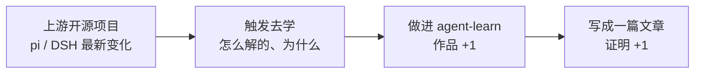

# 六个月跳槽计划（2026-09 → 2027-03）

> **状态**：⏳ 进行中（2026-09-13 定案，阶段 1「包装 + 开源」待开工）
> **本文是唯一执行文档**——决策依据 + 三条线 + 排期 + 验收 + 砍掉清单，都在这一份里。
>
> **主目标**：**学会 agent → 跳槽**（唯一主目标）
> **时间盒**：6 个月（2026-09 → 2027-03）
> **目标岗位**：AI 应用开发 / agent 工程（**不是"前端工程师"**）
>
> **现有底盘**（不用重来）：Phase 0-5 + A4 + B1 审批 + B2③ 真摘要 + B16/B18 引擎测试 + B22 多会话并行 run + C13 斜杠命令 + C15 仓库面板 —— 39 文件 358 用例，tsc 绿。
>
> **范围决策**：**不再做第二个全栈项目。** agent-learn 本身就是全栈（Next.js 前端 + Route Handlers 后端 + agent 内核 + 真实模型接入）。缺的不是"再做一遍"，是**把它变成别人能看见的东西**。

---

## 一、决策依据（为什么这么定）

### 1.1 现实条件（2026-09-13 确认）

| 事实 | 影响 |
|---|---|
| 公司项目由**另一个组**主导（核心 / Plan A），本组是 **Plan B** | 项目成败不由我决定，不能把个人策略押在它上面 |
| 我是**前端外包**，本组前端均为外包、正式员工均为后端 | 转正路径不确定；外包的合法曝光渠道少、合规容错低 |
| 我手上**独立负责的是传统前端项目**，不含后端、不含 agent | 没有 agent 实战 |
| **2026-09-14 领导明确：不让前端参与 agent 项目** | **线 ① 彻底关闭**——不再纠结源码与公司经历，只剩自有资产这一条路（反而更专注） |
| 公司源码**不一定拿得到** | 不能把它当作学习的前提 |
| 公司**已在逐步清理外包**；因五险一金按实际收入缴纳，**明年工资将被下调** | 留下的期望收益在下降；准备跳槽的紧迫性上升，但**不裸辞** |
| 市场大规模裁员、纯前端收缩、外包简历在初筛中处于劣势 | 战场选择比努力更重要（见 §1.3） |

### 1.2 三个关键判断

**① 公司 = 素材来源，不是主战场。**

"企业 agent 经验"确实稀缺——它属于 ETCLOVG 里 O（可观测）和 G（治理）两层，"藏在工业系统商业平台里、开源生态最稀疏"。**但这个价值是"提取"出来的，不是"待"出来的**：在传统前端项目里待 6 个月，学到的是"在一家企业待过"，不是"懂企业 agent"。

分界线是：**有没有在 agent 的决策现场**。想拿的是判断力（为什么企业要分级审批、为什么审计日志必须对账、沙箱的真实边界在哪），不是"参与过某项目"这句话。

**② 判断能带走，代码不行。**

- ❌ 复制公司代码 → 违约、带不走、不能写文章、随时可能变证据
- ✅ 理解设计判断 → 用自己的话写下来 → 完全合法，跳槽时还能讲

**知识不能被拥有，代码可以。** 而且写法上更强：读 → 提炼"他们解决了什么问题、为什么这么解" → **合上代码，自己在 agent-learn 里重新实现一遍**。agent-learn 本来就是"重写 pi"的项目，这是他最自然的模式。

**③ agent-learn 是最大的跳槽资产。**

| 对比 | 可验证性 | 面试可用度 |
|---|---|---|
| **agent-learn**（9 个月 / 三层架构 / 真实模型接入 / 358 用例 / 完整 UI 与轨迹） | ✅ 能打开、能跑、能读代码 | **高** |
| 公司内部项目 | ❌ 无法展示、无法验证、大概率保密限制 | 低 |

简历筛选是"信任游戏"（看公司名、看背书，我在这里是弱势）；**作品是"能力游戏"（看真东西，我在这里是强势）**。策略就是把战场从前一个移到后一个——用作品让人不需要看背景。

> ⚠️ **不伪造项目经历。** 理由不是道德洁癖，是它在最弱的地方下注（市场越紧验证越严），同时浪费最强的资产。真话的版本已经够强，而且那三条线跑 6 个月后，想要的经历会**变成真的**。

### 1.3 排序是算出来的，不是绝对的

同一件事的优先级，随目标权重变了三次：

| 次数 | 排序依据 | `B16/B18 引擎测试` 的判定 |
|---|---|---|
| 1 | 学习曲线（Phase 顺序） | 排在后面 |
| 2 | 公司可见度 | 降级（"公司里看不见"） |
| 3 | **面试可讲性**（当前） | **提回高优先级** |

> **教训：排序从来不是绝对的，是相对目标算出来的。** 目标一变，整张表要重算。

---

## 二、三条线，其实是一条流水线

**不要当成三份时间。** 一份投入流经三个产出——不互相抢时间，而是互相喂养。

| 线 | 内容 | 状态 |
|---|---|---|
| **⓪** | **包装 + 开源 agent-learn**（原清单漏了这条，杠杆最大） | ✅ 完全可控 |
| **①** | ~~积极参与公司 agent（争取参与、争取源码）~~ | ❌ **2026-09-14 关闭**——领导明确不让前端参与 |
| **②** | 把 pi / 开源技术所学写成文章 | ✅ 完全可控 |
| **③** | 参考上游最新变化 + 汲取好设计，持续完善 agent-learn | ✅ 完全可控 |

> **线 ① 关闭不是坏消息。** 它把"要不要争取源码 / 要不要写公司经历"这些悬而未决的问题一次性解决掉了。**只剩自有资产这一条路，反而更专注。** 公司项目降级为**素材的旁观来源**（看他们关注什么问题），不再是参与目标。

> **⓪ 不能省**：作品没包装等于没作品。它决定 ②③ 的产出**能不能被看见**。

### 两条附属规则

**文章双投**：内部论坛版（内部关系）+ 公开平台脱敏版（掘金 / 知乎 / GitHub——**跳槽资产**）。内部文章离职带不走，公开版才是自己的。文章只写**开源技术**。

**每条线的验收标准**：

| 线 | 验收 |
|---|---|
| ⓪ | 把链接发给一个不了解的人，对方 **5 分钟内**能看懂、能跑起来 |
| ② | 每 2 周至少 1 篇公开文章，且能说清"这篇讲了什么、为什么值得看" |
| ③ | 每个功能做完能**用自己的话讲清"为什么这么设计、不这么做会怎样"**——讲不出来 = 只是照搬形态 = 这次白做 |

---

## 三、复刻的守门员（防止范围失控）

复刻只做两类：

- ✅ **「开源里也有同类」** —— 行业知识，零风险（审批分级、只读放行、轨迹回放……）
- ✅ **「我本来就要学」** —— 沙箱、MCP、记忆分层、成本可观测

判据：**能说"这是业界通行做法"的安全；只能说"我们公司这么干"的别碰。**

一句话筛选：**这个复刻，能变成我的面试讲稿吗？** 不能 → 记下来，别做。

> **最大的风险是范围失控，不是功能不够。** agent-learn 已经 39 文件 358 用例，缺的是"能展示"。
> "公司有个好东西，我也做一个"是最容易让人**误以为在进步**的活——它消耗时间，产出却不进作品集、不进面试讲稿。

### 作品集叙事（比功能列表重要）

> ❌ "我的项目有 20 个功能：会话、压缩、审批、轨迹、MCP、沙箱……"
>
> ✅ "**我搭了一个 mini 企业级 agent 平台**：工具通过 MCP 标准接入，执行有沙箱隔离，权限走分级审批加审计，全链路可观测。内核照着 pi 重写，能讲清每个设计取舍。"

五个部件里**已经做完两个**（治理层：审批分级 B1 ✅；资源层：多会话并行 B22 ✅）。缺的是**工具接入层（MCP）**和**安全底座（沙箱）**。

**诚实边界**（面试时主动说，反而是加分项）：自建平台 ≠ 企业实战。差的是真实规模、合规压力、存量系统集成、跨团队协作。**说清差在哪，比含糊吹嘘可信得多。**

---

## 四、六个月排期

### 阶段 1（第 1 个月）：包装 + 开源 —— 最高杠杆

作品集是**滚动**的：先让现有成果可展示，之后每加一个功能都自动进作品集。最后才包装，时间一紧就什么都没有。

- [ ] **README**：架构图 + 亮点清单 + 快速开始
- [ ] **在线 demo（Mock 模式）** —— ⭐ 面试官点开就能玩，零 API 成本
  - ⚠️ 风险待验证：会话是文件存储（`.sessions/`），serverless 只读 FS 可能限制写入
  - 备选：① 换可写存储 ② 只读 demo ③ **录屏 + GIF（成本最低，先做这个兜底）**
- [ ] **开源准备**：剥离 `.env.local`、许可证、敏感信息扫描
  - ⚠️ 先确认：外包合同的知识产权条款 + agent-learn 是否全在业余时间/个人设备完成（9 个月的 git 提交历史是现成的证据链）。若有风险 → 只开源不涉及工作内容的部分，或只写文章不开源
- [ ] 一篇项目总览文章（公开平台）

**验收**：不了解的人拿到链接，5 分钟内看懂 + 能跑。

### 阶段 2（第 2-3 个月）：补"面试必问"的深度项

| 项 | 面试能答什么 |
|---|---|
| **A3 Trace Viewer** | "我怎么调试一个 agent" —— 可观测性 |
| **B9 重试退避** | 生产可靠性：瞬时错误 / 永久错误分流 |
| **B11 会话级运行锁** | 并发控制（per-session 互斥） |
| **B12 崩溃会话自愈** | 数据一致性：孤儿 toolCall 的修复在重建视图时做 |
| **B17 前端渲染优化** | 流式渲染性能 |
| **C1 MCP** | 外部工具接入标准（2026 agent 岗几乎必问）——**顺带补上"中台"的工具总线** |

> 每做完一个 → **一篇文章**（素材现成，零额外成本）。

### 阶段 3（第 4-5 个月）：沙箱 + 中台化收口

| 项 | 说明 |
|---|---|
| **C2 沙箱** | ⭐ **参考源已更新（09-14）：codex 最新的 Windows MXC 沙箱**（617 commits 里十几个 commit，且是 **Windows 实现**——我们在 Windows 上开发，直接可用）+ 走读 08 / 17。先做"命令策略 + 工作区围栏 + 进程隔离"这一层，能讲清原理就够，**别陷进容器技术** |
| **B5 hooks 注册表** | 扩展点设计 —— "怎么让内核保持干净"（agent-loop 纯净性改造是现成讲稿） |
| **B6 记忆分层** | 上下文 / 记忆类高频话题 |
| **B10 记忆文件注入** | 顺手；对标 CLAUDE.md / AGENTS.md |
| **中台化收口** | 把五个部件串成叙事，补上简化版配额 / 成本读数 |

### 阶段 4（第 6 个月）：面试冲刺

- [ ] 每个模块写**讲稿**：3 分钟讲清 loop / 压缩 / 审批 / 多会话（**用自己踩过的坑讲**，比背概念有说服力）
- [ ] 系统设计题：**"设计一个 agent harness"** —— 手里有全套答案（ETCLOVG 七层 + 六项目对照）
- [ ] 投递（**内推 > 海投**）+ 面试

---

## 五、砍掉 / 降级（明确不做）

| 砍掉 | 理由 |
|---|---|
| B3 后半 UI 视觉打磨、B14/B15 顺手件 | 面试不问视觉细节 |
| B2.1 压缩打磨 | 条件触发，不主动做 |
| C4 定时 / C5 遥测 / C9 代码执行器 / C10 goal / C11 complete_step / C12 move | 6 个月做不完 |
| A5 web_search | 曾搁置且卡在 dev 环境超时谜团，风险高 |
| C3 子智能体 | 除非时间宽裕 |

> **6 个月做不完所有事。砍范围比赶进度重要。**

---

## 六、风险与对策

| 风险 | 对策 |
|---|---|
| 公司加班吞掉学习时间 | 边界：优先接与学习项目重叠的活；**不为"表现"无限加班**（回报率在下降） |
| 被清理时手里空 | **阶段 1 先包装** —— 作品集随时可带走 |
| 计划腐烂（前 3 个月无进展） | **每月底自查**：阶段验收没达成 → **砍范围，不延期** |
| 范围失控（不断开新战线） | 复刻守门员（§三）+ 砍掉清单（§五） |
| 裸辞冲动 | **不裸辞**：有收入时准备，远好过没收入时找 |
| 用"再读一个开源项目"逃避动手 | 学习新项目的筛选标准 = "**面试会问但我答不上来**"，不是"这个项目很火" |

---

## 七、本周计划（2026-09-14 起）

> 09-04 → 09-14 停了 10 天，本周恢复。

| # | 事项 | 状态 |
|---|---|---|
| 1 | **整理所学，开始发文章** | 素材现成（24 篇走读 + 分享 PPT），可直接开写 |
| 2 | **继续 PLAN 开发** | 从 §四 排期接着做 |
| 3 | **参考上游最新变化，评估是否调整 PLAN** | ✅ 侦察完成，见 §八 |

**执行顺序**：

1. **先写第一篇文章**——素材零成本，且**不依赖开发进度**（开发一停文章就停，是常见陷阱）
2. **README + 架构图**——阶段 1 杠杆最大项，仍待开工
3. 按 §四 继续开发

---

## 八、上游变化侦察（2026-09-14 快照）

> 用 C15 `/repos` 的同一套机制做的（`git ls-remote` 比对 `.repo-updates/*.json` 基线）。以后这步直接在 `/repos` 页面点更新即可。

| 项目 | 基线 | 当前 HEAD | 增量 |
|---|---|---|---|
| **codex** | 09-01 `9d0eae74` | **09-14** `3abbf9fe2c` | **617 commits**（13 天）⭐ |
| **pi** | 09-04 `47236c84` | 09-11 `71dca871b` | **78 commits**（7 天） |
| **DSH** | 09-02 `4e84901e` | 09-10 `c291e7961a` | **1637 commits**（8 天） |
| **langchainjs** | 09-02 `3c03d16d` | 09-11 `778566e6` | **23 commits**（9 天） |
| opencode | 未登记基线 | 09-04 `20a77438` | — |

> ⚠️ 沙箱里 `git ls-remote` 不可用（SSH 建不了 signal pipe）→ 上表是**本地 HEAD**，即"已拉下来的最新"，**远端可能还更新**。以后在自己机器上跑 `/repos` 页面看。

### 结论：**条目不用改，但"参考源"要换**

没有出现推翻现有排期的变化——**排期里的条目一个都不用增删**。但 codex 这 617 个 commit 让参考地图变了：**codex 现在在 G（治理/审批）和 E（沙箱/执行环境）两层上跑得比 pi 快**，而这两层恰恰是"企业 agent"最缺的。

#### codex：五个主题直接命中我们的排期 ⭐

| codex 主题（617 commits 里） | 对应我方 | 动作 |
|---|---|---|
| **Windows 沙箱（MXC）** —— 十几个 commit：接入命令执行、托管网络策略、离线沙箱禁入站、token SID 校验、准备/清理分阶段、execution-host 路径上下文 | **C2 沙箱**（排队） | ⭐ **参考源从 pi/DSH 换成 codex**。我们在 Windows 上开发，这是唯一一份**Windows 沙箱**的工程参考 |
| **Guardian 审批** —— 权限放宽时失效缓存、评审动作完整性、审批归属绑定到发起执行、评审器独立成 crate | **B1 审批 / G 层**（已完成，可加固） | 📌 审批的"评审者抽象"+ 缓存一致性是新东西 |
| **MCP + 企业 auth** —— trusted enterprise MCP auth、OAuth 回调、按 HTTP server 选协议模式、能力暴露、描述与审批 JSON 分离 | **C1 MCP**（排队） | ⭐ 特别是 **enterprise MCP auth**——比 smolagents/Cline 的参考更贴企业场景 |
| **Code Mode** —— tool call 上下文保持、回调作用域、完整性追踪、响应 GC | **C9 代码执行器**（已砍） | 👀 看一眼再决定是否恢复 |
| `Preserve incoming prompts when pre-turn compaction fails` | **B2.1 压缩打磨**（条件触发） | ✅ 压缩失败的容错——正是 B2.1 的 A 类差距 |
| session isolation / forked sessions / worktree session | B11 / B12 / C3 | 📌 记录 |

#### 其余项目

| 上游变化 | 对应我方 | 动作 |
|---|---|---|
| pi `fix: cap agent retry backoff` | **B9 重试退避**（排队） | ✅ 做 B9 时直接读这个 commit——上游刚动手，说明是真问题 |
| pi `per-model compaction token budgets` | B2.1 / config | 📌 记录 |
| pi `feat(ai): deferred tool loading` | tool_search / C1 MCP | 📌 做 MCP 时参考 |
| pi `docs(agent): pico *`（~12 个 docs） | 无直接对应 | 👀 观察：pi 在酝酿新的任务/状态架构（task lifecycle、tagged-union task state、runtime schema bundle），仍是 design 阶段，**不进排期** |
| DSH `feat(web): preview file and skill references` | **C14 @文件匹配**（排队） | ✅ 做 C14 时读 |
| DSH 测试基建（native-mock client assembly / test-support） | B8 前端单测（已延后） | 💡 若做可参考 |
| langchainjs：23 commits，**全是 provider bug fix**（reasoning/thought 流式、tool call id 保持、schema allowlist）+ Vitest 安全升级 | 模型适配层 | 📌 **无架构级变化**。两条可与我们的 `deepseekModel` 对照：流式 tokenUsage 累积、流式下 tool call id 保持 |
| DSH `release(dsh): 0.1.5-rc.2` | 无 | 版本发布 |

> **扫描上游的目的变了**：线 ① 关闭后，不再是"看公司会用哪个"，而是纯粹的"**看业界在往哪走 + 有没有可抄的新参考**"。

> **副产品：这次扫描证明了 C15 `/repos` 的价值。** 617 + 1637 + 78 个 commit 里，真正相关的就上面这 20 来条——**人工翻不可能，必须靠面板做增量总结**。以后直接在 `/repos` 页面点更新。

### 能力欠缺盘点（对照 codex 这份版图）

结论：**条目不用增删，但有三处要改**；其余全部"记录不排期"——6 个月的时间盒不允许扩大范围。

#### A. 要改的三处

| # | 改动 | 为什么 |
|---|---|---|
| 1 | ⭐ **C2 沙箱的范围要扩：加「网络维度」** | 我们的 C2 只写"命令策略 + 工作区围栏 + 进程隔离"——**全是文件/进程维度，网络维度完全空白**。而这是企业安全最常问的一环（"agent 能不能往外发数据？"）。codex `network-proxy` 是可抄的完整参考 |
| 2 | **B1 审批的"完全体"补记：Guardian 式 LLM 评审** | B1 只做**静态分析**；Guardian 是**有预算管理的 LLM 评审会话**（`input_budget` / `request_budget` / `review_session`）。记入 B1 详案的完全体补记，条件触发 |
| 3 | **B5 hooks 的定位说清** | 我们的是**内部扩展点**（引擎内 onBeforeTool/onAfterTool），codex `ext/` 是**外部插件体系**。层次不同——写清边界，**避免以后误以为"要抄一个插件系统"** |

#### B. C2 网络维度的实现建议（设计完整 + 实现轻量）

**不需要真起代理**（那是独立重工程）：

- **设计层**：网络策略是**权限配置文件的一个维度**（与路径、命令并列）
- **轻量实现**：命令级网络意图识别（`curl` / `wget` / `Invoke-WebRequest`…）+ 域名白名单校验 + 拒绝时明确报错
- **面试话术**：*"我的沙箱有三个维度——文件、命令、网络。网络这块我做了策略设计和白名单校验，没实现完整 MITM 代理（那是独立工程）；业界 codex 的做法是……"* ——**主动划出边界比含糊吹嘘可信**

#### C. 记录但不排期（真欠缺，6 个月做不了）

| 能力 | codex 位置 | 为什么不排期 |
|---|---|---|
| **远程执行主机** | `exec-server/` + protocol | 企业常态，但是独立大工程 |
| **服务端形态**（run 脱离请求生命周期） | `app-server*/` | 我们已识别（B22 未来项），codex 是工业解；**记录** |
| **Code Mode** | `code-mode*`（4 个 crate） | 对应砍掉的 C9；**若将来要恢复，先读这个** |
| **提权协议** | `shell-escalation/` | 沙箱→提权是另一条路，理解即可 |
| **OTel 遥测** | `otel/` + `analytics/` | 我们是本地 jsonl；企业要的是标准遥测 |
| **多 agent / 身份 / 角色** | `agent-graph-store`、`agent-identity`、`agent-roles` | 对应 C3，已延后 |

#### D. 明确不抄

`cloud-tasks`（云端任务）、`voice-host` + `realtime-webrtc`（语音）、`secrets` / `keyring-store` / `aws-auth` / `workload-identity`（企业身份密钥基础设施）、`worktree`（git worktree 物理隔离——我们逻辑多会话已够）。

> **一句话**：codex 的版图比我们大一个数量级，但**只有「网络策略沙箱」是真欠缺、且现在值得补**。其余正确的动作是**知道它在哪**，而不是去做它。
>
> **教学点**：看上游不是"抄更多"，是"**知道自己少了什么，并判断该不该补**"。这次盘点里 90% 的结论是"知道就行"。
