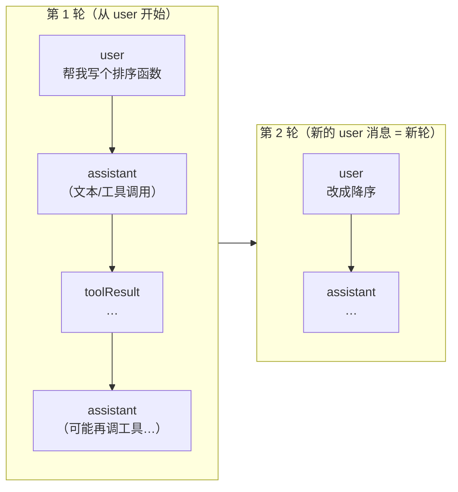
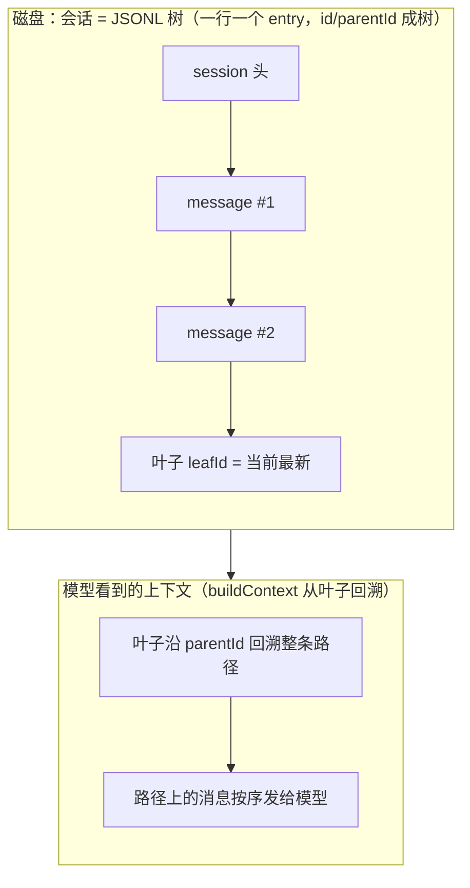

# 第零图：会话机制基础（分享第 1 部分，先讲这个）

> 讲解词：压缩处理的对象是"一次对话的完整记录"。在讲"怎么压"之前，先统一三个概念：**消息长什么样、什么是"轮"（turn）、模型每次到底"看到"什么**。这三件事三家用词一致、实现略有差异，后面三把剪刀全靠它们。
>
> 配套：`doc/分享-压缩三家对照/00-README.md`（总览）、`02-压缩机制-三家对照.md`（下一部分）。

---

## 0.1 一条消息长什么样（role + content）

| role | 谁写的 | 内容 | 例子 |
|---|---|---|---|
| `user` | 人 | 文本 | "帮我写个排序函数" |
| `assistant` | 模型 | 文本 或 工具调用（toolCall） | "好的" / 调 write_file 写 sort.ts |
| `toolResult` | 工具执行器 | 工具输出 | "已写入 sort.ts" |

---

## 0.2 什么是"一轮"（turn）：user 消息开启一轮，直到下一次 user 消息

> 关键：**一轮的边界是 user 消息**——pi 压缩时"回退到轮起点"找的就是这个；toolResult 永远紧跟它配对的 assistant(toolCall)，**拆开这对 = 孤儿 tool**（我们真实踩过 DeepSeek 400）。

---

## 0.3 模型每次到底"看到"什么：从当前叶子回溯拼出的上下文

> 三个关键点：
> 1. **磁盘上的记录 ≠ 模型看到的**——磁盘是树、全量、只追加；模型看到的是 buildContext 回溯"当前叶子路径"的结果。
> 2. **为什么是树不是数组**：支持 switchLeaf 分支——从任意历史节点可以岔出新线，数组表达不了"同一条父消息长出两个后续"。
> 3. **"当前" = leafId**：切会话/回溯 = 移动叶子指针，不删任何历史。

---

## 0.4 一句话把三家会话机制框住（衔接下一部分）

| | 会话怎么存 | "当前在哪"怎么表示 | 模型看到什么 |
|---|---|---|---|
| **我们** | JSONL 树（id/parentId） | leafId 叶子指针 | buildContext 从叶子回溯 |
| **pi** | append-only 事件日志 | 最新 entry | 读时过滤（最新 compaction 之后） |
| **DSH** | append-only 日志 + surface 视图 | surface 折叠到最新 | surface 派生视图 |

> 三者都是"**全量保留 + 只给模型看一部分**"——压缩就是在"给模型看哪一部分"上做文章。这正是下一部分要讲的。
