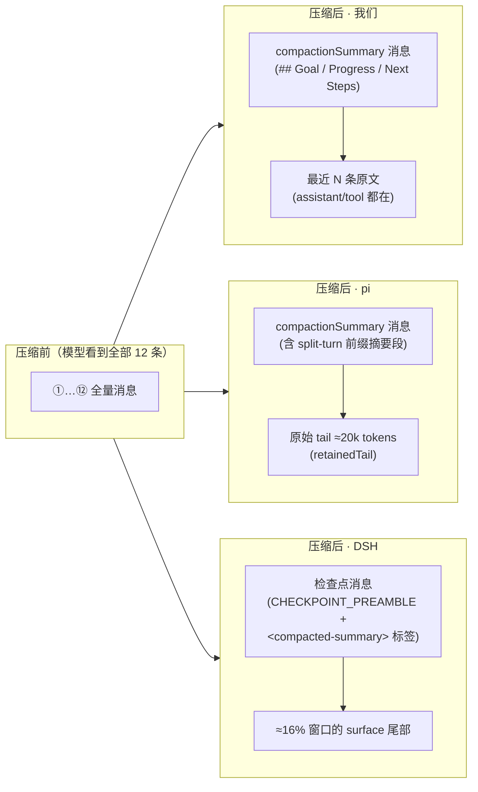

# 压缩机制三家对照（分享第 2 部分：图一 → 图二 → 图三）

> 讲解词：会话机制讲完了（见 `01-会话机制.md`），现在讲"在会话上做压缩"。三张图递进：先看三家**存储模型**为何不同（图一），再看同一段对话**三把剪刀切在哪**（图二，核心），最后看**压缩后模型看到什么**（图三）。
>
> 配套：`doc/分享-压缩三家对照/00-README.md`（总览）、深度备查 `doc/知识点-08-pi与codex-上下文压缩机制.md`。
> 图实现：Mermaid（GitLab/Typora/VS Code 插件渲染）+ 表格版兜底（任何环境可读）。

---

## 图一：三家存储模型（为什么切法不同——地基）

> 讲解词：三家压缩的做法不同，根子在**存储模型**不同。压缩的本质是"让模型重看一遍旧对话"——但"旧消息还在不在、怎么表示'已经不看了'"三家答案不一样。

```mermaid
flowchart TB
  subgraph us["我们 agent-learn"]
    A1["JSONL 会话文件<br/>(只追加，永不删)"] --> A2["内存：消息树<br/>id + parentId"]
    A2 --> A3["buildContext()<br/>从叶子回溯"]
    A3 --> A4["遇 compaction entry<br/>→ 跳过它之前的旧消息<br/>从 firstKeptEntryId 开始拼"]
    A4 --> A5["✅ 压缩后可 switchLeaf<br/>回任意历史分支"]
  end

  subgraph pi["pi"]
    B1["append-only 事件日志<br/>(只有 append API，无删除)"] --> B2["buildSessionContext()<br/>读时过滤"]
    B2 --> B3["路径折叠成：<br/>[最新 compaction entry, 其后条目]"]
    B3 --> B4["retainedTail 内联拷贝近尾<br/>/ firstKeptEntryId 指针"]
    B4 --> B5["✅ 日志是唯一真相"]
  end

  subgraph dsh["DSH"]
    C1["append-only 事件日志<br/>(真相，永不删)"] --> C2["surface 折叠视图<br/>(模型可见，派生)"] 
    C2 --> C3["压缩 = surface 上<br/>replace 最老一段 → 检查点消息"]
    C3 --> C4["被压旧消息 = shadowed<br/>(日志原封不动)"]
    C4 --> C5["❌ 视图单向折叠<br/>replace 不可逆"]
  end
```

| 维度 | 我们 | pi | DSH |
|---|---|---|---|
| 真相存哪 | JSONL 文件（树） | append-only 日志 | append-only 日志 |
| 模型看到什么 | buildContext 回溯结果 | 读时过滤的路径 | surface 折叠视图 |
| 压缩= | 追加 compaction entry 当新叶子 | 追加 compaction entry | surface replace + log-only 事件 |
| 旧消息 | 在（可回历史） | 在（日志） | 在（日志，被遮蔽） |
| 多出来的能力 | **可回溯分支**（switchLeaf） | 纯日志重放 | 审计/重建（锁+影子价格） |

**一句话**：我们=树，pi=纯日志，DSH=日志+视图。树的代价是"状态靠指针拼"，收益是**能回退**；DSH 的收益是"重放即真相"，代价是**视图单向**。

---

## 图二：同一段对话，三把剪刀（全场核心图）

> 讲解词：压缩要回答"从哪里开始压"。同一条 12 条消息的 ReAct 对话，三家**切的位置不一样**——因为对"什么是不能拆散的完整单元"判断不同。

**第一步：先认识这段对话**（编号 + 类型，投屏用）

| # | 类型 | 内容 | | # | 类型 | 内容 |
|---|---|---|---|---|---|---|
| ① | user | 帮我写个排序函数 | | ⑦ | assistant | toolCall: bash 再跑一次 |
| ② | assistant | 好的，我来写 | | ⑧ | toolResult | 输出… |
| ③ | assistant | toolCall: write_file | | ⑨ | assistant | 文本回复 |
| ④ | toolResult | 已写入 sort.ts | | ⑩ | user | 改成降序 |
| ⑤ | assistant | toolCall: bash 跑测试 | | ⑪ | assistant | toolCall: edit_file |
| ⑥ | toolResult | 测试通过 | | ⑫ | toolResult | 已修改 |

**第二步：三把剪刀各切在哪**（🔴=压进摘要　🟢=保留原文　✂️=保留区第一条）

> ⚠️ 教学示意：真实压缩要几百条消息才触发，这里把 12 条消息"放大"到可见尺度；三家保留预算口径不同（我们按 N 条消息、DSH 按窗口 16% token、pi 按 20k tokens），换算到本示例大致都落在"最近 3-6 条"量级，为的是在同一张图上看清**切点规则**的差异（保留量本身是图三的主题）。

| # | ① | ② | ③ | ④ | ⑤ | ⑥ | ⑦ | ⑧ | ⑨ | ⑩ | ⑪ | ⑫ |
|---|---|---|---|---|---|---|---|---|---|---|---|---|
| **我们** | 🔴 | 🔴 | 🔴 | 🔴 | 🔴 | 🔴 | ✂️ | 🟢 | 🟢 | 🟢 | 🟢 | 🟢 |
| **DSH** | 🔴 | 🔴 | 🔴 | 🔴 | 🔴 | 🔴 | 🔴 | 🔴 | ✂️ | 🟢 | 🟢 | 🟢 |
| **pi** | 🔴 | 🔴 | 🔴 | 🔴 | 🔴 | 🔴 | 🔴 | 🔴 | 🔴 | ✂️ | 🟢 | 🟢 |

> 三家的差异一眼可见（✂️ 落在不同消息上）——因为"预算想切的地方"被各自规则拉走了：
> - **我们（保留区从 ⑦ 起）**：预算想从 ⑧（toolResult）开始留 → 但保留区第一条不能是 toolResult（孤儿 tool → DeepSeek 400 真实事故）→ **前移到 ⑦**，把 ⑦⑧ 这对工具调用完整留下。
> - **DSH（保留区从 ⑨ 起）**：从尾巴往前数 token 到 16% 预算 → 找到最近的 tool-call/result **配对平衡**线（⑦+1、⑧−1，线在 ⑧ 后 balance=0）→ 从 ⑨ 起保留，7⑧ 被压但配对完整，不会悬空。
> - **pi（保留区从 ⑩ 起）**：切点回退到**轮起点**——⑩（user"改成降序"）是新的一轮，从它开始保留 = 保住"用户请求 + 它的整轮执行"；⑨ 是第一轮的收尾文本，跟着第一轮被压。

**加深一层：同一个"拆对"问题，三种约束强度**

| 谁 | 约束 | 一句话 |
|---|---|---|
| 我们 | 保留区第一条 ≠ toolResult | 单点防护（防孤儿 tool → API 400） |
| DSH | 任何切割线 tool-call/result balance == 0 | 可重建（重放不悬空） |
| pi | 切点回退到轮起点（user 消息） | 结构完整（turn 是语义单元，不腰斩对话） |

---

## 图三：压缩后"模型看到什么"（保留策略对比）

> 讲解词：切完还要决定"保留区里放什么"。三家都保留尾巴，但尾巴的内容哲学不同。

| | 我们 | pi | DSH |
|---|---|---|---|
| 摘要以什么身份进上下文 | 独立 compactionSummary 类型（不是 user） | 独立摘要类消息 | user/message + replace 事件（带 preamble） |
| 摘要格式 | Goal/Progress/Next Steps（+ UPDATE 增量） | 六段结构化 + split-turn 的 "Turn Context" | 检查点格式（Primary Request/Key Concepts/…） |
| 保留什么 | 最近 N 条原文 | 最近 ~20k tokens 原文 | 最近 ~16% 窗口 |
| 增量 | previousSummary 递归（提示词） | previousSummary 递归 + details 文件清单 | 指令内合并 `<compacted-summary>` 单块 |
| 模型会不会看到"摘要的摘要" | 会（递归合并） | 会（递归） | 不会（永远单块） |

**一句人话**：三家都是"把老的压成摘要、留下新的"——差别在**摘要的身份**（独立类型 vs 伪装 user）和**尾巴保什么**（我们的原文全保、pi 保 20k、DSH 保 16%）。

---

## 附：讲解节奏建议（20 分钟版，含第 1 部分的第零图）

> 原则：**先会话机制（建立概念），再压缩（在这些概念上做文章）**。第零图不是开场白，是整个分享的地基——切点约束、保留策略、增量更新全部挂在它上面。

1. **开场 1 分钟**：为什么每个 agent 都要压缩——对话无限增长、上下文窗口有限、token 是钱；压缩 = 让模型把旧对话写成"工作总结"。（不用图）
2. **第零图 6 分钟（会话机制，见 `01-会话机制.md`，讲压缩前必须先讲清）**：
   - 0.1 消息长什么样（role/content）30 秒
   - 0.2 什么是"轮"：user 开启一轮；toolCall/toolResult 永远配对（30 秒讲清，后面全靠它）
   - 0.3 模型看到什么 ≠ 磁盘存什么：JSONL 树 + leafId 叶子 + buildContext 回溯（2 分钟，重点）
   - 0.4 三家会话模型一句话框住 → 过渡到图一（30 秒）
3. **图一 3 分钟**：三家存储模型展开——树 vs 纯日志 vs 日志+视图，"为什么切法不同"的地基。
4. **图二 6 分钟（核心）**：同一段对话三把剪刀。讲"切点约束"→ 引出孤儿 tool 的真实 400 事故；切点回退到轮起点（呼应 0.2 的 turn 概念）。
5. **图三 3 分钟**：压缩后模型看到什么 → 引出"保留策略 = 产品哲学"。
6. **收尾 1 分钟**：我们抄了谁、没抄谁、为什么（走读 24 的三条施工单当彩蛋）。

> 反问问答备用（答不上 = 没懂）：
> - 为什么你们的切点"宁可多留一条"？→ 孤儿 tool → DeepSeek 400（真实事故，呼应 0.2 的配对）。
> - DSH 为什么能切在工具调用中间？→ 它找的是配对平衡线，不是轮次边界。
> - 你们为什么不做 split-turn？→ 我们的树结构天然不劈轮次、还能 switchLeaf 回退（场景不需要）。
> - 树和日志到底差在哪？→ 树能 switchLeaf 回退分支（Phase 2 多会话要用），日志只能线性重放（呼应 0.3）。
